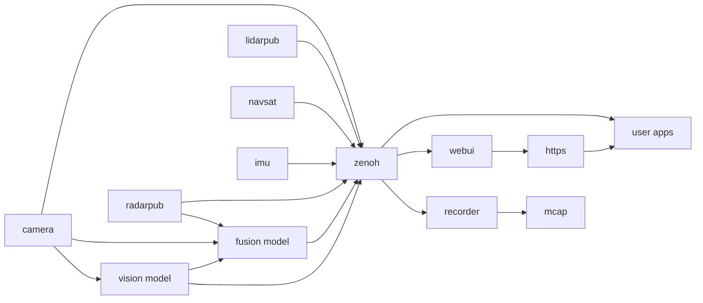

# The EdgeFirst Perception Middleware

The EdgeFirst Perception Middleware is a collection of applications and libraries used in the implementation of the modular perception stack. The perception stack is built on Zenoh that uses ROS 2–compatible CDR message formats to publish and subscribe messages to each topics accessible in the stack over the network.

## Middleware Services

The Perception Middleware is modular and split into various application services, each focused on a general task.  For example a camera service is charged with interfacing with the camera and ISP (Image Signal Processor) to efficiently deliver camera frames to other services who need access to the camera.  The camera service is also responsible for encoding camera frames using a video codec into H.265 video for efficient recording or remote streaming, this feature of the camera service can be configured or disabled if recording or streaming are not required.

The middleware services communicate with each other using the Zenoh networking middleware which provides a highly efficient publisher/subscriber communications stack.  This architecture is similar to ROS2 and our services encode their messages using the ROS2 CDR (Common Data Representation). We use the ROS2 standard schemas where applicable and augment with our own custom schemas where required.  The [Recorder](data_collection/recording.md) and [Foxglove](data_collection/foxglove.md) chapters go into more detail on how this allows efficient streaming and recording of messages and interoperability with industry standard tools.

## Architecture

Each service handles a specific task:

- **Camera Service**: Interfaces with the camera and ISP (Image Signal Processor) to deliver frames to other services. It also encodes frames to H.265 video for recording or streaming. You can configure or disable encoding if not needed.

## Communication

Services communicate through Zenoh, a high-performance publisher/subscriber stack. While EdgeFirst doesn't depend on ROS2, services encode messages using ROS2 CDR (Common Data Representation). The middleware uses ROS2 standard schemas where applicable and custom schemas where needed.

See the [Recording](data_collection/recording.md) and [Foxglove](data_collection/foxglove.md) sections for details on streaming, recording, and tool interoperability.

For programmatic access to EdgeFirst Studio (dataset upload, snapshots, training artifacts), see the [EdgeFirst Client](../client/index.md) documentation.
