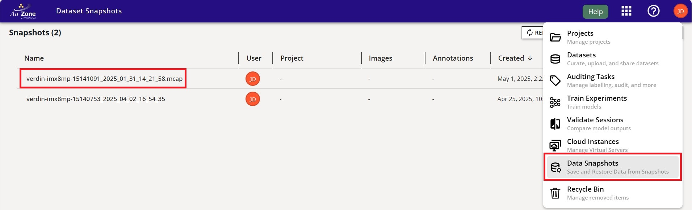
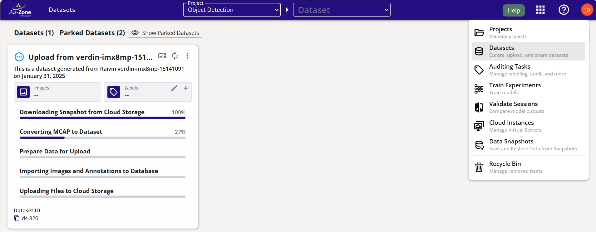
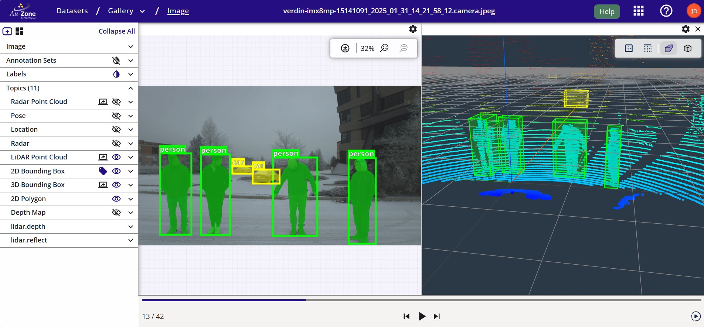

# Studio Client
The EdgeFirst Studio Client, `edgefirst-client`, provides an API and command-line interface (CLI) into the [EdgeFirst Studio](../studio/index.md).  This client provides programmatic and command-line access to many of the features of the EdgeFirst Studio, specifically related to the upload of MCAP file into [snapshots](../studio/snapshots.md) and snapshot conversion or *restoration* into datasets. The commands below will mirror the UI actions described in the snapshot walkthrough linked above.

This page describes the command-line interface, the [Bridge In API](../studio/dataio.md) is documented under the [EdgeFirst Studio documentation](../studio/index.md).

A summary of the core features is listed below:

- Project List & Search
- Dataset List & Search & Export
- Annotations Listing & Export to JSON and Arrow
- Snapshot Download & Upload & Restore to Dataset (including Auto-Annotations)
- Trainer List & Search
- Trainer Session List & Search & Artifacts Download
- Validator List & Search

## Installation
The Python package includes the command-line application and is an easy way to install the binary.

```shell
pip install edgefirst-client
```

!!! tip "Included with EdgeFirst Middleware"

    The `edgefirst-client` is installed as part of the standard EdgeFirst Middleware installation, no additional setup is required.    

Once installed you can confirm you can communicate with the EdgeFirst Studio Server with the version command.

```
$ edgefirst-client version
EdgeFirst Studio Server: 3.7.3-f0b4eee Client: 1.3.3
```

## Authentication
Authentication to the EdgeFirst Studio Server is done using the standard login you would use from the web interface.  To avoid having to type your username and password each time, an authentication token can be generated and saved using the `login` command.

```shell
$ edgefirst-client login
> EdgeFirst Studio Username ********
> EdgeFirst Studio Password ********
[2025-05-01T18:08:59Z INFO  edgefirst_client] Saved configuration to /home/torizon/.config/edgefirststudio/config.toml
```
This will generate an authentication token in `/home/torizon/.config/edgefirststudio/config.toml` which remains valid for 7 days.  At any time you can use the `logout` command to forget the token and remove it from the configuration file, or re-run the `login` command to regenerate it.

To query the token, use the following command:
```shell
edgefirst-client token
```
This should produce an output similar to:
```shell
$ edgefirst-client token
eyJhbGciOiJIUzI1NiIsInR5cCI6IkpX...
```

## Dataset Preparation
Once data has been recorded using the [MCAP Recording Service](../platforms/recording.md) of the Raivin, and we have access to the mcap files, it is very simple to upload the files into a project. The next step we have to do is to create a snapshot and then restore it as a dataset (optionally using AGTG for auto annotation of the images).

### Create a Snapshot
To create a snapshot, locate the folder with the MCAP files and run the following command:

```shell
$ edgefirst-client create-snapshot <path>
[<SNAPSHOT_ID>] <status>: <Name of the folder or file specified>
```
where `path` is the path to the folder containing the MCAP files or the path to the mcap file. Refer to the [MCAP Recording page](../platforms/recording.md) for more information. Notice that the snapshot can only be restored if `status` is `available` (keyword after the `[ID]`, `status` can also be `unavailable` if any error occurs).

This command with a successful output would looks as follows:
```shell
$ edgefirst-client create-snapshot /media/DATA/verdin-imx8mp-15141091_2025_01_31_14_21_58.mcap
[1816] available: verdin-imx8mp-15141091_2025_01_31_14_21_58.mcap
```

The created snapshot will be listed under the "Data Snapshots" page in EdgeFirst Studio

<figure markdown="span">
{ align=center }
<figcaption>Created Snapshot</figcaption>
</figure>

Also, available snapshots can be listed by calling:

```shell
$ edgefirst-client snapshots
[<SNAPSHOT_ID>] available: <Snapshot Name (folder name from above)>
[<OTHER_ID>] unavailable: <Snapshot Name (a different name)>
```
Example output would look like:
```shell
$ edgefirst-client snapshots
[1651] available: verdin-imx8mp-15140753_2025_04_02_16_54_35
[1816] available: verdin-imx8mp-15141091_2025_01_31_14_21_58.mcap
```

Make a note of the snapshot ID that was created. In this case, the snapshot ID is `1816`.

### Restore Snapshots
!!! warning
    Restoring snapshots to datasets will deduct funds from your EdgeFirst Studios account.

To restore any snapshot as a dataset, we need to get the project ID where the dataset is going to be stored. Available projects can be listed by calling:

```shell
$ edgefirst-client projects
[<PROJECT_ID>] <Project Name>: <Project Description>
```
For example:
```shell
$ edgefirst-client projects
[265] Sample Project: Sample project contains a collection of datasets to help users get started on the platform.
[628] Object Detection: This project trains and deploys Vision models for detecting objects. 
```

Make a note of the project ID where the dataset will be stored. In this case the project ID is `628`.

Now that we have the project ID `628` and the snapshot ID `1816`, we can restore the snapshot using the `restore-snapshot` command.
```shell
$ edgefirst-client restore-snapshot <PROJECT_ID> <SNAPSHOT_ID> --dataset-name "Dataset Name" --dataset-description "Dataset Description"
```
For example:
```shell
edgefirst-client restore-snapshot 628 1816 --dataset-name "Upload from verdin-imx8mp-15141091" --dataset-description "This is a dataset generated from Raivin verdin-imx8mp-15141091 on January 31, 2025"
[task: 3499] Upload from verdin-imx8mp-15141091: verdin-imx8mp-15141091_2025_01_31_14_21_58.mcap
```
The command above will spin up some cloud services to transform input data into datasets and output a task ID that is running on the services to restore the snapshot.

The dataset upload process will be shown in EdgeFirst Studio.

<figure markdown="span">
{ align=center }
<figcaption>Restoring Snapshot</figcaption>
</figure>

We can use the `datasets` command to confirm that the dataset was uploaded to the project with ID `628`:
```shell
$ edgefirst-client datasets 628
[2080] Upload from verdin-imx8mp-15141091: This is a dataset generated from Raivin verdin-imx8mp-15141091 on January 31, 2025
```

The `restore-snapshot` command provides several options to customize the dataset creation process:

- `--autodepth`: Enables automatic depth map generation for the dataset
- `--autolabel`: Specifies labels for automatic annotation of objects in the dataset (e.g. `person`, `car`)
- `--topics`: Filters which topics from the mcap files to include in the dataset (if not specified, all topics are included)
- `--dataset-name`: Sets the name for the new dataset
- `--dataset-description`: Provides a description for the dataset

!!! warning
    Automated depth generation and labeling services will incur additional costs on top of the snapshot restoration.

For example, to create a dataset with automatic depth maps and annotations for `person` and `car` objects, run the following command:

```shell
$ edgefirst-client restore-snapshot <PROJECT_ID> <SNAPSHOT_ID> --dataset-name "Dataset Name" --dataset-description "Dataset Description" --autodepth --autolabel "person car"
```
For example:
```shell
$ edgefirst-client restore-snapshot 628 1816 --dataset-name "Upload from verdin-imx8mp-15141091 with AGTG" --dataset-description "This is a dataset generated from Raivin verdin-imx8mp-15141091 on January 31, 2025 with depth map generation and automated labelling for the class person and car." --autolabel "person car" --autodepth
```

The `--autolabel` parameter currently supports [COCO labels](../datasets/coco2017.md#coco-labels). We can list any class found in the COCO labels list to auto annotate these classes. In EdgeFirst Studio, we can [visualize](../datasets/tutorials/management.md#viewing-datasets) the results of the auto-annotations when restoring the snapshot. In this example, "person" and "car" are being shown as specified from the command above.

<figure markdown="span">
{ align=center }
<figcaption>Restore Snapshot Results</figcaption>
</figure>

## Command Reference
The EdgeFirst Studio Client provides a comprehensive set of commands for interacting with EdgeFirst Studio. Here's a detailed explanation of the available commands:

### Authentication Commands
- `version`: Displays the current EdgeFirst Studio Server version
  ```shell
  $ edgefirst-client version
  edgefirst-client 1.3.3
  ```
- `login`: Authenticates with the server and stores the token in the configuration file
  ```shell
  $ edgefirst-client login
  Username: your_username
  Password: ****
  ```
- `logout`: Removes the stored authentication token
  ```shell
  $ edgefirst-client logout
  ```
- `token`: Displays the current authentication token
  ```shell
  $ edgefirst-client token
  eyJhbGciOiJIUzI1NiIsInR5cCI6IkpXVCJ9...
  ```

### Project Management
- `projects`: Lists all projects accessible to the authenticated user
  ```shell
  $ edgefirst-client projects
  [25] MultiTask: This project contains datasets for both object detection and segmentation
  [54] ObjectDetection: This project contains datasets that only support object detection task
  ```
- `project`: Retrieves detailed information for a specific project using its ID
  ```shell
  $ edgefirst-client project 54
  ```
- `find-projects`: Searches for projects by name
  ```shell
  $ edgefirst-client find-projects ObjectDetection
  [54] ObjectDetection: This project contains datasets that only support object detection task
  ```

### Dataset Operations
- `datasets`: Lists all datasets (optionally filtered by project ID). If project ID is not provided all the datasets will be listed
  ```shell
  $ edgefirst-client datasets 54
  [32] Playingcards: A dataset for detecting playingcards
  ```
- `dataset`: Retrieves detailed information for a specific dataset using its ID
  ```shell
  $ edgefirst-client dataset 32
  ```
- `find-datasets`: Searches for datasets by name (optionally filtered by project)
  ```shell
  $ edgefirst-client find-datasets Playingcards --project-id 54
  ```

### Annotation Management
A single dataset is allowed to have multiple annotations sets. That is the reason why annotations are separated from `dataset-download` commands.

- `annotation-sets`: Lists available annotation sets for a specific dataset
  ```shell
  $ edgefirst-client annotation-sets 32
  [1] Default Annotation Set
  [2] Validation Set
  ```
- `annotations`: Retrieves annotations for a dataset and annotation set, filtered by types. Types could be any of the following options: `box2d`, `box3d`, `segmentation`. By default this command will return a JSON file. However, the user can always return an Arrow dataframe by adding the `--arrow` as shown below.

=== "JSON"

    ```shell
    $ edgefirst-client annotations 32 --types box2d,segmentation
    ...
    "object_id": "605152ea-e681-4f02-a60a-a70e525e9acd",
      "label_name": "suitcase",
      "group": "train",
      "box2d": {
        "h": 0.21910417,
        "w": 0.23835938,
        "x": 0.69021099,
        "y": 0.874552085
      }
    ...
    ```

=== "Arrow"

    ```shell
    edgefirst-client annotations 32 --arrow dataset.arrow --types box2d,segmentation
    ```

### Snapshot Operations
- `snapshots`: Lists available snapshots
  ```shell
  $ edgefirst-client snapshots
  [101] Snapshot 2023-01-01
  [102] Snapshot 2023-02-01
  ```
- `snapshot`: Retrieves detailed information for a specific snapshot
  ```shell
  $ edgefirst-client snapshot 101
  ```
- `find-snapshots`: Searches for snapshots by description
  ```shell
  $ edgefirst-client find-snapshots "January 2023"
  ```
- `create-snapshot`: Creates a new snapshot from a local file or directory
  ```shell
  $ edgefirst-client create-snapshot ./my_dataset
  ```
- `download-snapshot`: Downloads a snapshot to the local filesystem
  ```shell
  $ edgefirst-client download-snapshot 101 --output ./snapshot_2023_01
  ```
- `restore-snapshot`: Restores a snapshot to a project
  ```shell
  $  edgefirst-client restore-snapshot 101 54 --name "Restored Dataset" --topics "list of topics" --autolabel "list of labels"
  ```

### Training Management
- `trainer-sessions`: Lists training sessions (optionally filtered by trainer)
  ```shell
  $ edgefirst-client trainer-sessions
  [456] ... Artifact { name: "modelpack.h5", model_type: "modelpack" },...]
  [324] ... Artifact { name: "modelpack.h5", model_type: "modelpack" },...]
  ```
- `trainer-session`: Retrieves detailed information for a specific training session
  ```shell
  edgefirst-client trainer-session 324
  [324] ... Artifact { name: "modelpack.h5", model_type: "modelpack" },...]
  ```
- `download-artifact`: Downloads artifacts from a training session. Notice this command requires the `output` parameter is pointing to a file and not to a folder
  ```shell
  edgefirst-client download-artifact 324 labels.txt --output /home/reinier/labels.txt
  ```

Each command supports various options and flags that can be viewed using the `--help` flag with any command. For example:
```shell
$ edgefirst-client projects --help
List all projects available to the authenticated user

Usage: edgefirst-client projects

Options:
  -h, --help  Print help
```

## Usage

Usage information is provided by the `help` command.

```shell
$ edgefirst-client help
Usage: edgefirst-client [OPTIONS] <COMMAND>

Commands:
  version            Returns the Deep View Enterprise Server version
  login              Login to the Deep View Enterprise Server with the provided username and password.  The token is stored in the application configuration file
  logout             Logout by removing the token from the application configuration file
  token              Returns the DVE authentication token for the provided username and password.  This would typically be stored into the DVE_TOKEN environment variable for subsequent commands to avoid re-entering username/password
  projects           List all projects available to the authenticated user
  project            Retrieve project information for the provided project ID
  find-projects       Find a project by name
  datasets           List all datasets available to the authenticated user.  If a project ID is provided, only datasets for that project are listed
  dataset            Retrieve dataset information for the provided dataset ID.  The cloud key can be printed with the --cloud-key option, this requires additional AWS S3 permissions to access the bucket
  find-dataset       Find a dataset by name.  If a project ID is provided, only datasets for that project are searched.  A project name can also be provided which will be used to find the project ID
  download-dataset   Download a dataset to the local filesystem.  The dataset ID is required along with an optional output file path, if none is provided the dataset is downloaded to the current working directory
  annotation-sets    List available annotation sets for the provided dataset ID
  annotations        Fetch annotations for the provided dataset and annotation set ID. The retrieved annotations are filtered by annotation type. The annotations are printed in JSON format
  snapshots          List available snapshots
  snapshot           Retrieve snapshot information for the provided snapshot ID
  find-snapshots     Find snapshots containing the provided description
  create-snapshot    Create a new snapshot from the provided path which can be a file or directory.  The snapshot name will be the base name of the path
  download-snapshot  Downloads a snapshot to the local filesystem.  The snapshot ID is required along with an optional output file path, if none is provided the snapshot is downloaded to the current working directory
  restore-snapshot   Restore a snapshot to the provided project ID.  The snapshot ID is required along with optional flags to restore the depth generator and AGTG pipeline.  The dataset name and description can also be provided to override the snapshot name, otherwise the snapshot name is used and the description is set to the snapshot timestamp
  trainers           List training experiments for the provided project ID (optional).  The trainers are groups of "experiments" in mlflow parlance, training jobs can be queried through the trainer-session commands
  trainer            Retrieve trainer information for the provided trainer ID
  trainer-sessions   List training sessions for the provided trainer ID (optional).  The sessions are individual training jobs that can be queried for more detailed information
  trainer-session    Retrieve training session information for the provided session ID.  The trainer session ID can be either be an integer or a string with the format t-xxx where xxx is the session ID in hex as shown in the DVE UI
  download-artifact  Download an artifact from the provided session ID.  The session ID can be either be an integer or a string with the format t-xxx where xxx is the session ID in hex as shown in the DVE UI.  The artifact name is the name of the file to download.  The output file path is optional, if none is provided the artifact is downloaded to the current working directory
  help               Print this message or the help of the given subcommand(s)

Options:
      --server <SERVER>      DVE Server Name
      --username <USERNAME>  DVE Username
      --password <PASSWORD>  DVE Password
      --token <TOKEN>        DVE Token
  -h, --help                 Print help
  -V, --version              Print version
```
