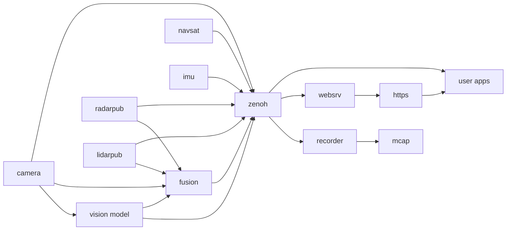

# Middleware Topics

The EdgeFirst Perception Middleware is built on a principle of having modular services handling their specialized tasks.
For example the camera service is tasked with configuring the camera source and publishing camera frames, the model service
subscribes to the camera service to receive camera frames which are then processed by the model and, in turn, publish the
model results.  There are numerous such services, some can be run in multiple instances to support multiple camera inputs
or multiple parallel models.

These middleware applications publish messages and subscribe to messages from other publishers on what is referred to as a topic.
Services will often publish to multiple topics within a namespace, for example the camera service uses the `camera` namespace
to publish a few topics such as `camera/info` which publishes information about the camera such as resolution and intrinsic
calibration parameters.  The camera service also publishes `camera/frame` which handles zero-copy of camera frames between
consumers, it can also publish the `camera/h264` or `camera/jpeg` topics for cases where compressed frames are required, such
as when recording or streaming the camera over the network.

Topics are identified by these path-like names and the underlying discovery and network connections to publish and subscribe
over topics is handled by the [Zenoh][zenoh] library.  Zenoh topics are by default available only on the local device, a service named
`zenohd` can be run to allow remote connections to the device's topics through a router interface defined as part of the Zenoh
protocol.  Messages published over Zenoh support various encodings defined through MIME types.  The EdgeFirst Middleware uses
the Common Data Representation (CDR) encoding for messages, this is an open standard encoding and the same used by ROS 2.  The
CDR encoding uses schemas to represent each type of message, the EdgeFirst Middleware uses the ROS 2 common interfaces whenever
possible and provides custom schemas when required.  The schemas are published on GitHub and we provide premade bindings for
Python, Rust, and C, refer to the [API Reference](../api/index.md).

## Hostname Namespaces

Every EdgeFirst service opens its Zenoh session with the session namespace set to the device hostname.  The services publish and
subscribe on bare application keys such as `camera/h264`, and Zenoh prefixes the namespace so the key on the wire is
`{hostname}/camera/h264`, for example `verdin-imx8mp-15141091/camera/h264`.  When the hostname is empty or invalid the services fall
back to the `localhost` namespace.

This convention replaces the `rt/` prefix used by earlier releases, which was a legacy of the Zenoh ROS 2 bridge.  The namespace keeps
the topics of several devices on the same network apart, avoids cross-talk between devices, and makes recordings from multiple devices
mergeable.  It has the following consequences for applications and tools:

- An application running on the device should open its Zenoh session with the namespace set to the hostname and then use the bare
  topic names, exactly as the services do.  This is what the [developer examples](../dev/index.md) demonstrate.
- An application running remotely, or subscribing to several devices, can subscribe with a wildcard such as `**/camera/h264` or
  `verdin-imx8mp-15141091/camera/h264` from a session without a namespace.
- The topic names in the service configuration files are written without the hostname, for example `camera/h264`.
- The [Recorder](../data_collection/recording.md) records topics with the hostname stripped, so the channels in an MCAP file are named
  `/camera/h264`, `/model/output`, and so on.  The [EdgeFirst Publisher](../data_collection/publishing.md) and EdgeFirst Studio also
  accept recordings from earlier releases carrying the `rt/` prefix or the hostname prefix.
- Applications still hard-coded to `rt/...` topics do not receive data from the current services.

The Web UI reaches the same topics through the web server, which maps its `/api/rt/{topic}` WebSocket endpoints to the bare
application keys.

## Topic Overview

The following topics are published by the stock services, the pages of this section describe each in detail along with the
schemas used.  Topics marked optional depend on the service configuration.

| Topic | Schema | Service | Notes |
|-------|--------|---------|-------|
| `camera/frame` | [CameraFrame](../api/edgefirst_msgs.md#cameraframe) | camera | Zero-copy camera frames, local consumers only |
| `camera/info` | [CameraInfo](../api/sensor_msgs.md#camerainfo) | camera | Camera intrinsics |
| `camera/h264` | [CompressedVideo](../api/foxglove_msgs.md#compressedvideo) | camera | H.264 video stream |
| `camera/jpeg` | [CompressedImage](../api/sensor_msgs.md#compressedimage) | camera | Optional JPEG frames |
| `camera/h264/{tl,tr,bl,br}` | [CompressedVideo](../api/foxglove_msgs.md#compressedvideo) | camera | Optional [4K tiles](../4k/index.md) |
| `model/output` | [Model](../api/edgefirst_msgs.md#model) | model | Boxes, masks, tracks, and timing |
| `model/info` | [ModelInfo](../api/edgefirst_msgs.md#modelinfo) | model | Model name, labels, and tensor shapes |
| `model/visualization` | [ImageAnnotations](../api/foxglove_msgs.md#imageannotations) | model | Optional Foxglove annotations |
| `model/boxes2d`, `model/mask` | [Detect](../api/edgefirst_msgs.md#detect), [Mask](../api/edgefirst_msgs.md#mask) | model | Optional legacy topics |
| `radar/targets`, `radar/clusters` | [PointCloud2](../api/sensor_msgs.md#pointcloud2) | radarpub | Radar point clouds |
| `radar/cube` | [RadarCube](../api/edgefirst_msgs.md#radarcube) | radarpub | Optional radar data cube |
| `radar/info` | [RadarInfo](../api/edgefirst_msgs.md#radarinfo) | radarpub | Radar configuration |
| `lidar/points`, `lidar/clusters` | [PointCloud2](../api/sensor_msgs.md#pointcloud2) | lidarpub | LiDAR point clouds |
| `lidar/depth`, `lidar/reflect` | [Image](../api/sensor_msgs.md#image) | lidarpub | LiDAR depth and reflectivity images |
| `fusion/radar`, `fusion/lidar` | [PointCloud2](../api/sensor_msgs.md#pointcloud2) | fusion | Points annotated with vision classes |
| `fusion/occupancy` | [PointCloud2](../api/sensor_msgs.md#pointcloud2) | fusion | Occupancy grid |
| `fusion/boxes3d` | [Detect](../api/edgefirst_msgs.md#detect) | fusion | 3D bounding boxes |
| `fusion/model_output` | [Mask](../api/edgefirst_msgs.md#mask) | fusion | Optional RadarExp model output |
| `imu` | [Imu](../api/sensor_msgs.md#imu) | imu | Orientation and motion |
| `gps` | [NavSatFix](../api/sensor_msgs.md#navsatfix) | navsat | GPS position |
| `tf_static` | [TransformStamped](../api/geometry_msgs.md#transformstamped) | camera, radarpub, lidarpub, fusion | Static sensor transforms from `base_link` |

User applications interface with the EdgeFirst Middleware by subscribing to the appropriate topics.  For example, if we need
an application to display the camera feed with bounding boxes drawn from the detection model we would write an application
which subscribes to the camera and model topics.  This application would be responsible for drawing the camera pixels and
then drawing the bounding box pixels over the camera and finally displaying the results for the user.  We provide a few
examples of such applications, the first you're likely to see is the [Web User Interface](../../platforms/quickstart/maivin/webui.md).  Our sample
code includes many examples which use the Rerun framework for drawing and demonstrate how to subscribe to topics and how
to interpret the results, such as reading bounding boxes and drawing them over the camera feed.  You'll see these examples
using Rerun for display throughout our examples, but there is no direct connection to Rerun and user applications could use
any UI of their choosing.

[zenoh]: https://zenoh.io/
