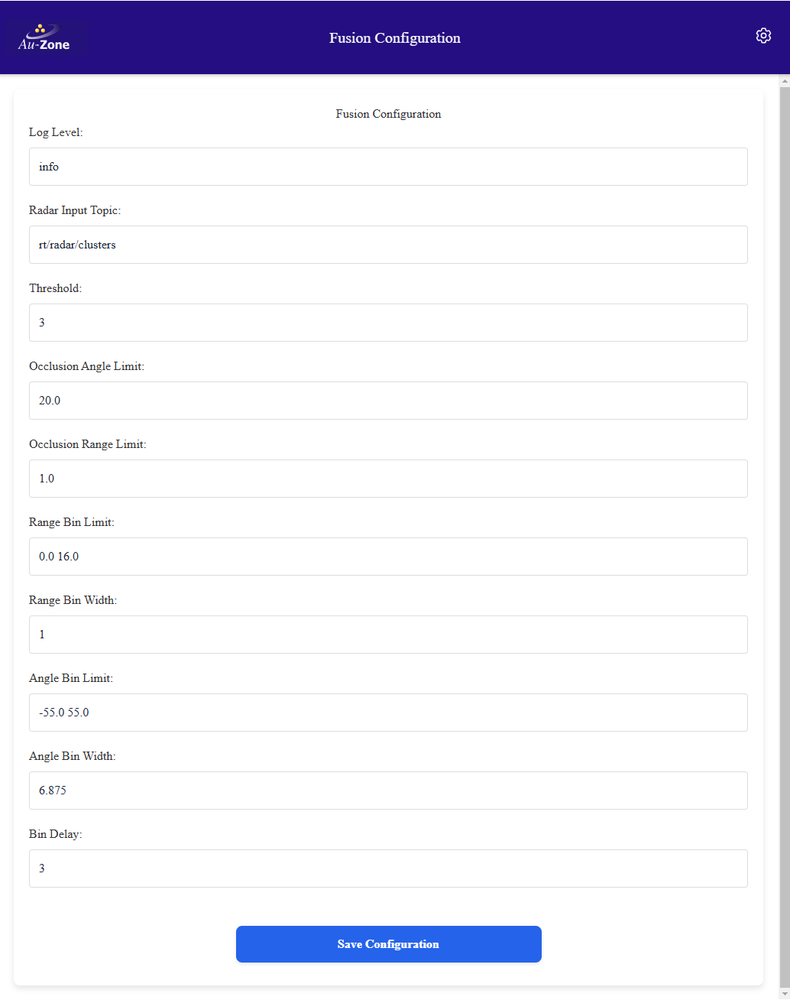

# Fusion Settings (Raivin-only)

These settings configure the perception engine that is processing input from the radar sensor and providing output on the Fusion topics.

<figure markdown="span">
{align=center}
<figcaption>Fusion Settings page</figcaption>
</figure>

!!! tip
    These values are stored in the `/etc/default/fusion` file on the device and can be hand-edited.  This is not recommended.

## Log Level

Log level for the application, relevant sub-filters include 'maivin-fusion'.  Refer to [RUST_LOG documentation][rustlog] for details.

## Radar Input Topic

The radar topic to use for a source of targets.  This is typically `/radar/clusters` which provides better target stability compared to the raw `/radar/targets` topic.
!!! Warning
    This setting is currently disabled and is being replaced by input topics for both radar and LiDAR.  These can be manually edited into the `/etc/default/fusion` file but this is not recommended.

## Occlusion Angle Limit and Occlusion Range Limit

These settings are currently disabled.

## Occupancy Settings

The following settings are only used when the radar PCD is unclustered, usually by setting the radar input topic to `/radar/targets` instead of `/radar/clusters`.  These settings configure the way Fusion service generates occupancy output from the unclustered radar PCD.

### Threshold

The number of required targets to acknowledge the target as real as opposed to noise that is filtered out.

### Range Bin Limit

The minimum and maximum range to use for range bins, in meters.

### Range Bin Width

The size of each range bin, in meters.

### Angle Bin Limit

The minimum and maximum angles, in degrees, to use for angle bins. 0 degrees is forward.

### Angle Bin Width

The size of each angle bin, in degrees.

### Bin Delay

Bin delay in radar message count.  Each cell needs to be valid for "bin delay" frames before it is drawn. The cell stops being drawn after being invalid for "bin delay" frames.

[rustlog]: https://docs.rs/env_logger/latest/env_logger/#enabling-logging
