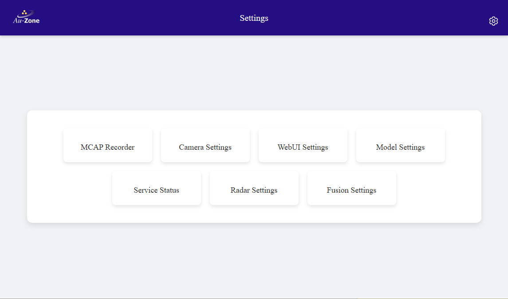

# Configuration
This section describes the various settings pages and what they do.  The root Settings Page can be reached by clicking the rightmost gear icon on the top ribbon of any page of the Raivin web-interface.

<figure markdown="span">
{align=center}
<figcaption>root Settings page</figcaption>
</figure>

Every settings page has a "Save Configuration" button at the bottom of the page. If you make changes, click this button to save them.

<figure markdown="span">
{align=center}
<figcaption>Save Configuration button</figcaption>
</figure>

As well, each settings page will have a corresponding configuration file located in `/etc/default/` on the device.  These can be edited with the `vi` text editor, for example, the `sudo vi /etc/default/camera` command will edit the configuration file for the camera service.

!!! warning
    It is not recommended for users to manually edit the configuration files in `/etc/default`.