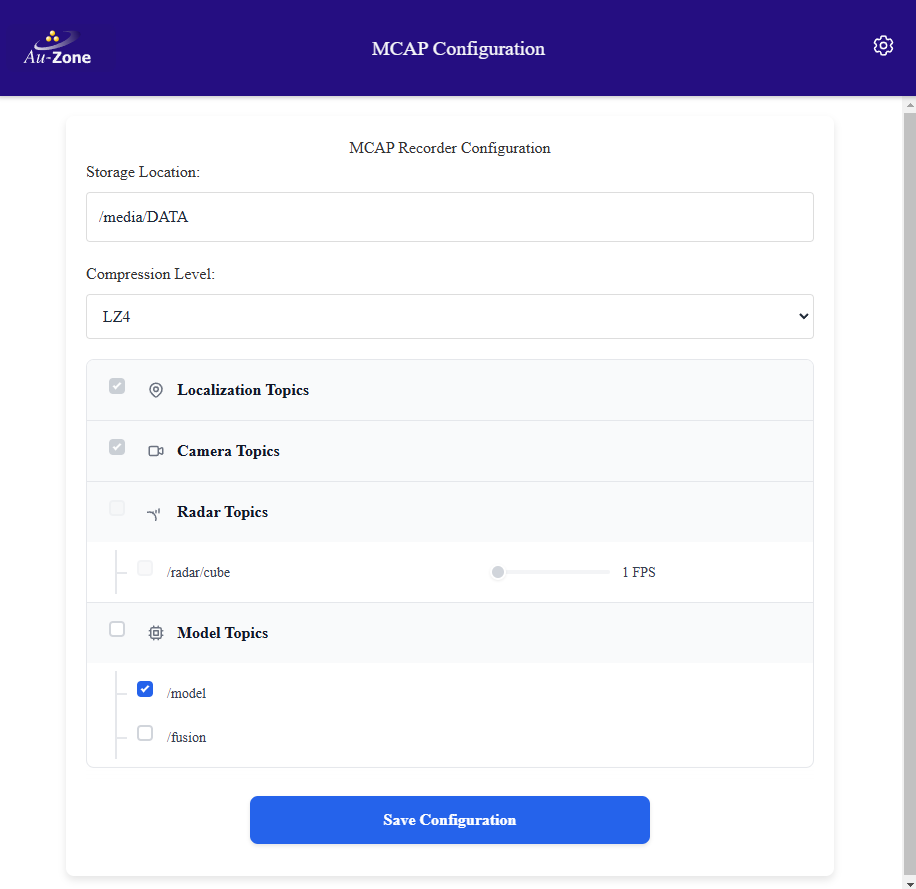

# Recorder Settings

This page configures how sensor and processed outputs are saved on the [MCAP Recording Page](../../perception/data_collection/recording.md).

<figure markdown="span">
{align=center}
<figcaption>MCAP Settings page</figcaption>
</figure>

!!! tip
    These values are stored in the `/etc/default/recorder` file on the device and can be hand-edited. This is not recommended.

## Storage Location

This controls the storage location for the MCAP recordings. If using an SD Card, this should point to `/media/DATA` or adjusted for the SD Card mount point.

## Compression

This controls the MCAP compression level. Compression will impact the CPU usage compared to no compression but can have significant benefits to MCAP size. It is most impactful when recording the `/radar/cube` or `/model/mask` topics. Options are `none`, `lz4`, and `zstd`. The [LZ4][lz4] compression is faster while [ZSTD][zstd] provides better compression. No compression is the fastest but creates files up to 3x larger.

## Default Topics Recorded

The rest of the page reports upon which topics are recording and allows the user to enable or disable certain optional topics. Mandatory topics that cannot be changed on the page include:

- Localization topics, such as:  
  - **/tf_static**: This is a meta-topic that includes information from all recorded topics.  
  - **/gps**: This is the GPS topic that includes latitude, longitude, elevation, etc.  
  - **/imu**: This is where the IMU sensor exports its information, and includes acceleration and orientation information about the vision module.
- Camera Topics, such as:  
  - **/camera/info**: This includes information about the video sensor.  
  - **/camera/h264**: This contains the raw-video output of the video sensor, in H.264 format.  
- Radar Topics (Raivin only), such as:  
  - **/radar/info**: This contains information regarding the radar.  
  - **/radar/targets**: This contains the target information from the radar sensor.  
  - **/radar/clusters**: This contains the clustered information from the radar sensor. It also opens up the "/radar/cube" topic that can be enabled.  

These topics are parts of the "Localization Topics", "Camera Topics", and "Radar Topics", which are currently locked.

## Configurable Topics to be Recorded

Several configuration boxes can be interacted with, and will enable recording of additional topics, as described below.

### Radar Cube (Raivin Only)

- **/radar/cube**: The raw radar cube data output. This can be a lot of data, and we expose a setting to the user to limit this.

The Radar Cube FPS setting limits the radar cube framerate to reduce recording size. While the camera topic is encoded with H.264 which makes use of keyframes to significantly reduce the topic size, no such compression is available for the radar cube which means only the COMPRESSION parameter applies (if enabled). While capturing datasets, the full 18 FPS is typically not required and it is recommended to set this parameter to 1-5 FPS to reduce the MCAP size.

### Model Recording

Checking the "/model" topic box enables the following topics:

- **/model/info**: This contains information regarding the model being run.
- **/model/boxes2d**: This includes detection boxes from the model, if the model supports object detection.
- **/model/mask_compressed**: This contains the output of the segmentation model if running.

### Fusion Recording (Raivin Only)

Checking the "/fusion" topic box enables recording of the following topics:

- **/fusion/radar**: This contains information regarding the analysis of the radar targets, including the classes of the targets reported by both the Vision and Fusion outputs.
- **/fusion/lidar**: This contains information regarding the analysis of the LiDAR targets, including the classes of the targets reported by both the Vision and Fusion outputs.
- **/fusion/occupancy**: This contains information regarding the occupancy of targets on a polar grid emanating from the camera.

## Caveats

There are several settings that will stop or change specific topics, which may result in the topic not being recorded.

- On the [Model Settings](model.md) page:  
  - [Enabling Visualization](model.md#visualization) will create the `/model/visualization` topic  
  - [Disabling Mask Compression](model.md#mask_compression) will stop the `/model/mask_compressed` topic and start the `/model/mask` topic  
  - [Loading a Model without detection or segmentation outputs](model.md#model) will stop the corresponding `/model/boxes2d` or `/model/mask_compressed` topics  
- On the [Camera Settings](camera.md) page:  
  - [Setting the Camera Size to 4k](camera.md#camera-size) will put the Camera service into [4K Mode](../../perception/4k/index.md) and create the `/camera/h264/tl`, `/camera/h264/tr`, `/camera/h264/bl`, and  `/camera/h264/br` topics while stopping the default `/camera/h264` topic.
  - [Disabling H264 streaming](camera.md#h264-streaming) will stop the `/camera/h264` topic
  - [Enabling JPEG streaming](camera.md#jpeg-streaming) will create the `/camera/jpeg` topic

Topics that have been stopped by a configuration change cannot be recorded into an MCAP file. However, the new topics created by the above changes are not automatically added to the MCAP recorder and will need to be added manually.

### Adding Topics Manually to the Recording Service

Topics that are not included by the WebUI front-end to be recorded must be added manually at the platform command-line interface. You will need to [SSH into the platform](../../platforms/networking/ssh.md). Then, the topics will need to be added manually to the `TOPICS` line in the `/etc/default/recorder` configuration file. To edit this file, you need to run the `sudo vi /etc/default/recorder` command.

!!! Tip
    If you are unfamiliar with `vi`, please read a [quick tutorial][vi].

The default topics line should read:

```
TOPICS = "/tf_static /imu /gps /camera/info /camera/h264 /radar/clusters /radar/targets /radar/info /model/info /model/boxes2d /model/mask_compressed"
```

To add topics to be recorded, simply add them in the quoted portion as space-separated items. For example, if we wanted to add the 4K tiles topics, we would just change the line to:

```
TOPICS = "/tf_static /imu /gps /camera/info /radar/clusters /radar/targets /radar/info /model/info /model/boxes2d /model/mask_compressed /camera/h264/tl /camera/h264/tr /camera/h264/bl /camera/h264/br"
```

[vi]: https://www.tutorialspoint.com/unix/unix-vi-editor.htm
[lz4]: https://lz4.org/
[zstd]: https://facebook.github.io/zstd/
