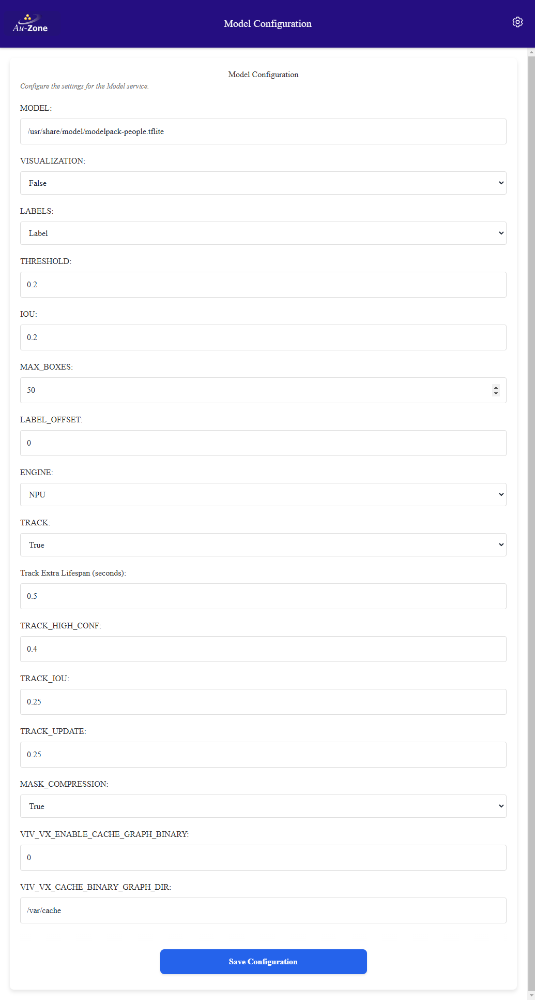

# Model Settings

These settings configure the perception engine that is processing input from the video sensor and providing output on the model topics.

<figure markdown="span">
{align=center}
<figcaption>Model Settings page</figcaption>
</figure>

!!! tip
    These values are stored in the `/etc/default/model` file on the device and can be hand-edited.  This is not recommended.

## Model

A model is required for the model application for 2D image processing. This can be a segmentation model and/or a detection model.  By default, Maivin/Raivin comes with three [ModelPack](../../models/modelpack/index.md) models at trained on the [COCO People dataset](../../datasets/coco_people/index.md), located in the `/usr/share/model` directory:

| Model Name | Segmentation Masks? | Detection Boxes? | Default? |
| ---------- | :-----------------: | :--------------: | :------: |
| modelpack-people.tflite | :material-check: | :material-check: | :material-check: |
| modelpack-people-detect.tflite | :material-close: | :material-check: | :material-close: |
| modelpack-people-mask.tflite | :material-check: | :material-close: | :material-close: |

## Engine

The model can be run using different computation engines.  The default engine is the NPU for the [i.MX 8M Plus](https://www.nxp.com/products/i.MX8MPLUS).  Other options are the CPU or the GPU.

## Detection-only Settings

The following settings will only impact detection-based output in the `/model/boxes2d` topic with models that output object detection results.

### Visualization

Enables publishing the legacy visualization message for detection models.  It is 'false' by default which means only the primary model box and mask topics will be available.  If using [Foxglove Studio](../../perception/data_collection/foxglove.md) make sure you install the [EdgeFirst for Foxglove Plug-in](../../perception/data_collection/foxglove.md#installing-edgefirst-plugin).  If set to 'true', the `/model/visualization` topic will be created which can be used by FoxGlove to draw the default detection boxes.

### Threshold

Score threshold sets the minimum detection score before a bounding box is generated for the inferred object for detection.

### IOU

Detection IoU controls the minimum overlap for merging boxes during NMS.  A larger number will produce more boxes with some overlap while a smaller number will generate fewer boxes.

### MAX_BOXES

The maximum number of detection boxes which can be generated.

### LABEL_OFFSET

The label offset is required for certain models to account for differences in background class handling relative to the labels.  It should usually be zero but some odd configurations will sometimes require 1 or -1 for offset.

## Track Settings

These settings impact object tracking with object detection.  They have no effect for segmentation-only models.

### TRACK

This turns on the [ByteTrack][bytetracker] tracker. This is useful for smoothing bounding boxes across frames, and for associating multiple detections over time to a single object. None of the other settings will have an effect if this is set to 'false'.

### Track Extra Lifespan (seconds)

The number of seconds a tracked object can be missing for before being removed from tracking.

### TRACK_HIGH_CONF

The high confidence threshold for the ByteTrack algorithm.

### TRACK_IOU

The tracking IoU threshold for box association. Higher values will require boxes to have higher IoU to the predicted track location to be associated.

### TRACK_UPDATE

The tracking update factor. Higher update factor will mean less smoothing but more rapid response to change. Use values from 0.0 to 1.0. Values outside this range will cause unexpected behavior.

## Segmentation-only Settings

The following setting will only impact segmentation-based output in the `/model/mask_compressed` or `/model/mask` topics with models that output segmentation results.

### MASK_COMPRESSION

Enable compression for segmentation masks.  When enabled, both the `/model/mask` and `/model/mask_compressed` topics will be available.  The compressed mask should be used from remote connections while the uncompressed topic should be used from local connections to avoid redundant compress/decompress steps.

!!! warning
    Turning off mask compression will disable the `/model/mask_compressed` topic.  The WebUI will need to have its [Mask Topic](webui.md#topics) changed to `/model/mask`.  The segmentation mask will also not be recorded.

## OpenVX Graph Caching

The OpenVX driver provides a graph caching mechanism that significantly speeds up future reload times for the graph.  The cache stores a binary representation of the in-memory graph, not the model used to generate the graph, to the file system.  When loading a model, graph generation proceeds as normal but the time-consuming graph loading step will first attempt to load the cached representation.  

The driver allows for many graphs to be stored and the location, along with enabling the feature, is controlled through a pair of environment variables.  This allows a user to select on a per-process basis when to enable graph cache and where to store the cache.

These settings enable and configure this functionality.

### VIV_VX_ENABLE_CACHE_GRAPH_BINARY

This option will enable the graph caching which significantly speeds up load times for models.  If you encounter issues set to 0 to disable.

### VIV_VX_CACHE_BINARY_GRAPH_DIR

This controls the NPU graph cache storage location.

[bytetracker]: https://arxiv.org/abs/2110.06864
