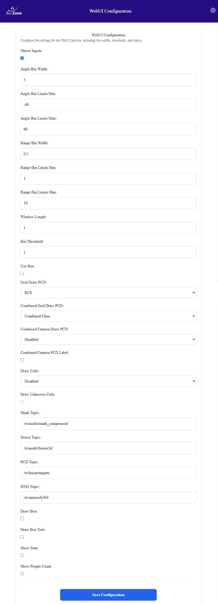
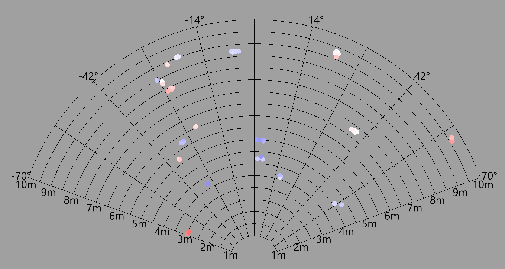
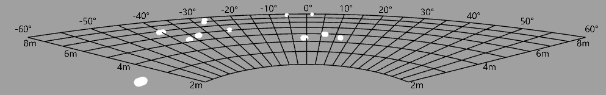
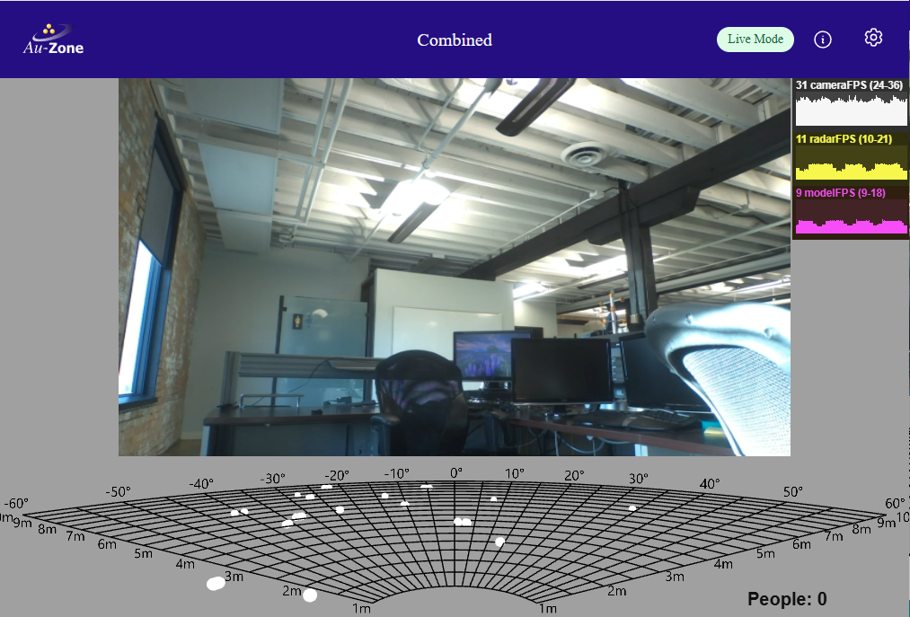

# WebUI Settings

This page configures how information is displayed on the [Segmentation Page](../walkthrough.md#the-segmentation-page).

<figure markdown="span">
{align=center}
<figcaption>WebUI Settings page</figcaption>
</figure>

!!! tip
    These values are stored in the `/etc/default/webui` file on the device and can be hand-edited.  This is not recommended.

## Mirror Inputs

This mirrors both the Segmentation View as well as the Occupancy Grid on the Segmentation page.

## Angle Bins

These three settings set the left-side minimum, right-side maximum, and width size (in degrees) of the angular radar views on the Segmentation and Occupancy pages.  The image below shows a minimum of -70, maximum of 70, and a binwidth of 14.

<figure markdown="span">
{align=center}
<figcaption>Grid -70 by 70 at 14 steps</figcaption>
</figure>

## Range Bins

These three settings set the near-side minimum, far-side maximum, and width size (in meters) of the radar views on the Segmentation and Occupancy pages.  The image below shows a minimum of 2, maximum of 9, and a binwidth of 1.

<figure markdown="span">
{align=center}
<figcaption>Grid 2 to 9 by 1 range</figcaption>
</figure>

## Draw PCD

There are three settings for drawing the Point Cloud Data (PCD):

- **Grid Draw PCD**: This controls drawing the PCD on the Occupancy Page.
- **Combined Grid Draw PCD**: This controls drawing the PCD on the Occupancy Grid on the Segmentation Page.
- **Combined Camera Draw PCD**: This controls drawing the PCD on the Segmentation View on the Segmentation Page.

Each of these settings can be configured to disable drawing the PCD, or draw it based on radar power, radar cross-section (RCS) area, speed of object, or post-processed output from the Fusion model, Vision model, or Combined from both.

## Topics

The topic settings control the following:

- **Mask Topic**: This sets what topic the Segmentation View uses as input to draw segmentation masks.
- **Detect Topic**: This sets what topic the Segmentation View uses as input to draw detection boxes.
- **PCD Topic**: This sets what topic the Segmentation View and both Occupancy Grids use as input to draw radar data.
- **H264 Topic**: This sets what topic the Segmentation View uses to get the video feed.

## Draw Boxes and Draw Boxes Text

The settings turn on objection detection boxes and text from the Detect Topic to display on the Segmentation View.  If there is no Detect Topic, boxes will not be displayed.

## Show Stats and People Count

These settings enable statistics views and a people counter on the Segmentation and Occupancy Pages.  The statistics are near the top right of the screen while the people counter is at the bottom right.

<figure markdown="span">
{align=center}
<figcaption>Statistics</figcaption>
</figure>
