# Foxglove Studio

[Foxglove Studio][foxglove] is an open source application developed by FoxGlove Technologies, Inc.  It is part of the [Robot Operating System (ROS)][ros] ecosystem and supports playback for MCAP recordings.  You can [download Foxglove Studio][foxglove_dl] as well as our [EdgeFirst plug-in for Foxglove][github_edgefirst_dl] and customized [Raivin Foxglove layout](assets/Raivin_Foxglove_Layout.json){: download="Raivin_Foxglove_Layout.json" }

## Getting Started

Let's discuss how to install our custom plugins once you've installed Foxglove Studio.

### Installing EdgeFirst Plugin

!!! note
      These guidelines describes installation of version 1.1.3 of the EdgeFirst plug-in for Foxglove, which is current as of time of writing.

1. Open Foxglove Studio

2. If necessary, uninstall any existing versions of the EdgeFirst plug-in
   - Click the User Settings button on the right side of the top menu bar.
   - Select the Extensions option in the pull-down menu.

      <figure markdown="span">
      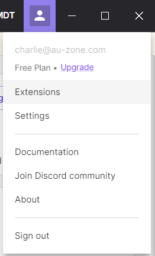{align=center}
      <figcaption>Foxglove Settings</figcaption>
      </figure>

   - Click the EdgeFirst Schemas plugin (or the older EdgeFirst Detect plugin)

      <figure markdown="span">
      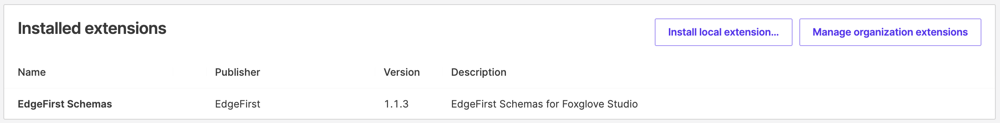{align=center}
      <figcaption>Foxglove Extension View</figcaption>
      </figure>

   - Click the "Uninstall" button.

      <figure markdown="span">
      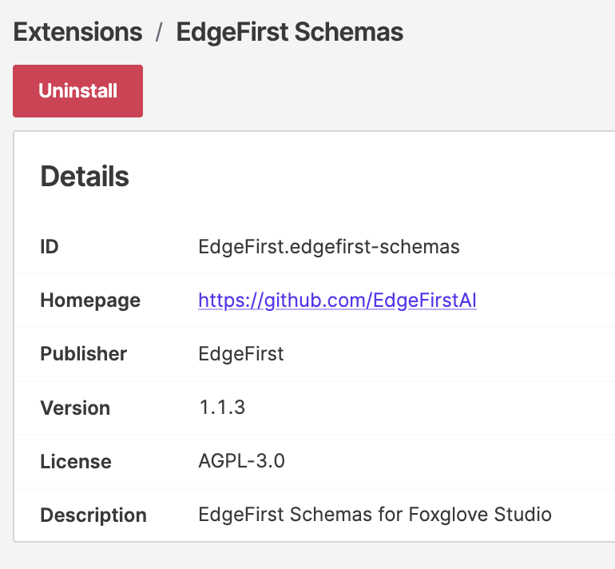{align=center}
      <figcaption>Foxglove Install Extension</figcaption>
      </figure>

   - Click the "Back to dashboard" button in the top-left corner of the application main window.

3. Install the current version of the EdgeFirst plug-in.

   - Click the User Settings button on the right side of the top menu bar.
   - Select the Extensions option in the pull-down menu.  

      <figure markdown="span">
      {align=center}
      <figcaption>Foxglove Settings</figcaption>
      </figure>

   - Click the "Install local extension..." button.  

      <figure markdown="span">
      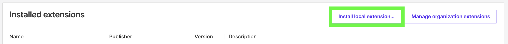{align=center}
      <figcaption>Foxglove Extension View</figcaption>
      </figure>

   - Select the `edgefirst.edgefirst-schemas-1.1.3.foxe` file or a later version from the downloads directory.

4. Confirm that the 1.1.3 version was installed or the latest version available.

      <figure markdown="span">
      {align=center}
      <figcaption>Foxglove Extension View with 1.1.3</figcaption>
      </figure>

5. Close Foxglove Studio and restart it.

### Installing Foxglove Layout

We have included a [Custom Raivin Layout for Foxglove Studio](assets/Raivin_Foxglove_Layout.json){: download="Raivin_Foxglove_Layout.json" }. Please download it and follow the instructions below.

1. Open Foxglove Studio.
2. Load an MCAP file downloaded from the Raivin.
3. Click the "Layout" button in the top taskbar.
4. Select the "Import from file..." option in the Layout menu.  

 <figure markdown="span">
 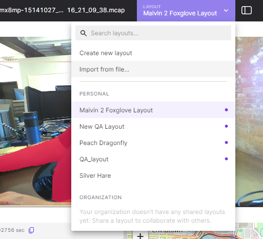{align=center}
 <figcaption>Foxglove Layout</figcaption>
 </figure>

5. Go to the download directory holding the JSON layout file and select the file.
6. Confirm the layout JSON file is loaded.  

 <figure markdown="span">
 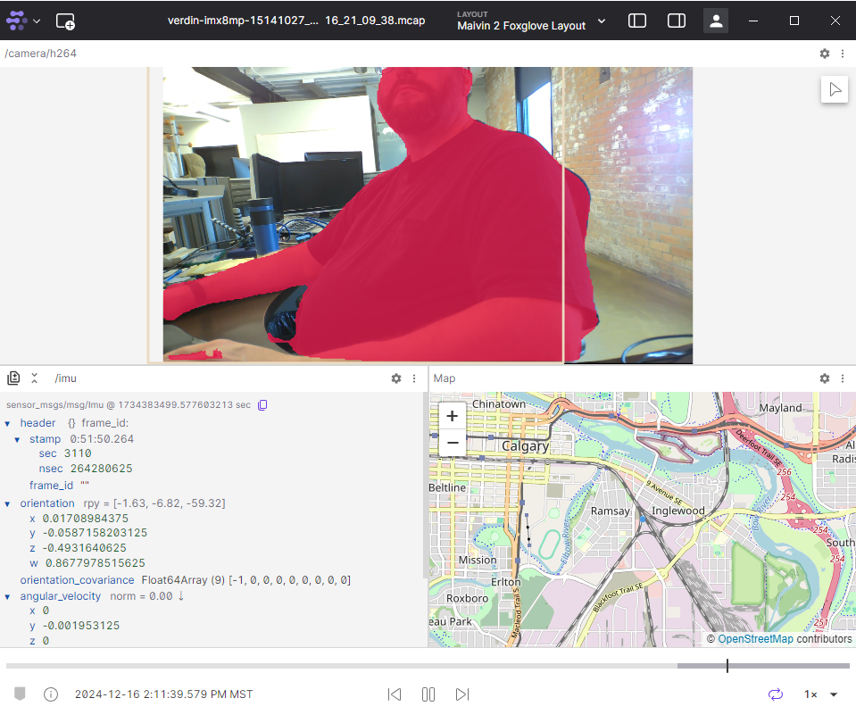{align=center}
 <figcaption>Foxglove Scene</figcaption>
 </figure>

### Layout Features

The default Raivin layout includes:

- Top panel: H.264 camera stream with bounding box overlays
      - Shows detection results (i.e. the colored boxes around people when using a detection model)
      - Shows segmentation masks (i.e. the coloured blobs covering detected objects when using a segmentation model)
- Bottom right panel: GPS coordinates map view
      - Interactive map with zoomable blue target showing camera position
- Bottom left panel: IMU sensor readings
      - Can be configured to show real-time plots
- Bottom timeline: Playback controls for navigation

## Visualization Features

In the example above, we see both detection boxes and segmentation masks in the H.264 Camera topic.

### Viewing Detection Messages

The detection boxes are contained in the `/model/boxes2d` topic.  By default, this topic is not enabled.  See the Maivin Dataset Recording section for details on how to enable this topic and record an MCAP with the Raivin.

!!! note
 Not all vision models are able produce detection results.  The default model on the Raivin can produce both detection and segmentation results.

1. Record a MCAP file that captures the `/model/boxes2d` topic.
2. Confirm with the "Details" button that the newly recorded MCAP has a `/model/boxes2d` topic.  

 <figure markdown="span">
    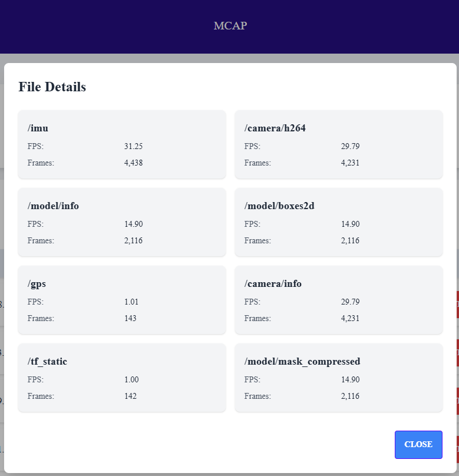{align=center}
 <figcaption>MCAP Details</figcaption>
 </figure>

3. Download the file from the Raivin and load it in Foxglove Studio.
4. Click the "Settings" gear icon on the right side of the `/camera/h264/` panel task bar.
5. The `/model/boxes2d` option should appear in the "Image annotations" dropdown menu in the "Image Panel" settings sidebar (bottom left of image below).  

 <figure markdown="span">
    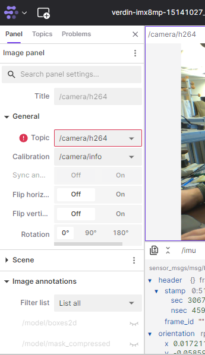{align=center}
 <figcaption>Foxglove Detect Plugin View</figcaption>
 </figure>

6. Enable the `/model/boxes2d` image annotations by clicking the closed eye icon. This will draw boxes around the detected objects.  

 <figure markdown="span">
    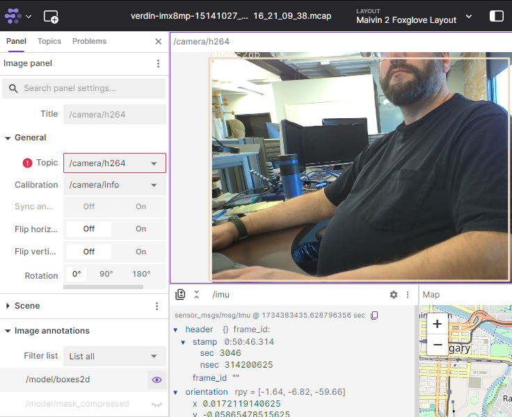{align=center}
 <figcaption>Foxglove Detect Boxes Enabled</figcaption>
 </figure>

### Viewing Segmentation Messages

Segmentation masks are contained in the `/model/mask_compressed` topic which is enabled on the Raivin by default.  Because of the amount of data included within this stream, it is not compatible with the default Image drawing API in Foxglove Studio. To visualize the Segmentation Mask, the EdgeFirst Foxglove plug-in must be installed to view segmentation masks in Foxglove.

The instructions to view these masks are the same as above but using the `/model/mask_compressed` topic instead of the `/model/boxes2d` topic.

<figure markdown="span">
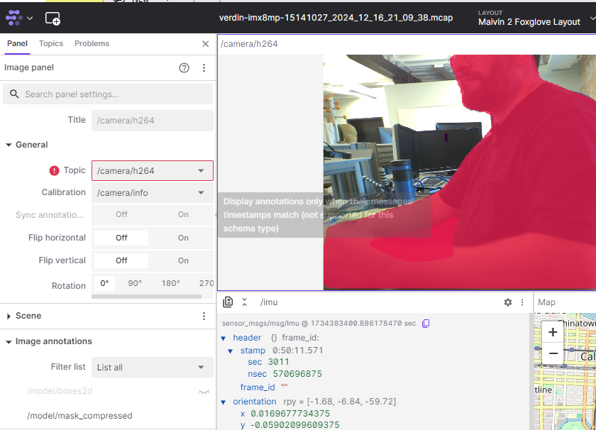{align=center}
<figcaption>Foxglove Detect Boxes Enabled</figcaption>
</figure>

### Viewing /radar/cube Messages

By default, none of the radar topics are recorded as part of an MCAP file.  The Image panel in Foxglove can viewer can:

1. Record a MCAP file that has the `/radar/cube` message in it. See Maivin Dataset Recording for details.
2. Play the MCAP file in Foxglove Studio. See Playback MCAP with Foxglove Studio for details.
3. In the image panel, the `/radar/cube` topic should appear under the list of valid image topics.  

 <figure markdown="span">
 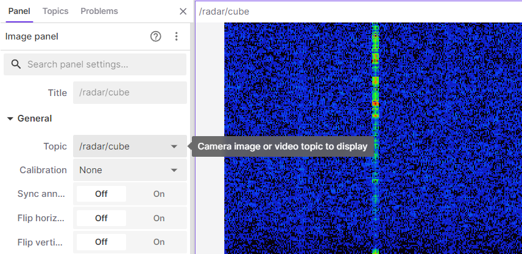{align=center}
 <figcaption>Foxglove Radar Mask</figcaption>
 </figure>

4. Select the `/radar/cube` topic.
5. Change the color mode to Color Map, and select Turbo for the color map.  

 <figure markdown="span">
 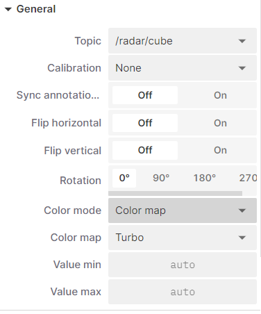{align=center}
 <figcaption>Foxglove Radar Message</figcaption>
 </figure>
 
6. Leave the value min and value max on auto.
7. You can now see the `/radar/cube` message.  

<figure markdown="span">
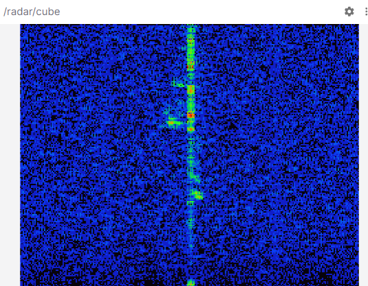{align=center}
<figcaption>Foxglove Final Radar View</figcaption>
</figure>

### IMU Data Plotting

To create IMU sensor plots:

1. Convert bottom left panel to Plot view
2. Click "Add a Series"
3. Select `/imu` as the topic
4. Choose desired parameters (e.g, angular_velocity, x, y, z)
5. Repeat to add additional plot series as needed.

 <figure markdown="span">
    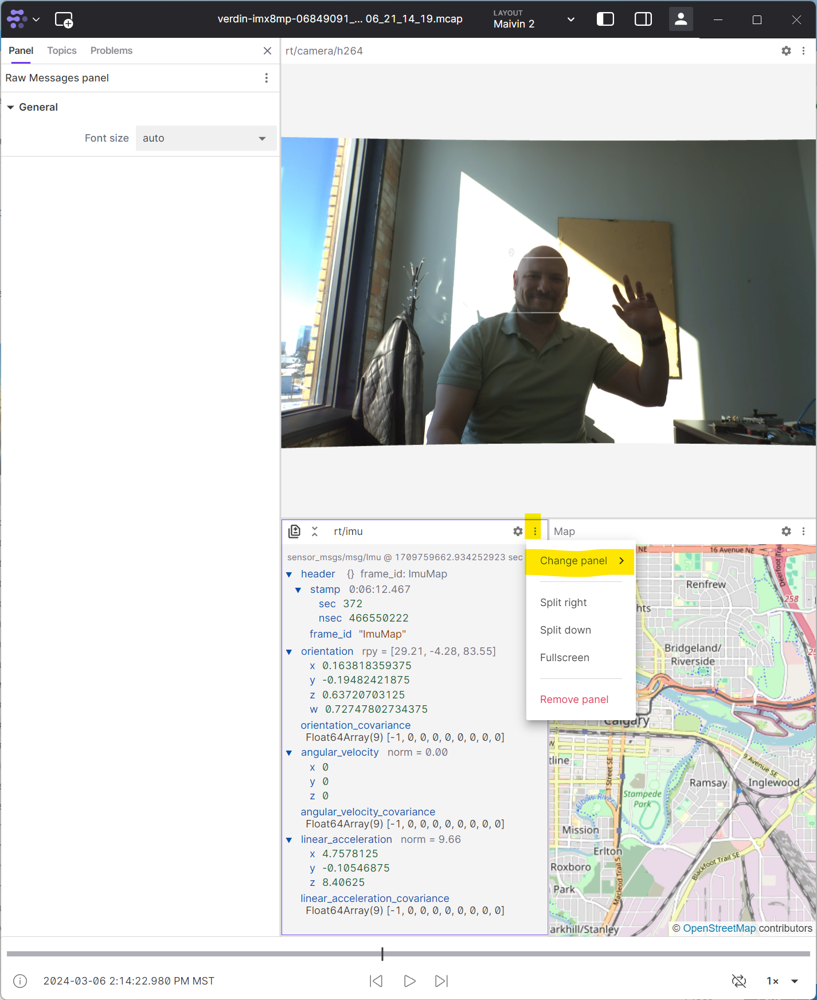{align=center}
 <figcaption>IMU</figcaption>
 </figure>

 <figure markdown="span">
    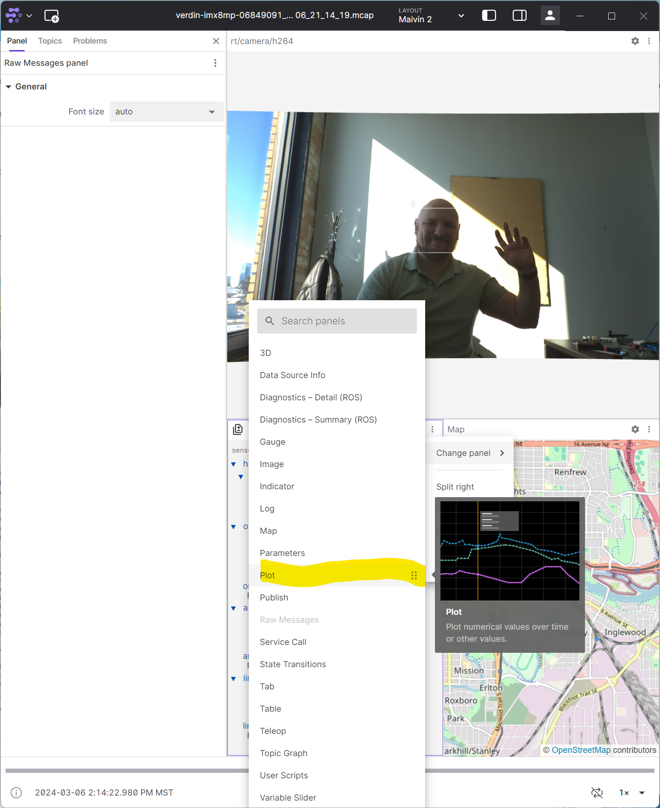{align=center}
 <figcaption>IMU to Plot</figcaption>
 </figure>

 <figure markdown="span">
    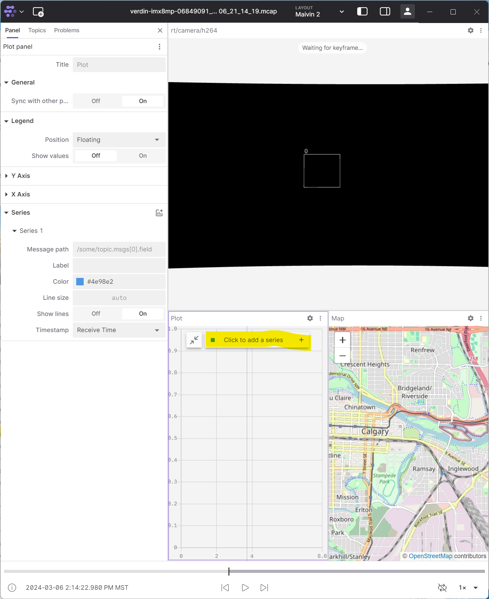{align=center}
 <figcaption>Plot</figcaption>
 </figure>

 <figure markdown="span">
    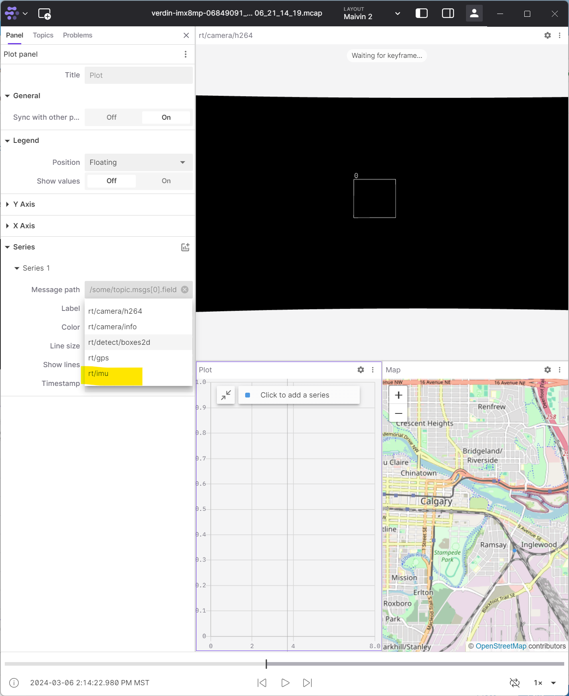{align=center}
 <figcaption>IMU Message</figcaption>
 </figure>

 <figure markdown="span">
    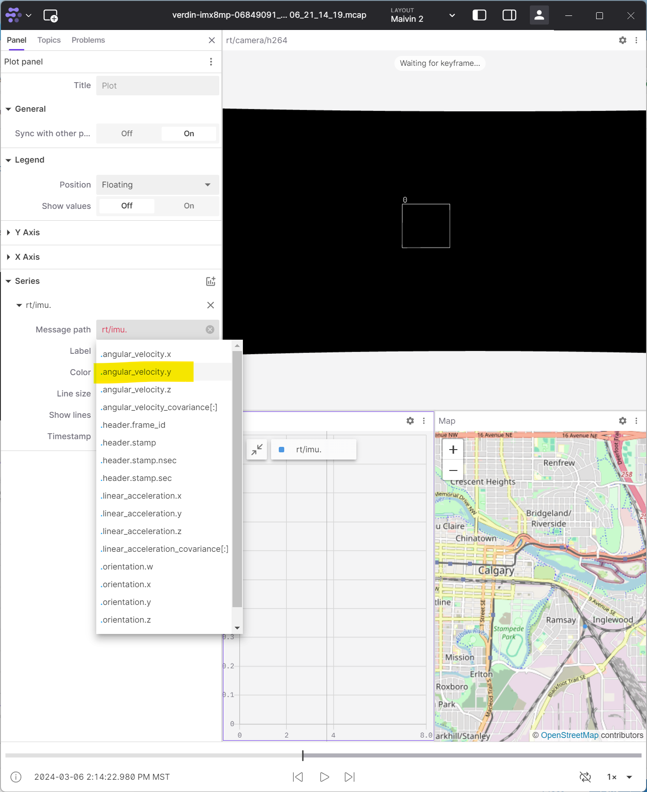{align=center}
 <figcaption>IMU Velocity</figcaption>
 </figure>

 <figure markdown="span">
    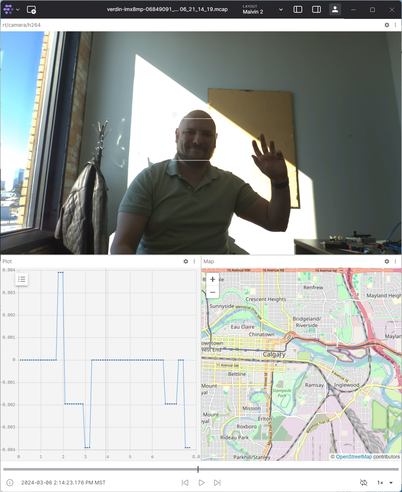{align=center}
 <figcaption>IMU Final View</figcaption>
 </figure>

## Additional Resources

For more detailed information about Foxglove Studio features, visit the [Foxglove Documentation website][foxglove_doc].

[foxglove]: https://foxglove.dev/
[foxglove_dl]: https://foxglove.dev/download
[foxglove_doc]: https://docs.foxglove.dev/docs/introduction/
[github_edgefirst_dl]: https://github.com/EdgeFirstAI/foxglove/releases/latest
[ros]: https://ros.org/
