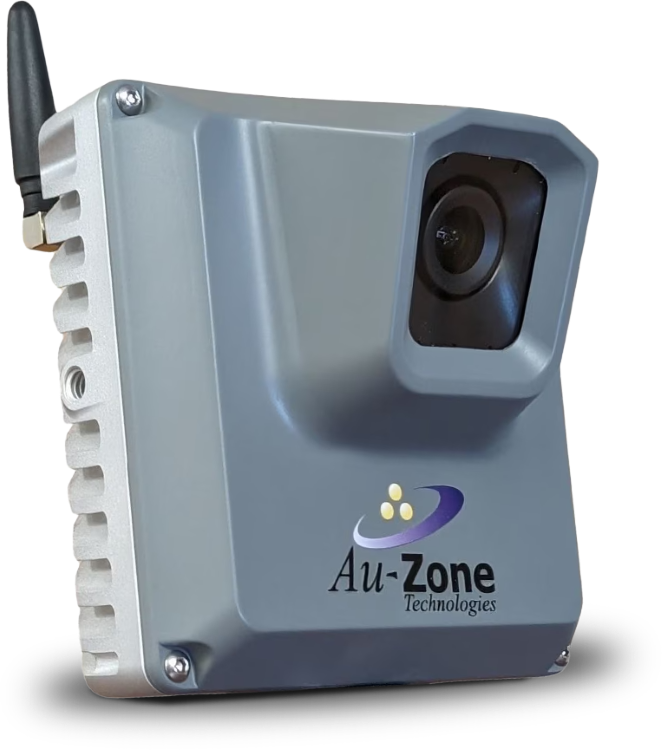
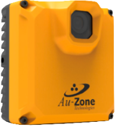

# EdgeFirst Platforms User Manual

This is the EdgeFirst Platforms User Manual.  It provides information on how to use the EdgeFirst Perception Middleware in both the vision-only Maivin configuration and the combined vision and radar Raivin configuration.  If you have purchased a Maivin or Raivin vision module, please continue on to the [Quickstart Guide](./quickstart.md) for an unboxing of your new module.

The following devices are recognized EdgeFirst Platforms.

**Maivin** | **Raivin**
:------------------:|:------------------:
 | 