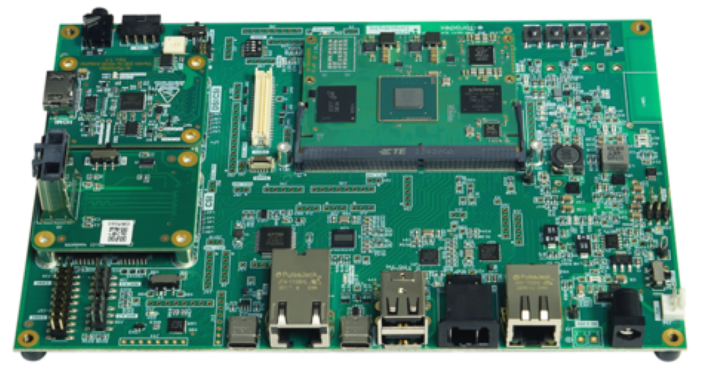
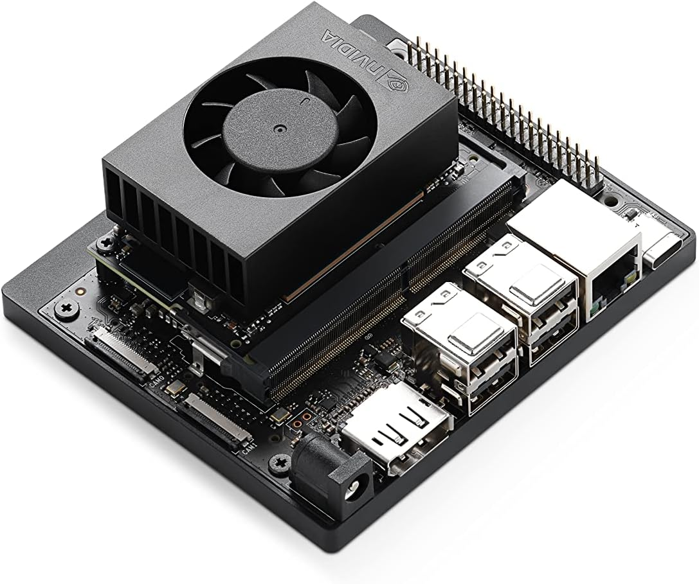
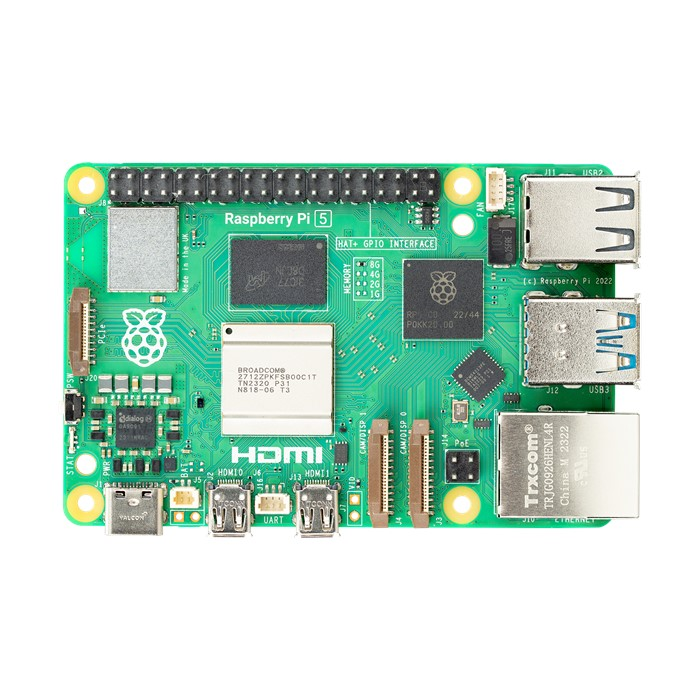

# Supported Platforms

This section covers Quick Start guides for deploying the EdgeFirst workflow in your platform. These guides will start from setting up your platform to running model inference in your platform.

=== "EdgeFirst"

    - **Maivin**: Vision-only configuration
    - **Raivin**: Combined vision and radar configuration

    **Maivin** | **Raivin** 
    :-----------------------------:|:----------------------------: 
     | 

=== "NXP"

    **i.MX 8M Plus** | **i.MX 95** 
    :-----------------------------:|:----------------------------: 
     | 

=== "NVIDIA"
    
    **NVIDIA Jetson Orin Nano**
    

=== "Raspberry Pi"

    **Raspberry Pi 5**
    
