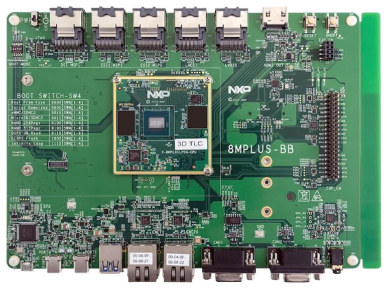
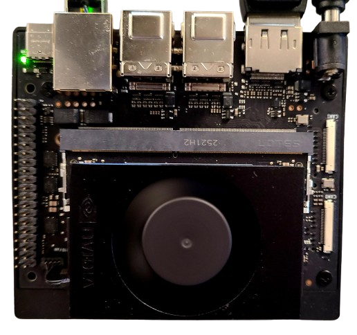
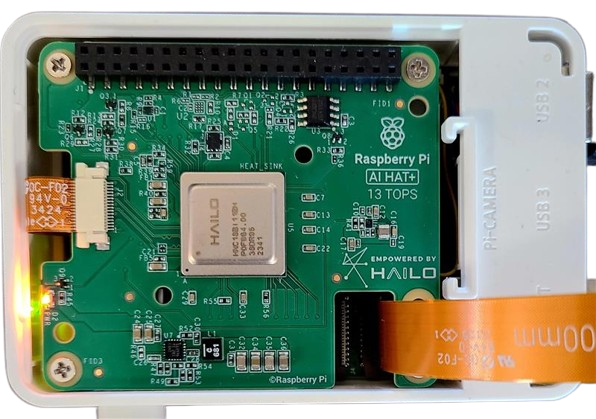

# Supported Platforms

This section covers Quick Start guides for deploying the EdgeFirst workflow in your platform. These guides will start from setting up your platform to running model inference in your platform.

=== "EdgeFirst"

    **[Maivin](quickstart/maivin/index.md)** | **[Raivin](quickstart/raivin/index.md)** 
    :-----------------------------:|:----------------------------: 
     | 
    **Vision-only configuration**  | **Combined vision and radar/LiDAR configuration**

=== "NXP"

    **[i.MX 8M Plus](quickstart/imx8mplus/index.md)** | **[i.MX 95](quickstart/imx95/index.md)** 
    :-----------------------------:|:----------------------------: 
     | 

=== "NVIDIA"

    **[NVIDIA Jetson Orin Nano](quickstart/jetson_orin/index.md)**

    

=== "Raspberry Pi"

    **[Raspberry Pi 5](quickstart/raspberrypi/index.md)**
    
    

The following diagram describes the workflow you will follow depending on the hardware available.

```mermaid
%%{init: {"flowchart": {"defaultRenderer": "elk", "nodeSpacing": 60, "rankSpacing": 80}, "themeVariables": { "fontSize": "40px" }} }%%

flowchart LR
    classDef blue fill:#d0ecff80,font-weight:bold;
    classDef teal fill:#a2e8ed80,font-weight:bold;
    classDef orange fill:#ffd69980,font-weight:bold;
    classDef green fill:#a9e5bb80,font-weight:bold;
    classDef purple fill:#d6c1f580,font-weight:bold;
    classDef coral fill:#ffc2bb80,font-weight:bold;
    classDef all fill:#f0e6f580,font-weight:bold;
    classDef invisible fill:transparent,stroke:transparent;

    %% ---------- USER GROUP ----------
    subgraph Users
    direction TB
    users_pad[" "]:::invisible
    maivin_user([Maivin]):::blue 
    click maivin_user "quickstart/maivin/" "Open Maivin"

    raivin_user([Raivin]):::orange 
    click raivin_user "quickstart/raivin/" "Open Raivin"

    imx8mp_user([i.MX 8M Plus]):::green 
    click imx8mp_user "quickstart/imx8mplus/" "Open i.MX 8M Plus"

    imx95_user([i.MX 95]):::teal 
    click imx95_user "quickstart/imx95/" "Open i.MX 95"

    orin_user([Jetson Orin]):::purple 
    click orin_user "quickstart/jetson_orin/" "Open Jetson Orin"

    pi_user([Raspberry Pi 5]):::coral 
    click pi_user "quickstart/raspberrypi/" "Open Raspberry Pi 5"
    end

    %% ---------- SETUP ----------
    subgraph Device_Setup
    direction TB
    setup_pad[" "]:::invisible
    maivin_setup[Setup Maivin]:::blue 
    click maivin_setup "quickstart/maivin/setup" "Open Maivin Setup"

    raivin_setup[Setup Raivin]:::orange
    click raivin_setup "quickstart/raivin/setup" "Open Raivin Setup"

    imx8mp_setup[Setup i.MX 8M Plus]:::green
    click imx8mp_setup "quickstart/imx8mplus/setup" "Open i.MX 8M Plus Setup"

    imx95_setup[Setup i.MX 95]:::teal 
    click imx95_setup "quickstart/imx95/setup" "Open i.MX 95 Setup"

    orin_setup[Setup Jetson Orin]:::purple
    click orin_setup "quickstart/jetson_orin/setup" "Open Jetson Orin Setup"

    pi_setup[Setup Raspberry Pi 5]:::coral 
    click pi_setup "quickstart/raspberrypi/setup" "Open Raspberry Pi Setup"

    copy_dataset[[Copy Sample Dataset]]
    click copy_dataset "../getting_started/copy_dataset" "Copy Public Dataset"
    end

    %% ---------- TRAINING ----------
    subgraph Training
    direction TB
    training_pad[" "]:::invisible
    train_2d[[Train Vision Model]]
    click train_2d "../models/training/vision" "Open Training Vision"

    ara2{Device has ARA2 processor?}
    validate_2d[Validate Vision Model]
    click validate_2d "../models/validation/vision/user_managed" "Open Validating Vision"

    train_3d[[Train Fusion Model]]:::orange 
    click train_3d "../models/training/fusion" "Open Training Fusion"

    validate_3d[Validate Fusion Model]:::orange 
    click validate_3d "../models/validation/fusion/managed" "Open Validating Fusion"
    end

    %% ---------- CONVERSION ----------
    subgraph Model_Conversion
    direction TB
    conversion_pad[" "]:::invisible
    neutron_converter[Neutron Converter]:::teal 
    click neutron_converter "../models/ultralytics/neutron" "Open Neutron Converter"

    kinara_converter[Kinara Converter]

    validate_imx95[Validate Neutron Converted Model]:::teal 
    click validate_imx95 "../models/validation/vision/user_managed" "Open Validating Vision"
    end

    %% ---------- DEPLOYMENT ----------
    subgraph Deployment
    direction TB
    deploy_pad[" "]:::invisible
    browser((Browser))

    maivin((Maivin)):::blue 
    click maivin "quickstart/maivin/deploy" "Open Maivin Deploy"

    raivin((Raivin)):::orange 
    click raivin "quickstart/raivin/deploy" "Open Raivin Deploy"

    imx8mp((i.MX 8M Plus)):::green 
    click imx8mp "quickstart/imx8mplus/deploy" "Open i.MX 8M Plus Deploy"

    imx95((i.MX 95)):::teal 
    click imx95 "quickstart/imx95/deploy" "Open i.MX 95 Deploy"

    orin((Jetson Orin)):::purple 
    click orin "quickstart/jetson_orin/deploy" "Open Jetson Orin Deploy"

    pi((Raspberry Pi 5)):::coral 
    click pi "quickstart/raspberrypi/deploy" "Open Raspberry Pi Deploy"
    end

    %% ---------- USER → SETUP ----------
    maivin_user --> maivin_setup
    raivin_user --> raivin_setup
    imx8mp_user --> imx8mp_setup
    imx95_user --> imx95_setup
    orin_user --> orin_setup
    pi_user --> pi_setup

    %% ---------- SETUP → DATA ----------
    maivin_setup --> copy_dataset
    raivin_setup --> copy_dataset
    imx8mp_setup --> copy_dataset
    imx95_setup --> copy_dataset
    orin_setup --> copy_dataset
    pi_setup --> copy_dataset

    %% ---------- CONVERSION ----------
    train_2d --> neutron_converter --> validate_imx95
    ara2 -- Yes --> kinara_converter --> validate_2d
    ara2 -- No --> validate_2d

    %% ---------- CORE PIPELINE ----------
    copy_dataset --> train_2d
    train_2d --> ara2

    %% ---------- 3D PIPELINE ----------
    copy_dataset -- Raivin Only --> train_3d
    train_3d --> validate_3d

    %% ---------- DEPLOYMENT ----------
    validate_2d --> browser
    validate_2d --> maivin
    validate_2d --> imx8mp
    validate_2d --> orin
    validate_2d --> pi
    validate_2d --> raivin

    validate_imx95 --> imx95
    validate_3d --> raivin
```

