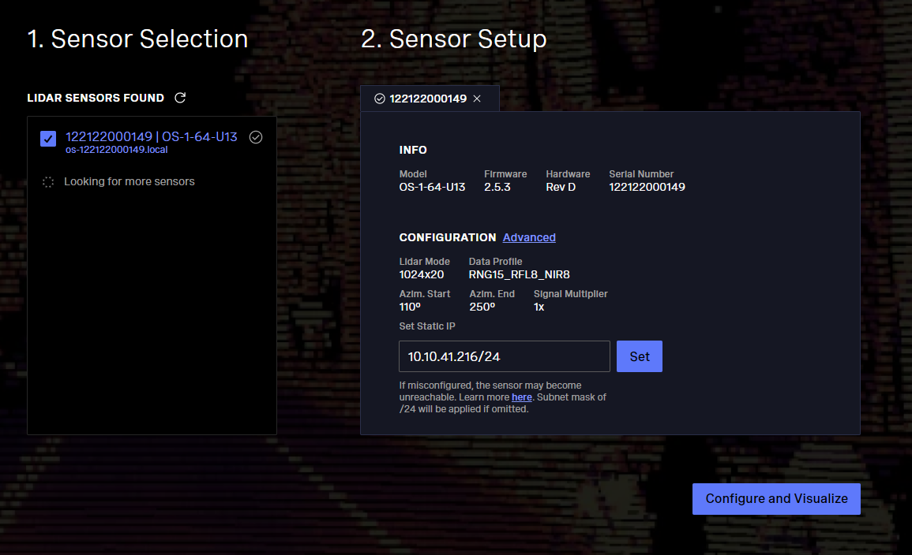
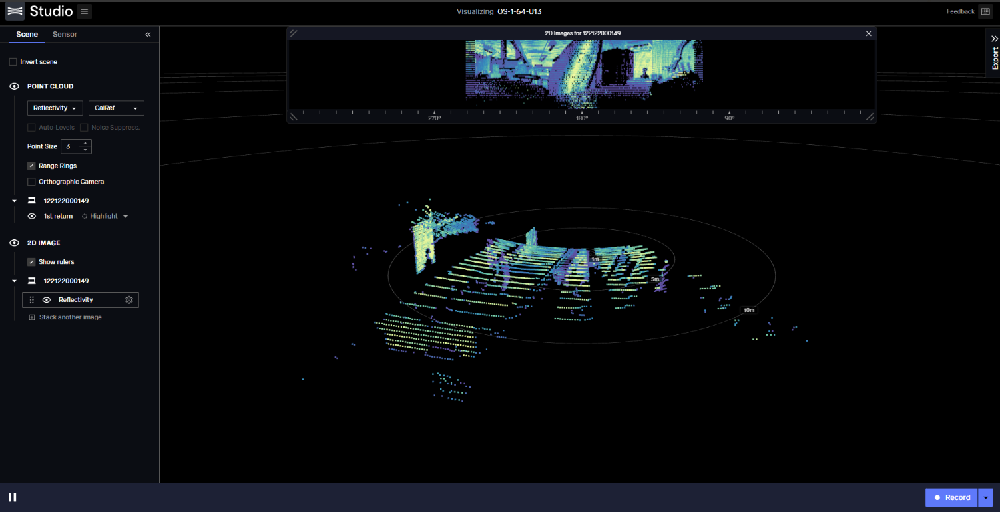
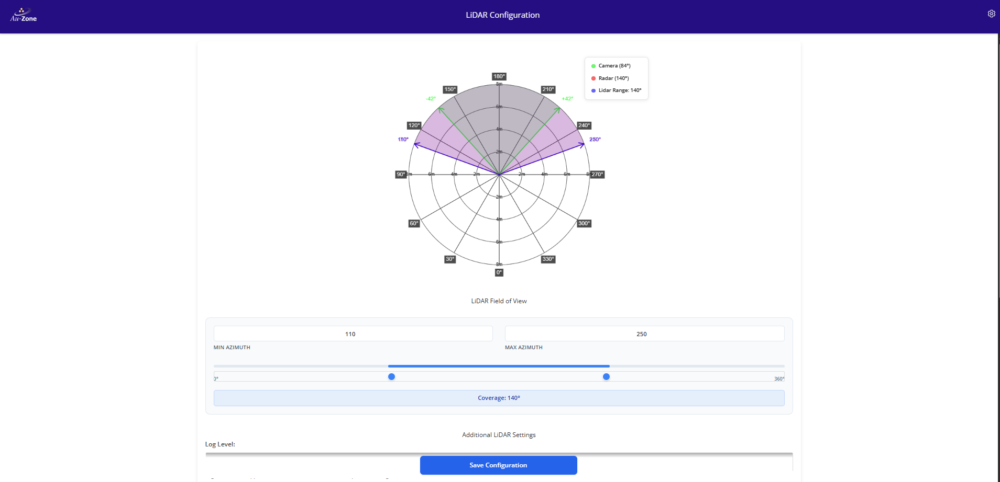

# LiDAR Module
The Raivin configuration includes an integrated [Ouster OS1-64 LiDAR sensor][ouster] which provides high-resolution 3D point cloud data. The LiDAR sensor is connected to the Raivin through a Gigabit Ethernet interface, providing both data communication and power over Ethernet (PoE) capabilities.

## Specifications
The Ouster OS1-64 is a high-resolution imaging LiDAR sensor with the following key specifications:

- **Range**: 
  - 100m @ >90% detection probability (80% Lambertian reflectivity)
  - 45m @ >90% detection probability (10% Lambertian reflectivity)
- **Field of View**: 
  - Vertical: 45° (+22.5° to -22.5°)
  - Horizontal: 360°
- **Resolution**:
  - Vertical: 64 channels
  - Horizontal: Configurable (512, 1024, or 2048 points per rotation)
- **Data Rate**: 129 Mbps (64 channel mode)
- **Points Per Second**: 1,310,720 (64 channel mode)
- **Rotation Rate**: 10 or 20 Hz (configurable)
- **Power Consumption**: 14-20W (22W peak at startup)
- **Operating Voltage**: 22-26V, 24V nominal

A full set of the LiDAR sensor specifications can be found in the [Ouster OS1 datasheet][datasheet].

## Ouster Studio

Ouster Studio is a free digital LiDAR visualizer available for both web and desktop platforms. It provides a comprehensive solution for viewing, organizing, and sharing LiDAR point cloud data captured by Ouster OS series sensors. Download the [Ouster Studio][studio]

#### Desktop Application
- Live streaming and recording of LiDAR data
- Real-time visualization
- Sensor discovery and configuration
- Cloud integration for data uploading and sharing

### Sensor configuration
Once you have downloaded Ouster Studio it can be used get the device name as well as make modifications to the Static IP of the device. It is recommended that the user sets a static ip as shown in the image below.
{align=center}

After making all the changes required you can hit "Configure and Visualize" and it will show a LiDAR PCD as follow 
{align=center}

## Firmware Requirements
The sensor should be running firmware version v2.5.3 or later. The sensor's local information page can be accessed at:
```
http://os-<serial_number>.local/
```

### Data Format
The LiDAR sensor outputs data in the following formats:
- MCAP files for recorded data
- PCAP files for recorded data
- Live UDP stream over Ethernet

Each point in the point cloud contains:
- Range
- Signal
- Reflectivity
- Near-infrared
- Channel
- Azimuth angle
- Timestamp

## Configuration


### Azimuth Orientation
The 0° azimuth angle aligns with the RJ45 Ethernet connector on the Ouster OS1 sensor. Azimuth angles increase counterclockwise when viewed from above:
- 0°: Towards the Ethernet connector
- 90°: A quarter turn counterclockwise
- 180°: Opposite the connector
- 270°: Three-quarters counterclockwise from the connector

The LiDAR settings can be configured using the webui LiDAR config page
{align=center}

## Data Visualization
The LiDAR data can be visualized using:
1. Raivin Webui for both live and recorded MCAPs
2. Rerun visualization tool for both PCAP files and live data
3. Ouster Studio for live or recorded data

## Additional Resources
- [Ouster Sensor Documentation][docs]
- [Ouster OS1 Datasheet][datasheet]
- [Sensor Data Format Documentation][dataformat]

[ouster]: https://ouster.com/products/os1-lidar-sensor/
[studio]: https://ouster.com/products/software/ouster-studio
[datasheet]: https://data.ouster.io/downloads/datasheets/datasheet-revd-v2p0-os1.pdf
[docs]: https://static.ouster.dev/sensor-docs/
[dataformat]: https://static.ouster.dev/sensor-docs/image_route1/image_route2/sensor_data/sensor-data.html
