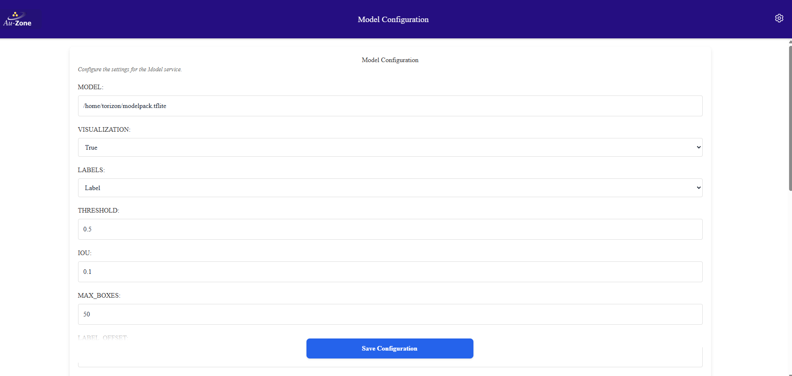
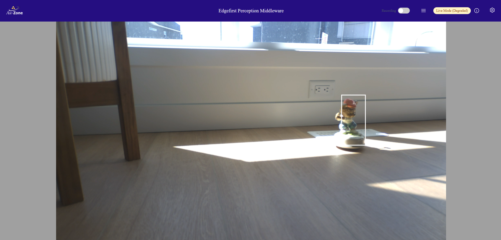

# Uploading Models
This walkthrough describes how to upload new ModelPack 2D vision models and radar-vision fusion models to the Raivin.

## Getting New Models
You can [train models using EdgeFirst Studio](../models/index.md), both [ModelPack Vision models](../models/modelpack/training.md) and [Fusion Radar models](../models/fusion/training.md).  Once the models are trained, they can be downloaded from their respective, completed training sessions.

## Uploading Models to the Raivin
In the [SCP section in the SSH Tutorial](ssh.md#secure-copy), files can be uploaded to the Raivin using the command:
```bash
scp input_file torizon@verdin-imx8mp-XXXXXXX:.
```
!!! note
    The above command assumes you have an SSH client, such as OpenSSH, installed.  Please review the [SSH documentation](ssh.md) to confirm.

For the following examples, we will have the Fusion model of `fusion.tflite` and the ModelPack model `modelpack.rtm` that we want to upload to target device `verdin-imx8mp-07130049`.

First, we need to upload the files to the Raivin target using SCP:
```bash
$ scp fusion.tflite torizon@verdin-imx8mp-07130049:.
$ scp modelpack.rtm torizon@verdin-imx8mp-07130049:.
```
We should be able to confirm the files are there by using commands via SSH.
```bash
$ ssh torizon@verdin-imx8mp-07130049 ls fusion.rtm modelpack.rtm
fusion.tflite  modelpack.rtm
```
These files will be the `/home/torizon` directory, so their absolute filenames will be `/home/torizon/fusion.tflite` and `/home/torizon/modelpack.rtm`.  Once the files have been uploaded, we can then configure the device with the files.

## Deploying a New Model to the Model Service
There are two ways to deploy a new, 2D model to the Raivin's Model Service: the Web UI Interface or via the command-line.

### From the Raivin Web UI
From the [Model Service Configuration page](configuration.md#model-configuration), enter the absolute filename `/home/torizon/modelpack.rtm` in the "MODEL" text-box.  Also, confirm the "Draw Boxes" check box is enabled, as the current trainer only supports 2D Box detection.  Hit the "Save Configuration" box and continue on.



Remember to save the configurations at the end of the process. The  Model Configuration page can be accessed via the following url:
`https://verdin-imx8mp-xxxxx/config/model`

### Manual Model Deployment
In case the manual deployment is needed, you need to connect to the device via [SSH](ssh.md):

```shell
$ ssh torizon@verdin-imx8mp-15141030
```

and edit the model parameters in `/etc/default/model`

```shell
$ vi /etc/default/model
```

then restart the model service using the `systemctl` command

```shell
$ sudo systemctl stop model
$ sudo systemctl start model 
```

!!! note
    Rember to use **sudo** to start and stop model services

Now the model is running, open the Raivin's WebUI, go to the [Segmentation Page](walkthrough.md#the-segmentation-page), and check the camera to see the model detection the object.  


## Deploying a New Model to the Fusion Service
As the Fusion Service Configuration page does not currently have a line item for Model, you will need to SSH into the device and edit the `/etc/default/fusion` file, using the following the command:
```bash
$ sudo vi /etc/default/fusion
```
Change the model line to point to the new Fusion model `/home/torizon/fusion.tflite`:

```
# The radar model
MODEL = "/usr/share/fusion/radarexp-ultra-short.tflite"
#MODEL = "/home/torizon/fusion.tflite"
```
After that, restart the Fusion Service using the following command:
```bash
$ systemctl restart fusion
```

## Summary
At this point, the new models should be uploaded to the Raivin and you should be able to the outputs on the [Segmentation View page](./walkthrough.md#the-segmentation-page).
