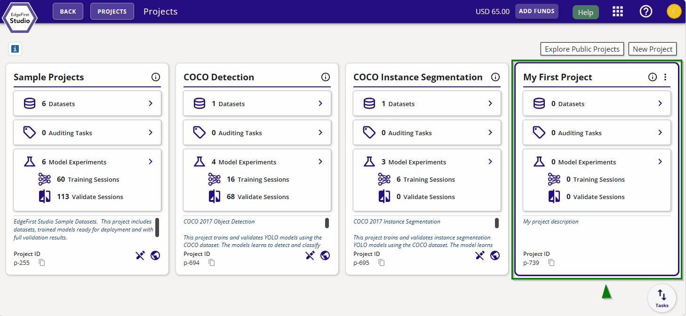
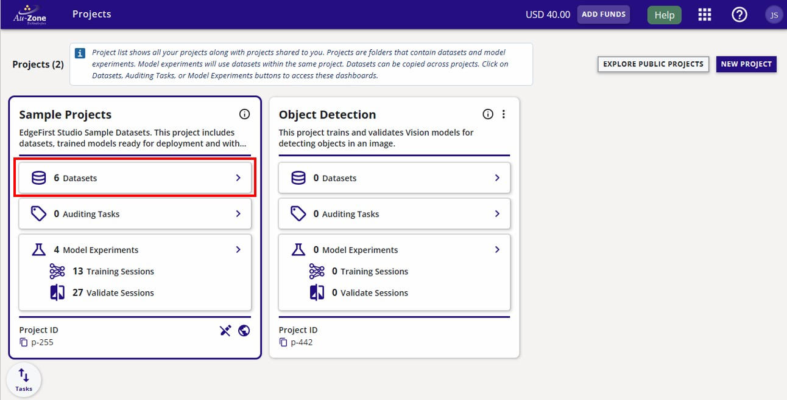

# Copy Sample Dataset

This page will show you how to copy a dataset from the "Sample Projects" in [EdgeFirst Studio](https://edgefirst.studio/). You will be using this dataset to train your model. In the following examples, you will be copying the "Coffee Cup" dataset for faster training ~15 minutes.

!!! note "Have you created a project?"
    It is important that you have followed through the [Getting Started](../../../index.md) which shows you how to [sign up](https://edgefirst.studio/signup) and [login](https://edgefirst.studio/login) to EdgeFirst Studio and including [creating a project](../../../getting_started/create_project.md) in EdgeFirst Studio which is crucial before starting any experiments.

Once you have your own project created, you can finally copy a dataset inside your project. Here you can see the newly created project "Object Detection" next to the "Sample Projects".

<figure markdown="span">
{ align=center }
<figcaption>Both Projects</figcaption>
</figure>

Under "Sample Projects", click on the "Datasets" button.

<figure markdown="span">
{ align=center }
<figcaption>Sample Datasets Button</figcaption>
</figure>

Inside the "Sample Projects", you will find a sample dataset called "Coffee Cup".  You will be copying this dataset to train a Vision model for detecting coffee cups on images.



Once you have copied the dataset, you can now begin training your model.
