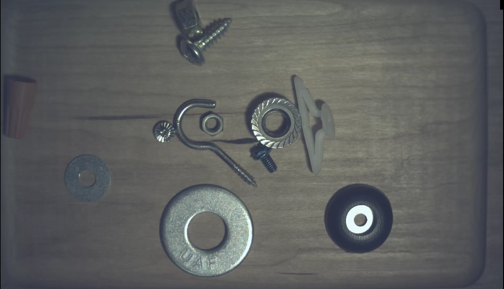
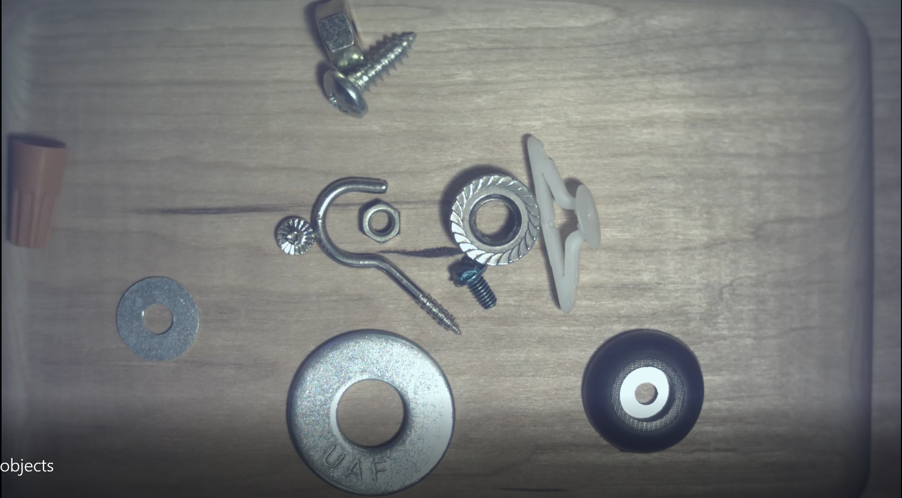

# GStreamer Dataset Capture

This guide walks you through how to capture videos and images from the phyFLEX-i.MX 95 Libra development kit with a [VM-020 phyCAM-L camera](https://www.phytec.eu/en/produkte/embedded-imaging/kameramodule/vm-020-phycam-l/) using [GStreamer](https://gstreamer.freedesktop.org/).

The examples shown in this guide are based on PHYTEC's Dataset Collection demo for capturing small hardware objects such as screws, nuts, washers, etc.

## Setup Camera

1. Ensure the camera is connected to CSI1 port X32

2. Ensure "/boot/overlays.txt" is set to:

    ```shell
    # cat /boot/overlays.txt
    fit_overlay_conf=conf-imx95-phyflex-libra-rdk-lvds-ph128800t006-zhc01.dtbo#conf-imx95-phyflex-libra-rdk-neoisp.dtbo#conf-imx95-phyflex-libra-rdk-vm020-fpdlink-port0-csi1.dtbo
    ```

3. Run this command if you need to set "/boot/overlays.txt" to the proper setting

    ```shell
    # echo 'fit_overlay_conf=conf-imx95-phyflex-libra-rdk-lvds-ph128800t006-zhc01.dtbo#conf-imx95-phyflex-libra-rdk-neoisp.dtbo#conf-imx95-phyflex-libra-rdk-vm020-fpdlink-port0-csi1.dtbo' > /boot/overlays.txt
    ```

    Then `reboot` after applying the setting.

4. Test that the camera feed is displayed on the monitor using the following examples provided in the BSP

    ```shell
    # cd /root/gstreamer-examples/isp/
    # ./capture-libcamera-liveview-csi1.sh
    ```

    You should see a live feed of the camera on the monitor. 

    {{ figure("../../assets/setup/phytec/imx95_livestream.png", "Live Stream View") }}

## GStreamer Capture

1. Ensure adequate lighting is placed upon the tray and keep wiring away from the camera’s field of view

2. Ensure the camera’s exposure mode is set to auto `v4l2-ctl -d /dev/v4l-subdev21 --set-ctrl=auto_exposure=0`
    
    You can confirm the current exposure mode setting with this command:

    ```shell
    # v4l2-ctl -d /dev/v4l-subdev21 --get-ctrl=auto_exposure
    auto_exposure: 0 (Auto Mode)
    ```

    | Manual Exposure | Auto Exposure |
    |-----------------|---------------|
    |  |  |

3. Start the dataset capture using the following GStreamer commands

    Record a video:

    ```shell
    gst-launch-1.0 -e libcamerasrc ! video/x-raw,format=NV21,width=1920,height=1200,framerate=30/1 ! videoconvert ! v4l2h264enc ! h264parse ! mp4mux ! filesink location=add_objects.mp4
    ```

    Capture an image:

    ```shell
    gst-launch-1.0 libcamerasrc ! video/x-raw,format=NV21,width=1920,height=1200 ! jpegenc ! multifilesink location=image.jpg
    ```

    !!! tip "Auto-Annotations with Video Propagation"
        It’s recommended to capture videos for your dataset to take advantage of auto-annotations using video propagation capabilities in EdgeFirst Studio.

4. Once you have captured some samples for your dataset, copy the files to your PC

## Next Steps

Now that you have captured some videos or images using GStreamer, let's take a look at [importing the captures](import.md) into EdgeFirst Studio to begin the annotation process.
