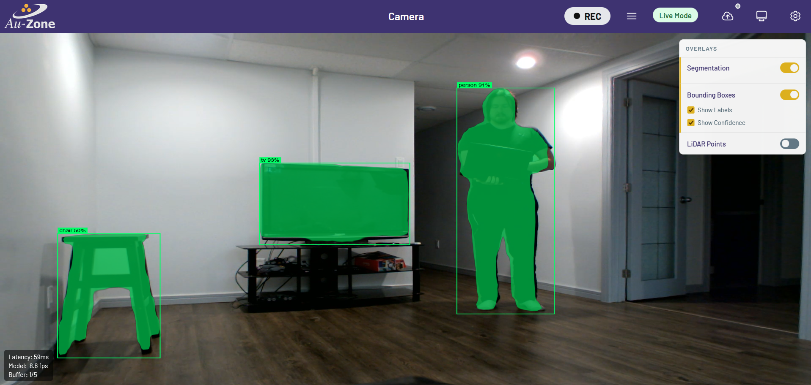

# Raivin Setup Guide

This article will walk you through the Raivin hardware setup and then lead you to resources for using additional features.

    <iframe width="560" height="315" src="https://www.youtube.com/embed/LuA3JlRUfVY" title="Raivin Unboxing" frameborder="0" allow="accelerometer; autoplay; clipboard-write; encrypted-media; gyroscope; picture-in-picture; web-share" referrerpolicy="strict-origin-when-cross-origin" allowfullscreen></iframe>

## Unboxing

The Raivin box contains the following items:

- The Raivin vision module
- A five-meter power cable, M12 circular connector (male) to 2.1mm x5.5mm barrel adapter (female)
- Box with power adapters
  - Power-adapter with interchangeable plugs.  2.1mm x 5.5mm barrel adapter (male) connector.
  - Interchangeable plugs for the following regions:
    - NEMA 1-15P (Type A) (North America)
    - CEE-7/16 Alternative II "Europlug" (Type C) (Europe)
    - AS/NZS 3112, ungrounded (Type I) (Australia / Oceania)
    - BS 1363 (Type B) (British) wall adapter
- Desktop tripod





After all that, you should see the [Raivin Main Page](webui.md).

<figure markdown="span">
{align=center}.  
<figcaption>Raivin Main Page</figcaption>
</figure>

From here, we recommend that you check out the Segmentation View page by clicking the "Segmentation View" card.

<figure markdown="span">
{align=center}  
<figcaption>Raivin Segmentation Page</figcaption>
</figure>

!!! note
    The ultra-short model included in this release was trained for fixed camera and mostly tested indoors.

## Next Steps

Now that you have completed these initial steps, we recommend that you read the following walkthroughs:  

- [Raivin Web UI Walkthrough](webui.md), to see what each UI card on the splash screen does  
- [SSH Walkthrough](../../networking/ssh.md), to learn how to SSH into your Raivin and basic command-line operations  
- [Raivin Recording Walkthrough](../../../perception/data_collection/recording.md), to learn how to record datasets and download them to your PC  
- [Model Upload Walkthrough](../../software/model_uploads.md), to learn how to upload vision models and radar fusion models to your Raivin  
