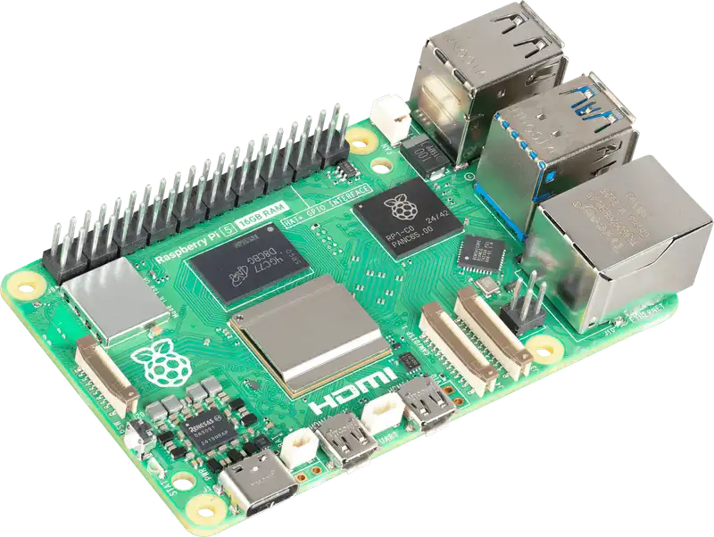
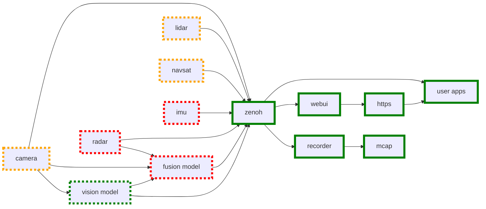

# Quickstart Guide

<figure markdown="span">
{align=center, width=50%}
</figure>

To get started using EdgeFirst Studio with the Raspberry Pi you simply need to install the EdgeFirst Perception Middleware using the following command on your Raspberry Pi terminal.

```bash
$ pip install edgefirst
```

This will install the EdgeFirst Perception Middleware into your Python environment allowing you to easily collect datasets and evaluate models trained in EdgeFirst Studio on your Raspberry Pi.

Sign up for a free trial on EdgeFirst Studio and then use your login information to connect your Raspberry Pi to EdgeFirst Studio.

```bash
$ edgefirst login
Username: myself
Password: *****
```

You're now ready to evaluate the various public models or collect a custom dataset on your Raspberry Pi!

A default model has been provided which will detect and segment people using the camera.  To start the demo simply run the following command and then point your browser to your Raspberry Pi.

```bash
$ edgefirst webui
```

## Supported Topics

Most EdgeFirst Middleware topics are supported by the RaspberryPi platform.  A summary of the topics is provided here, the ones with a red outline are currently unsupported by the RaspberryPi while those with an orange outline have certain hardware requirements outlined further below.  The topics with a green outline are fully supported.



## Hardware Requirements

- Raspberry Pi 5
    - Older Pi devices may work but have not been tested
- Raspberry Pi OS (64bit)
- Raspberry Pi Camera Module (optional)
    - Raspberry Pi or compatible modules through GStreamer with the libcamera driver
- USB Camera (optional)
    - USB cameras are supported through GStreamer with the UVC V4L2 driver
- Models will run on the CPU by default
    - Ara-2 and Hailo accelerators are also supported for improved performance
