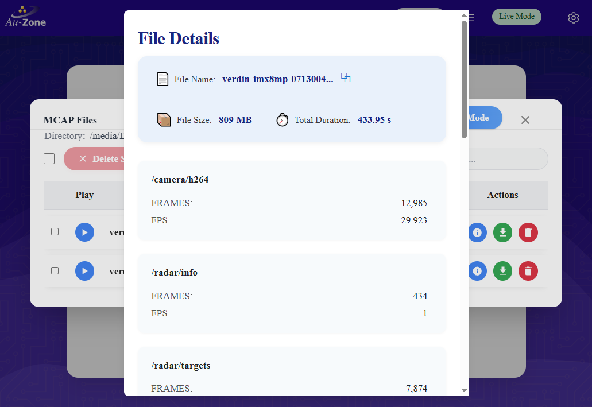
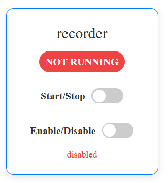
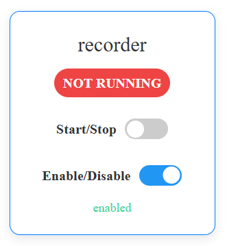

# MCAP Recording Service

## Overview
The Recorder Service enables you to capture and store [ROS2][ros2] topic data in [MCAP][mcap] format, providing a comprehensive recording solution for your Raivin system. This service acts as a data historian, collecting published topics from various services for later analysis and playback.

### How It Works
When active, the Recorder Service:

- Logs specified topics
- Compiles data into an MCAP-format recording
- Automatically saves the file upon service termination
- Provides real-time recording status

### The MCAP Modal
The MCAP Recording Service is managed on its own modal, which can be accessed by clicking the "MCAP Details" button on the top navbar of any Raivin Web UI Page.

<figure markdown="span">
{align=center}
<figcaption>MCAP Modal</figcaption>
</figure>

At the top ribbon of the MCAP Modal we have the title, the Disk Usage Infobar, and the "Live Mode" button. Under the ribbon, we have the Recording Toggle, which will start or end an MCAP recording. We also have the "Live Mode" button, which will take the Raivin out of ["Replay Mode"](./replay.md) and back to "Live Mode".

Underneath the MCAP navbar, we have the current MCAP recording directory -- in the above image, it is `/media/DATA`. Under this directory text, we have a "select all" checkbox which can be used to select every MCAP for deletion; the "Delete Selected" button which will delete the MCAP selected by the checkboxes, and the "Search files..." textfield if we need to search for a specific file.

Under all of that, we have a list of MCAP files in the recording directory. For each MCAP file, the following elements and information exist, starting from left to right:

- A selection checkbox.
- A playback button . Clicking this will put the device into ["Replay Mode"](./replay.md), replaying the sensor information from this MCAP file.
- The filename of the MCAP
- The size of the MCAP, in MB
- The creation date and time of the MCAP
- Three Action buttons, which are:
     - The "Info" button , which shows information about the topics recorded in the MCAP file (see below).
     - The "Download" button , which will download the MCAP file to your local machine.
     - The "Delete" button , which will remove the MCAP file.

To leave the MCAP Modal, click the "X" close button in the top right corner of the modal.




## Managing Recordings
Once a recording is complete, you can see the size in MB of the captured data on the MCAP page.  You can also get more detailed metadata, such as the topics recorded, by clicking the "Details" button for the MCAP recording.

<figure markdown="span">
{align=center}  
<figcaption>MCAP File Details</figcaption>
</figure>

The details modal contains the filename, size, duration in seconds, and a list of each topic captured with frame count and frames per second of data for the topic.

At the bottom of the "File Details" modal, there is a "Close" button to close the modal.

!!! note
     MCAP recording file names are saved in `hostname_YYYY_mm_DD_HH_MM_SS.mcap` format, where:

     - _hostname_ is the hostname of the device, e.g. `verdin-imx8mp-071744901`
     - _YYYY_mm_DD_ is the zero-padded year, month, and day that the recording was started
     - _HH_MM_SS_ is the UTC time the recording started in 24-hour notation

Any MCAP recording can be deleted by clicking its "Delete" button and confirming that you wish to delete the recording, as well as clicking its checkbox and clicking the "Delete Selected" button.

## Configuration
The Recorder Service can have the following settings configured:

- Which topics to record
- Location of the recording file
- Recording compression

These settings can be configured in the [MCAP Recorder Settings Page](./configuration.md#mcap-recorder-settings-page).

## Recording On Boot-up
The Recording Service can be set up to automatically start on boot-up.
!!! warning
     Having the Recording Service run for prolonged periods of time will fill the SD card of the Raivin.  Use this functionality with caution.

On the [Services Status](./configuration.md#service-status) page, you can use the Recorder Service status card to enable the recorder service to start on boot.
<figure markdown="span">
{align=center}  
<figcaption>Recorder Service status card</figcaption>
</figure>
Flip the Enable/Disable switch to enable to enable the Recorder Service on boot.
<figure markdown="span">
{align=center}  
<figcaption>Recorder Service enabled</figcaption>
</figure>
!!! note
     You can start and stop the Recording Service here as well as on the MCAP Recording Page by flipping the Start/Stop switch.

## Next Steps
Now that you have your MCAP, there are many things you can do with it, such as:  
- Use [Foxglove Studio](./foxglove.md) to view the downloaded MCAP, especially with some [advanced Foxglove understanding](./advanced_foxglove.md)  
- Use the [Replay Service](./replay.md) to view the recorded MCAP on the device  
- [Publish the MCAP to EdgeFirst Studio](./publishing.md)  

[ros2]: https://www.ros.org/
[mcap]: https://mcap.dev/