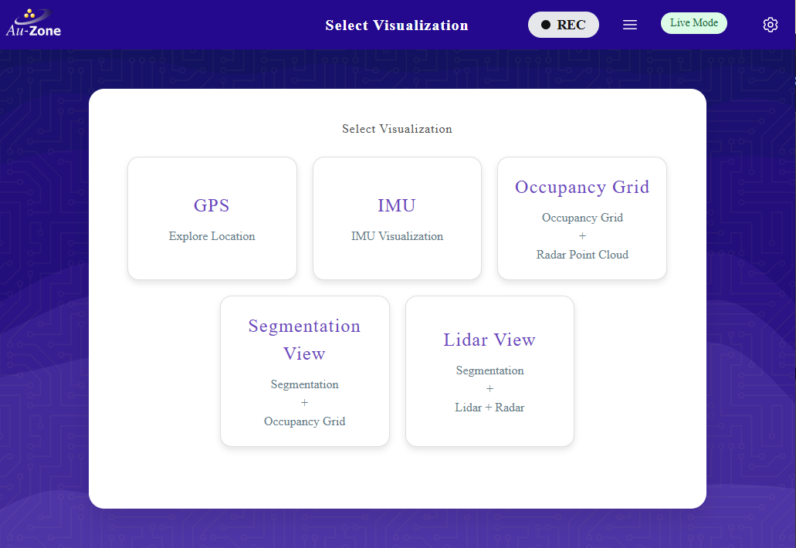
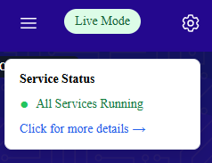
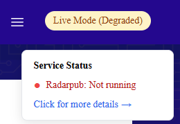
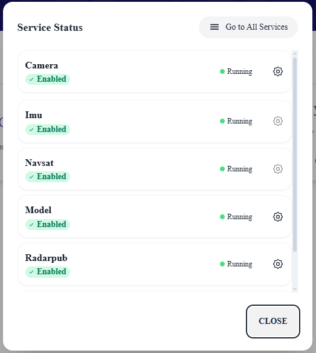
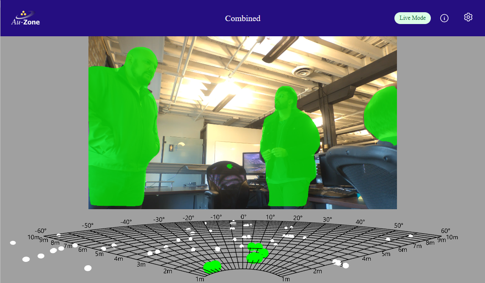
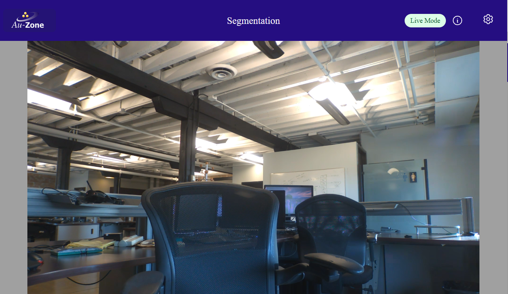
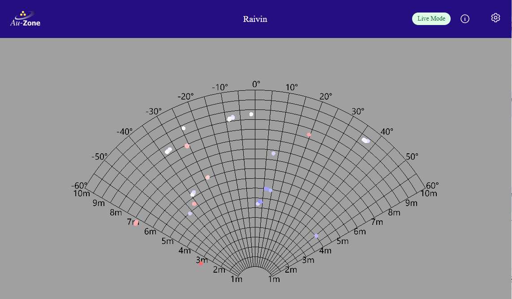
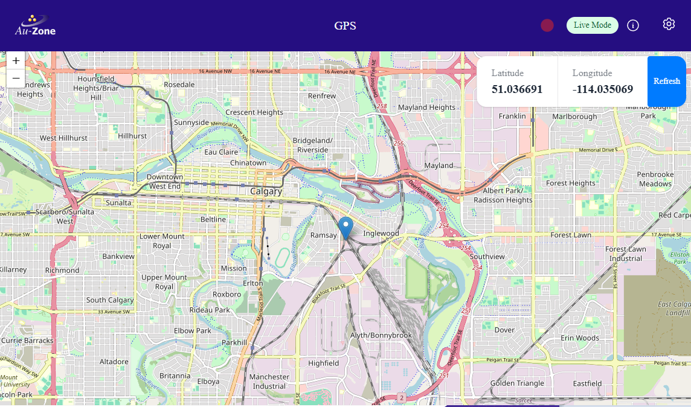
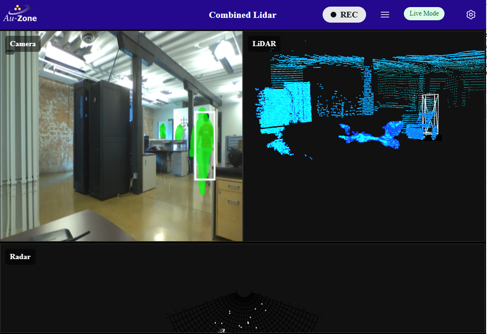
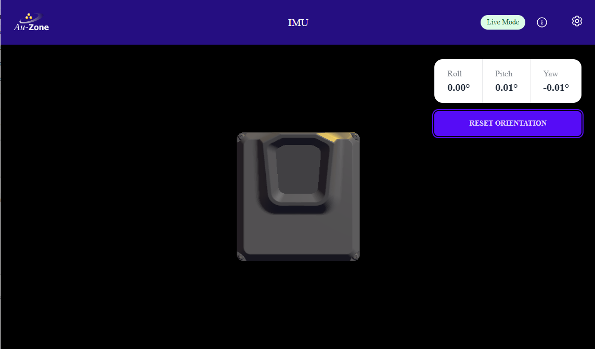

# Web UI Walkthrough

This chapter will walk you through the Raivin's and Maivin's Web User Interface (WebUI).

## The Main Page

The Main Page of the Raivin web interface should look as follows:  

<figure markdown="span">
{align=center}
<figcaption>Raivin Main Page</figcaption>
</figure>

The Main Page for the Maivin looks slightly different:  

<figure markdown="span">
{align=center}
<figcaption>Maivin Main Page</figcaption>
</figure>

There are five cards on the Main Page that link to the Visualization pages:

- **GPS**: This page displays a map with the current location of the device, along with GPS co-ordinates.
- **IMU**: This page displays the 3D orientation of the device with current pitch, yaw, and roll values.
- **Occupancy Grid**: (Raivin only) This will show the radar grid.
- **Segmentation View**: This page shows the camera with running segmentation and/or detection pipeline.  For Raivin devices equipped with a radar module, it will also show the radar grid.
- **Lidar View**: (Raivin only) This will show the Lidar View, which will include the camera, radar grid, and LiDAR grid.

### The Top Ribbon

The ribbon at the top of the Raivin web interface is available on every page of the web interface.  The following six elements are available on every page of the Raivin web interface.

1. On the left, the "Home" button with the Au-Zone icon, which will return the user to the Main Page.
2. In the middle, the title of the current page.
3. On the right side, we first have the Recording Indicator, shown as a gray oval with "REC" when not recording from the sensors and a red oval when recording.
5. The MCAP Details Modal button, which opens the MCAP Modal.
6. The System Status Indicator and Dropdown button.
3. The farthest rightmost button, with the gear icon, is the Settings Buttons and will take you to the [Settings Page](./configuration/index.md).

### The MCAP Modal

The MCAP Modal is the interface to manage MCAP recordings, including getting information about recorded MCAP files, disk usage, deletion and downloading files.  More information about the MCAP Modal and recording MCAPs is in the [Recording section](./recording.md)

<figure markdown="span">
{align=center}  
<figcaption>The Radar Publishing service is down.</figcaption>
</figure>

### System Status Indicator

Mousing over the System Status Indicator field will give a brief summary of any problems.  

<figure markdown="span">
{align=center}  
<figcaption>Everything is good!</figcaption>
</figure>

<figure markdown="span">
{align=center}  
<figcaption>The Radar Publishing service is down.</figcaption>
</figure>

More on these status can be found in the [Status Monitoring section](./replay.md#status-monitoring).

Clicking on the indicator will bring up the Service Status Modal, which contains a list of services and, if available, clickable gear icons that link to the service's configuration page.

<figure markdown="span">
{align=center}  
<figcaption>Service Status Modal</figcaption>
</figure>

## The Visualization Pages

These pages contain the user-facing functionality of the vision module.

### The Segmentation Page

The Segmentation page shows camera overlain with the current visual model output.  For Raivin modules, this will also includes the occupancy grid at the bottom.  

<figure markdown="span">
{align=center}
<figcaption>Raivin Segmentation Page</figcaption>
</figure>

White points are unmatched, raw data from the radar; green points are raw data matched to segmentation masks.

For the Maivin, its Segmentation Page does not include the Occupancy Grid at the bottom.  

<figure markdown="span">
{align=center}
<figcaption>Maivin Segmentation Page</figcaption>
</figure>

### The Occupancy Page (Raivin-only)

The Occupancy Page shows the raw, radar data, colored by radar cross-section (RCS) size.  

<figure markdown="span">
{align=center}
<figcaption>Occupancy Page</figcaption>
</figure>

### The GPS Page

The GPS page shows an interactive map centered on the device's location.  

<figure markdown="span">
{align=center}
<figcaption>GPS Page</figcaption>
</figure>

This should be familiar to anyone who has used standard map web interfaces.  The map can be moved by dragging with left-mouse button (or touch with a touchscreen-enabled device).  The "+" and "-" buttons on the left will zoom-in and zoom-out on the map.  The "Refresh" button will re-center the map on the device's location.  The latitude and longitude are also reported on the web interface.

### The Lidar View Page (Raivin-only)

This page shows the segmentation view, the occupancy grid, and the 3D LiDAR view.  The 3D LiDAR view will be blank if the device does not have a LiDAR unit connected.

<figure markdown="span">
{align=center}
<figcaption>Lidar View Page</figcaption>
</figure>

### The IMU Page

The IMU page shows the device's orientation in 3D.  

<figure markdown="span">
{align=center}
<figcaption>IMU Page</figcaption>
</figure>

By physically moving the device, it's virtual counterpart should move the same way.  Roll, pitch, and yaw values are reported.  If the device's virtual orientation does not match the physical orientation, keep the device's bottom flat and hit the "Reset Orientation" button.
