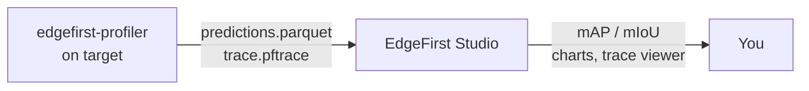

# Profiler

The **EdgeFirst Profiler** is the on-target measurement engine for the EdgeFirst Studio platform. It runs the complete vision pipeline — decode, preprocess, inference, postprocess, NMS — on the hardware your model will deploy to, then publishes per-image predictions and a detailed timing trace to EdgeFirst Studio where accuracy metrics, charts, and trace visualizations are produced.

For public benchmarks, explore the **EdgeFirst Model Zoo on Hugging Face** at [https://huggingface.co/spaces/EdgeFirst/Models](https://huggingface.co/spaces/EdgeFirst/Models). We publish public benchmarks and metrics there across Ultralytics and other community models so you can compare your validation results against known baselines.

{{ figure("assets/tui-profiler.png", "EdgeFirst Profiler — F4 dashboard during a validation run") }}

## What it is

`edgefirst-profiler` is a native binary that runs on each supported target. It owns everything that has to happen *next to the silicon*: model loading, accelerated decode, pipeline orchestration, and the inference call itself. It uses `edgefirst-hal` under the hood for hardware-accelerated decode and pre/post-processing, drives every backend through a unified interface, and inherits the EdgeFirst DMA optimizations across the pipeline.

The result is a small, portable, high-performance on-target tool. Adding a new device to the EdgeFirst ecosystem only requires landing the profiler on that platform — the same CLI and workflow plug straight into the existing Studio-side metrics, charts, and reports.

## How it fits together

The profiler measures and publishes. EdgeFirst Studio receives the artifacts and produces the accuracy charts, the per-operator timing visualizations, and the comparison views. The same `v-XXXX` validation-session ID links the on-target run to everything Studio shows afterwards.

## What you can do with the profiler

The profiler is always operated against an EdgeFirst Studio session. There are two equivalent entry points:

- **Validation from Studio** — create a user-managed validation session in the Studio web UI, then run the profiler against that session ID on your target.
- **Validation from the Profiler** — browse training sessions inside the profiler's TUI and let the profiler create the validation session in place.

Both paths produce the same artifacts and the same Studio session card.

## Read next

- **[Quick Start](quickstart.md)** — install the profiler, sign in to Studio, run your first validation session in under five minutes.
- **[Installation](installation/index.md)** — supported targets, per-target dependencies, and target-specific quirks.
- **[EdgeFirst Studio Integration](studio/index.md)** — connecting to Studio, validation from Studio, and validation from the profiler.
- **[Pipelining](concepts/pipelining.md)** — the multi-stage measurement pipeline, the `--pipeline-depth` flag, and how each backend constrains it. (Concepts deep-dive.)
