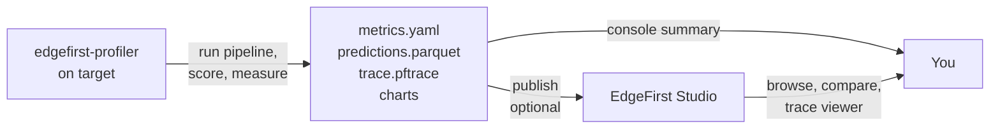

# Profiler

The **EdgeFirst Profiler** is the on-target measurement engine for the EdgeFirst Studio platform. It runs the complete vision pipeline — capture, preprocess, inference, postprocess, NMS — on the hardware your model will deploy to, then scores the result against ground truth and reports how fast each stage ran. Accuracy metrics, timing, and charts are all computed by the profiler itself, on the device; EdgeFirst Studio is where they are published, compared, and browsed.

For public benchmarks, explore the **EdgeFirst Model Zoo on Hugging Face** at [https://huggingface.co/spaces/EdgeFirst/Models](https://huggingface.co/spaces/EdgeFirst/Models). We publish public benchmarks and metrics there across Ultralytics and other community models so you can compare your validation results against known baselines.

{{ figure("assets/tui-profiler.png", "EdgeFirst Profiler — F4 dashboard during a validation run") }}

## What it is

`edgefirst-profiler` is a native binary that runs on each supported target. It owns everything that has to happen *next to the silicon*: model loading, accelerated decode, pipeline orchestration, and the inference call itself. It uses `edgefirst-hal` under the hood for hardware-accelerated decode and pre/post-processing, drives every backend through a unified interface, and inherits the EdgeFirst DMA optimizations across the pipeline.

The result is a small, portable, high-performance on-target tool with no Python and no `pycocotools` on the device. Adding a new device to the EdgeFirst ecosystem only requires landing the profiler on that platform — the same CLI, the same measurements, and the same published artifacts follow automatically.

## How it fits together

The profiler runs the pipeline, computes the accuracy metrics, and derives the timing and charts — all on the target. Publishing to Studio is a separate step, and an optional one: a run with no Studio session still writes `metrics.yaml`, the predictions, the trace, and a readable console summary to disk. When you do publish, the `v-XXXX` validation-session ID links the on-target run to everything Studio shows afterwards.

## What you can do with the profiler

There are several ways in, depending on where the model lives and where you want the results to land:

- **[Validation from Studio](studio/from_studio.md)** — create a user-managed validation session in the Studio web UI, then run the profiler against that session ID on your target.
- **[Validation from the Profiler](studio/from_profiler.md)** — browse training sessions inside the profiler's TUI and let the profiler create the validation session in place.
- **Offline validation** — point `validate` at a local model, a directory of images, and a ground-truth file. No Studio session is created and nothing is uploaded. See [Validation and Metrics](concepts/validation.md).
- **[Cloud runs](studio/cloud.md)** — hand a training session and an artifact to `dispatch` and let the run happen on a cloud machine you choose, instead of on hardware in front of you.

Three further commands round out the workflow. `report` prints a full summary of any run's `trace.pftrace` after the fact. `publish` uploads a finished result set to Studio from wherever the files ended up, separating measurement from publication. `system-info` prints how the current machine will be identified, without loading an inference runtime.

Detection models can also run each image as a grid of overlapping tiles rather than one letterboxed frame, which markedly improves recall on small objects — see [Tiled Inference (SAHI)](concepts/sahi.md).

## Platform Video Demos

These demos show EdgeFirst Profiler runs on common deployment and development targets.

### MacBook

    <iframe width="560" height="315" src="https://www.youtube.com/embed/M2j6ryFsbew?si=LN6zAJKAv83SgSVz" title="EdgeFirst Profiler on MacBook" frameborder="0" allow="accelerometer; autoplay; clipboard-write; encrypted-media; gyroscope; picture-in-picture; web-share" referrerpolicy="strict-origin-when-cross-origin" allowfullscreen></iframe>

### NXP i.MX 95

    <iframe width="560" height="315" src="https://www.youtube.com/embed/ajZR9XHaEVQ?si=9Jztb9hxUGhXp0qA" title="EdgeFirst Profiler on NXP i.MX 95" frameborder="0" allow="accelerometer; autoplay; clipboard-write; encrypted-media; gyroscope; picture-in-picture; web-share" referrerpolicy="strict-origin-when-cross-origin" allowfullscreen></iframe>

### NXP Ara240

    <iframe width="560" height="315" src="https://www.youtube.com/embed/kN44eJ7BtZk?si=nPYj62d4XA1KxYeM" title="EdgeFirst Profiler on NXP Ara240" frameborder="0" allow="accelerometer; autoplay; clipboard-write; encrypted-media; gyroscope; picture-in-picture; web-share" referrerpolicy="strict-origin-when-cross-origin" allowfullscreen></iframe>

## Read next

- **[Quick Start](quickstart.md)** — install the profiler, sign in to Studio, run your first validation session in under fifteen minutes.
- **[Installation](installation/index.md)** — supported targets, per-target dependencies, container images, and target-specific quirks.
- **[EdgeFirst Studio Integration](studio/index.md)** — connecting to Studio, validation from Studio, validation from the profiler, and cloud runs.
- **[Validation and Metrics](concepts/validation.md)** — how accuracy is scored on-device, the `--validation` modes, what `metrics.yaml` contains, and how to re-score a run without re-running the model. (Concepts deep-dive.)
- **[Pipelining](concepts/pipelining.md)** — the multi-stage measurement pipeline, the per-stage depth flags, and how each backend constrains them. (Concepts deep-dive.)
- **[Tiled Inference (SAHI)](concepts/sahi.md)** — running each image as a grid of overlapping tiles to recover small objects. (Concepts deep-dive.)
