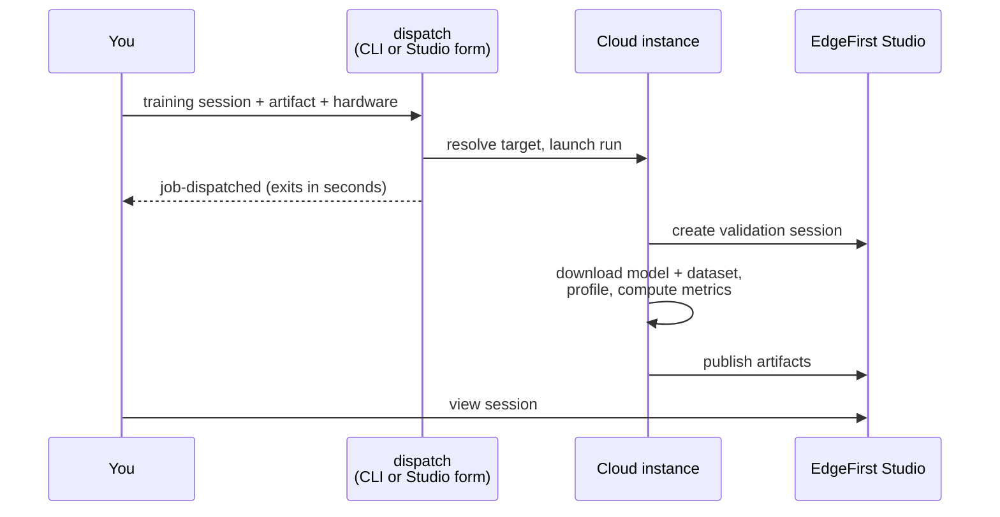

# Cloud Runs

Not every validation needs your own hardware. EdgeFirst Studio can run the profiler on managed cloud machines — from the **launch form** in the Studio web UI, or from the CLI with the `dispatch` command. A cloud run downloads the model and dataset on the cloud machine, profiles there, computes the accuracy metrics, and publishes the same [artifact set](index.md) as any other validation run: predictions, trace, `metrics.yaml`, `platform.yaml`, and the chart JSONs.



## The `dispatch` command

Point `dispatch` at a training session and one of its model artifacts, and it resolves the cloud machine matching the model's format and the compute class you asked for, starts the run there, and exits — the command returns in seconds rather than after the machine has finished starting up. The launched run creates the validation session on the cloud machine and publishes into it.

```sh
edgefirst-profiler dispatch \
    --training-session t-abc123 \
    --artifact best.onnx \
    --instance-class c8g-12xlarge
```

Point it at an existing session instead with `--session-id v-XXXX` and it re-scores that session's uploaded predictions — no new session is created and no inference is run, so the hardware choice is ignored.

Everything is validated before anything is launched: a model format with no cloud machine behind it (`.hef` and `.engine` are edge-only formats) or an unrecognized compute class is rejected up front, so a mistyped launch leaves no half-started session and costs no compute time. If a run cannot be started at all, a session it just created is marked with the failure rather than left waiting forever — while a session named with `--session-id` is left untouched, since a launch that never started says nothing about results already published there.

For scripting, `dispatch` prints one status line per outcome: `job-dispatched <target> <job-id>` for a new run (the validation session does not exist until the launched run creates it), or `session-dispatched <id> <target> <job-id>` when re-scoring an existing session. Every option can also come from the environment — `VALIDATION_SESSION_ID`, `TRAINING_SESSION_ID`, `ARTIFACT_NAME`, `INSTANCE_CLASS` — which is how a launch from Studio supplies them.

## Launching from Studio

The Studio launch form drives the same dispatch path without the CLI. Pick the model through the form's model picker — project, experiment, and training session dropdowns, then the artifact from a list — and the hardware from the **Hardware** menu. That is the whole form: the validation session is created by the run itself, so there is nothing else to fill in.

## Choosing hardware

The Hardware menu offers a cost-optimized default plus a set of dedicated machines named for the EC2 instance they run on. Each named class owns one instance of exactly one type and nothing else shares that machine, so throughput measured on it is comparable between runs and against other models.

| Class | Hardware |
| ----- | -------- |
| `default` | Cost-optimized shared-CPU class (Fargate) |
| `m8g-2xlarge` | AWS Graviton4, 8 vCPUs |
| `c8g-12xlarge` | AWS Graviton4, 48 vCPUs |
| `m7i-2xlarge` | Intel Sapphire Rapids, 8 vCPUs |
| `c7i-12xlarge` | Intel Sapphire Rapids, 48 vCPUs |
| `g5-2xlarge` | NVIDIA A10G GPU |

The menu entries also state the processor, vCPU count, and memory for each option.

- **The default class gives trustworthy accuracy but not benchmark-grade throughput.** It runs on Fargate, where the underlying processor varies from run to run and is not recorded, so two runs can land on different CPU generations with nothing to say which. Use a named class when the timing numbers matter.
- **The GPU option serves ONNX models only.** GPU runs use the CUDA execution provider automatically; there is no CUDA build for TFLite.
- **Validation never runs on interruptible capacity.** Every queue that runs a validation is dedicated: an interruption mid-run would force the most expensive part — the dataset download — to start over, and the restarted run's timing would be indistinguishable from a genuinely slow model. Only the short pre-launch dispatch step uses discounted capacity, where an interruption costs a few seconds.

!!! warning "Old class names no longer exist"
    The classes were previously named for their shape — `graviton-few`, `graviton-many`, `cpu-x86-few`, `cpu-x86-many`, `cuda-x86` — which made a published number unattributable to a specific machine. Saved launch configurations that name an old class must be updated to the EC2-based names above; the `default` option is unchanged and keeps its name.

## Sessions are self-describing

Every cloud validation session records the exact instance type and hardware specification it ran on, in its description — for example `Cloud run on c8g.12xlarge (AWS Graviton4, 48 vCPU (48 physical cores, no SMT), 96 GiB instance RAM)`. Physical cores are stated separately from vCPUs because they differ by processor: 48 vCPUs are 48 cores on Graviton but 24 cores plus SMT on Intel, so two equally-sized options do not deliver equal throughput. Reading a session later needs no lookup against a configuration that may since have changed.

Alongside the description, `platform.yaml` is uploaded with the session's artifacts as the canonical, machine-comparable record of the host: architecture, processor, accelerator, OS, memory, and — for cloud runs — the requested compute class and the actual EC2 instance type and ID.
