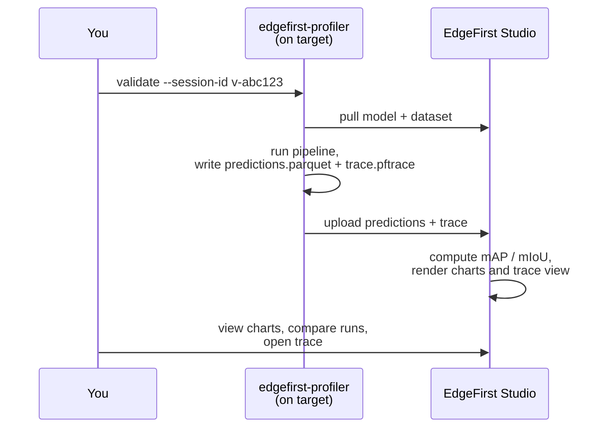

# EdgeFirst Studio Integration

The profiler is always operated against an EdgeFirst Studio **validation session** — the mechanism that joins an on-target run to Studio's metrics dashboard and trace viewer.

This section covers:

1. **[Connecting to Studio](connecting.md)** — interactive login and headless credential handling.
2. **[Validation from Studio](from_studio.md)** — create a validation session in Studio, then point the profiler at the session ID.
3. **[Validation from the Profiler](from_profiler.md)** — browse projects and training sessions in the profiler's **F2 Studio** screen and create the validation session in place.

## Validation sessions, end to end

A validation session is the unit of work that links the device, the model, the dataset, and the Studio results. Every session has a short ID like `v-abc123`. The session ID is the only piece of state you need to remember.

!!! warning "Validation sessions need a writable project"
    Creating a validation session requires **write access** to the Studio project. You cannot validate against the read-only public **Sample Project** directly — first [copy its dataset](../../getting_started/copy_dataset.md) into a project you own (and add your model), then create the training and validation session there.

The on-target side is the profiler. Studio receives the published artifacts and produces the accuracy charts, the per-operator timing visualizations, and the comparison views. The on-device dependency footprint is small — no Python, no `pycocotools` — and the binary uses `edgefirst-hal`, multiple inference engines, and the EdgeFirst DMA optimizations for high on-target performance.

## What you see in Studio

When the validation session finishes, the session card surfaces accuracy charts, a per-frame timing summary, and the trace viewer.

{{ figure("../assets/studio-validation-metrics.png", "EdgeFirst Studio — validation metrics surfaced on the session card") }}

{{ figure("../assets/studio-trace-viewer.png", "EdgeFirst Studio — trace viewer with pipeline stages, per-operator timing, and system metrics") }}

See [Object Detection Metrics](../../models/validation/metrics/detection/index.md) and [Segmentation Metrics](../../models/validation/metrics/segmentation.md) for the metrics reference.
