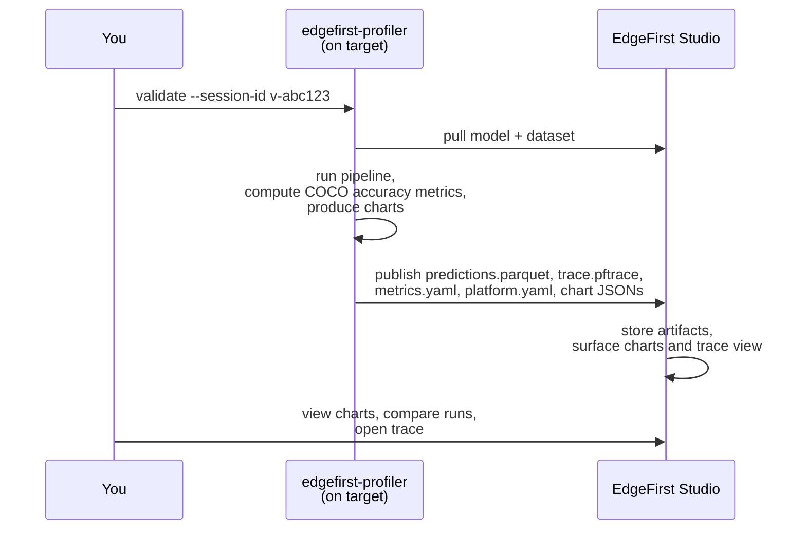

# EdgeFirst Studio Integration

The profiler does not require Studio — an offline run against a local model, images, and ground truth computes its metrics entirely on its own. Connecting to Studio adds the **validation session**: the mechanism that stores a run's published artifacts, surfaces them on Studio's metrics dashboard and trace viewer, and makes runs comparable across models and devices.

This section covers:

1. **[Connecting to Studio](connecting.md)** — interactive login, headless credential handling, and token-based authentication for CI.
2. **[Validation from Studio](from_studio.md)** — create a validation session in Studio, then point the profiler at the session ID.
3. **[Validation from the Profiler](from_profiler.md)** — browse projects and training sessions in the profiler's **F2 Studio** screen and create the validation session in place.
4. **[Cloud Runs](cloud.md)** — launch a validation run on Studio-managed cloud hardware, from the Studio launch form or the `dispatch` command.

## Validation sessions, end to end

A validation session is the unit of work that links the device, the model, the dataset, and the Studio results. Every session has a short ID like `v-abc123`. The session ID is the only piece of state you need to remember.

!!! warning "Validation sessions need a writable project"
    Creating a validation session requires **write access** to the Studio project. You cannot validate against the read-only public **Sample Project** directly — first [copy its dataset](../../getting_started/copy_dataset.md) into a project you own (and add your model), then create the training and validation session there.

The on-target side does the measuring *and* the scoring: the profiler runs the pipeline, computes the COCO detection and segmentation metrics on the agent itself, and produces the charts — there is no separate cloud validation step. Studio stores the published artifacts and displays them: the accuracy charts, the per-operator timing visualizations, and the comparison views. The on-device dependency footprint is small — no Python, no `pycocotools`, even for the metrics computation — and the binary uses `edgefirst-hal`, multiple inference engines, and the EdgeFirst DMA optimizations for high on-target performance.

A completed session carries the full artifact set:

- `predictions.parquet` — the run's predictions (detections, and masks for segmentation models).
- `trace.pftrace` — the Perfetto execution trace with pipeline-stage spans, per-operator timing, and system telemetry.
- `metrics.yaml` — the accuracy and measured-timing metrics document, the same one an offline run writes locally.
- `platform.yaml` — a structured record of the machine that ran it: architecture, processor, accelerator, board, OS, and memory.
- Chart JSONs — accuracy, timing and throughput, device execution-timing, and system-telemetry charts, produced by the profiler and rendered by Studio.

## What you see in Studio

When the validation session finishes, the session card surfaces accuracy charts, a per-frame timing summary, and the trace viewer.

{{ figure("../assets/studio-validation-metrics.png", "EdgeFirst Studio — validation metrics surfaced on the session card") }}

{{ figure("../assets/studio-trace-viewer.png", "EdgeFirst Studio — trace viewer with pipeline stages, per-operator timing, and system metrics") }}

See [Object Detection Metrics](../../models/validation/metrics/detection/index.md) and [Segmentation Metrics](../../models/validation/metrics/segmentation.md) for the metrics reference.
