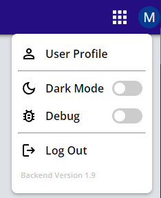
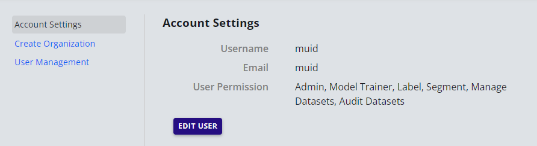
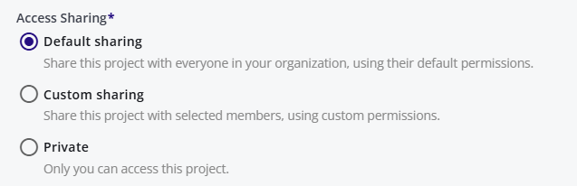

# Access Management

This page describes security protocols in EdgeFirst Studio.

## User Credentials

When initially deployed, the portal has one admin user for the organization.  The user credentials are provided by the AuZone Team. After login, the user can change their password. The organization information may not exist at this stage. The admin user can create the organization and its information. 

!!! note
    The admin user can add other users with different permissions. 

## User Management

To manage users, click on the user icon and select *User Profile*.

<figure markdown="span">
{ align=center }
<figcaption>User Profile</figcaption>
</figure>

This opens the user management panel.

<figure markdown="span">
{ align=center }
<figcaption>Account Settings</figcaption>
</figure>

The account setting is used to see user information and permissions. The button *EDIT USER* is used to update the username, email, or change the password.

### Change Password

- Click on the user icon on the top right corner. 
- Select *User Profile*.
- Select *Account Settings*.
- Click on *EDIT USER*.
- Enter the new password.
- Click *Update*.

### Add New User

- Click on the user icon on the top right corner. 
- Select *User Profile*.
- Select *User Management*.
- Enter the username/password/email for the new user.
- Check the roles to be enabled.
- Click *Add*.

!!! note
    The admin user that creates other users is responsible for the usage bills of the users.

### List, Edit and Delete Users

- Click on the user icon on the top right corner.
- Select *User Profile*.
- Select *User Management*.
- The lists of users under this admin user will be displayed.
- Click on the *X* to delete user and the edit icon to edit user. 

!!! note
    The admin user can change the password of the users connected to this account.

## Create Organization

An admin user can still add users without creating an organization. However creating an organization prints the organization information on the bills and provides information for other users.

To create an organization.

- Click on the user icon on the top right corner. 
- Select *User Profile*.
- Select *Create Organization*.
- Enter the organization information.
 
#### Video Tutorial:

    <iframe width="560" height="315" src="https://www.youtube.com/embed/DJabdEHaZ8E" title="Getting Started Video" frameborder="0" allow="accelerometer; autoplay; clipboard-write; encrypted-media; gyroscope; picture-in-picture; web-share" referrerpolicy="strict-origin-when-cross-origin" allowfullscreen></iframe>

Access management works on project or dataset level.

There are two levels of access:

1. View Only - User can see the dataset, annotation, and training and validation results.
2. Edit - User can edit datasets, perform training and validation, and add/delete annotations.

There are three categories of access control.

<figure markdown="span">
{ align=center }
<figcaption>Access Control</figcaption>
</figure>

### Default Sharing

All the resources in the project are viewable and editable to all members of the organization.

### Custom Sharing

User can selectively add other users as viewers and editors. A users can be in one of the three modes with respect to a dataset.

- No Access - If the user is not in the list of the allowed users.
- View only - If the user is in the list with viewer permissions.
- Edit - If the user is in the list with Edit permissions.  

### Private

Available to the creator of the projects only.
