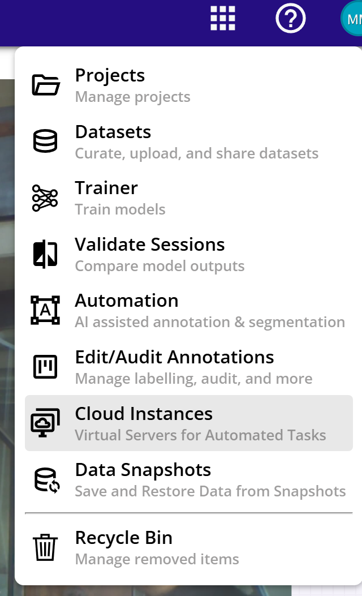
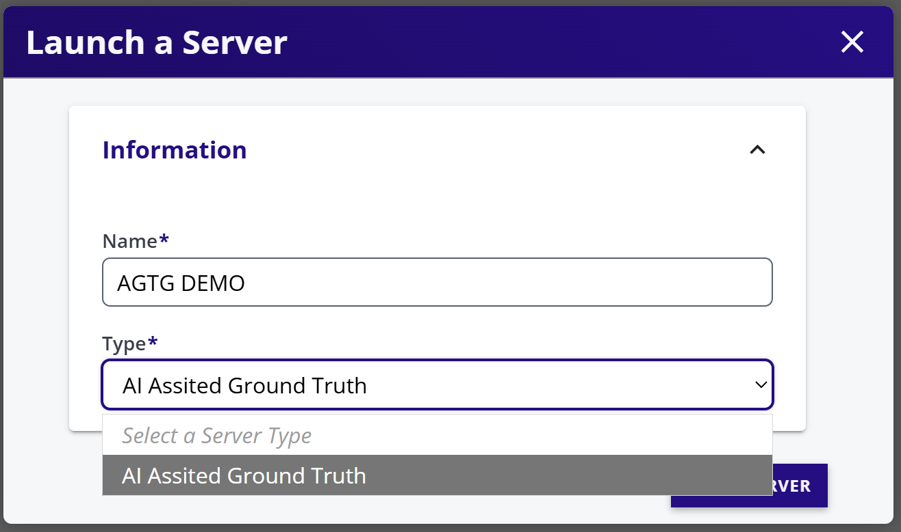
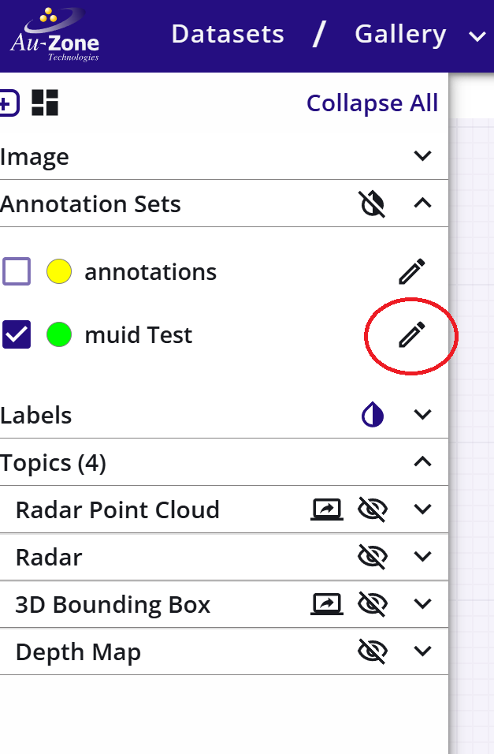
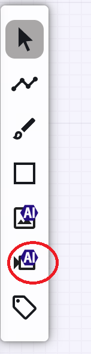
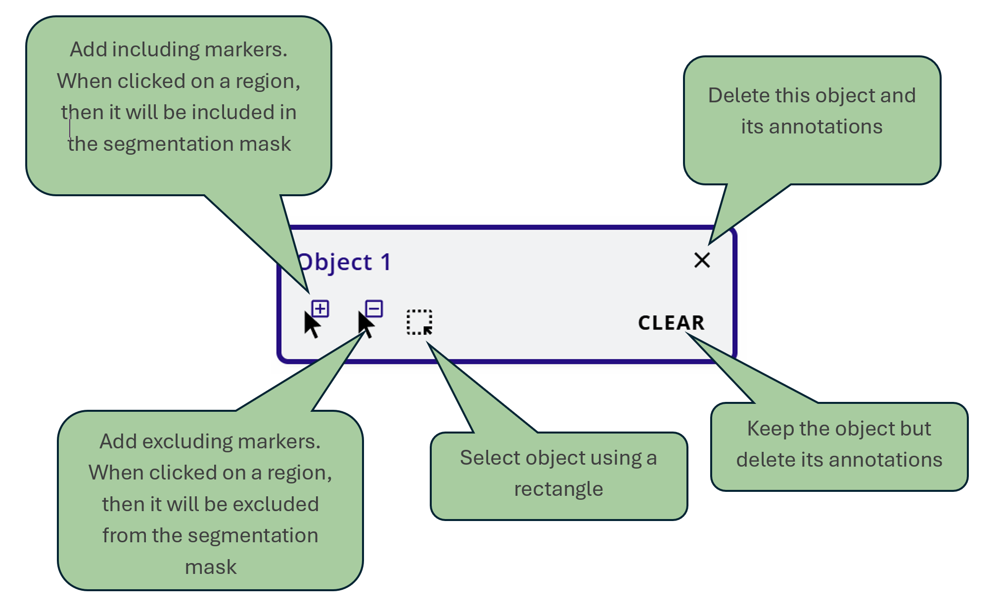
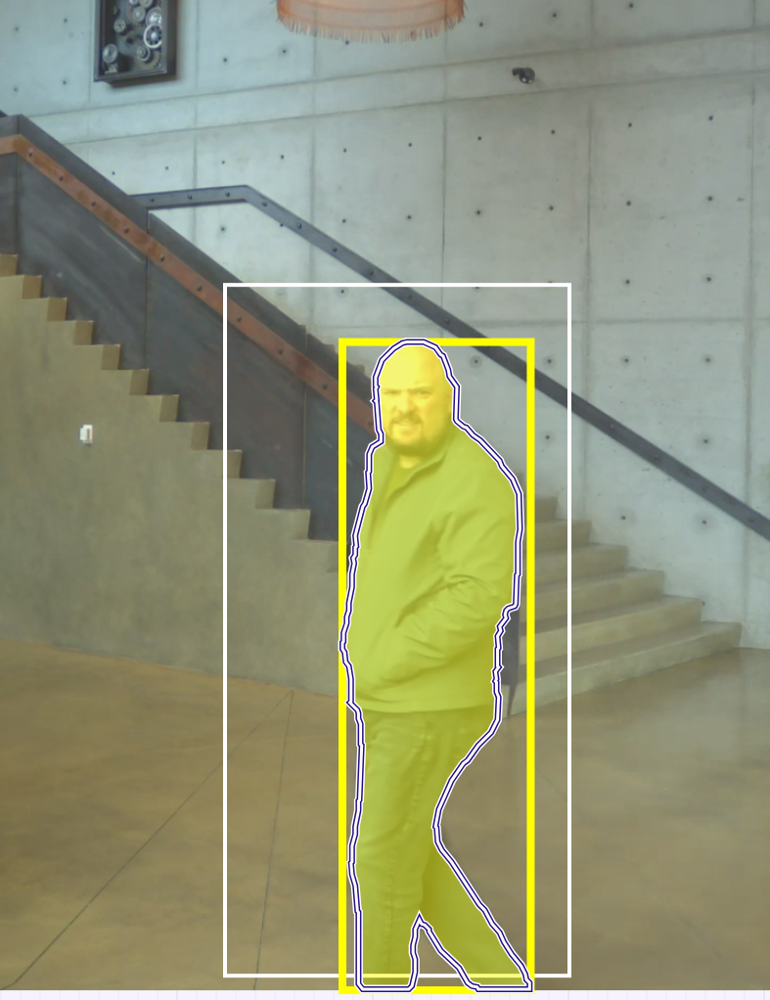

# Automatic Ground Truth Generation (AGTG)

AGTG allows datasets to have annotations populated on a dataset with minimal human interaction. There are two modes of operation.

1. Background Operation: This is invoked at the time of importing the dataset.
2. Semi-automatic: Users can select portions of dataset sequenced and manually trigger AI assisted annotations.

## Fully Automatic Ground Truth Generation

This functionality is available at the time of restoring a snapshot. To invoke the restore feature, import/create a snapshot and then enable AGTG while restoring the snapshot. Please refer to [Restoring a snapshot](snapshots.md) for more information.

## Semi-Automatic Ground Truth Generation

This process is used to generate 2D Bounding boxes, 2D segmentation masks, and 3D bounding boxes using AI assisted pipelines in EdgeFirst Studio.

### Starting an AGTG Server

1. Select *Cloud Instances* dashboard from the apps menu.

<figure markdown="span">
{ align=center }
<figcaption>Cloud Instances</figcaption>
</figure>

2. Click on the *Start* button.
3. Enter A desired name and select AI Assisted Ground Truth.

<figure markdown="span">
{ align=center }
<figcaption>AI Server</figcaption>
</figure>

4. This will create a server. Please refresh to see the status of the server. The server takes about 5 to 10 minutes to fully initialize.
5. Once initialized, it is ready for usage in next steps.

### Creating AI Assisted Annotations

1. Open a database and go to its gallery.
2. Click on a sequence that is intended to be edited.
3. Go to the frame where editing begins.
4. Enable the editing of annotations.

<figure markdown="span">
{ align=center }
<figcaption>Enable Edit Annotations</figcaption>
</figure>

5. Select *Video Segment Tool*.

<figure markdown="span">
{ align=center }
<figcaption>Video Segment Tool</figcaption>
</figure>

6. Select the AGTG server (as started above) if not already selected.
7. Click *INITIALIZE STATE*. By default, all frames of the sequence are selected - If only a portion of a sequence is to be edited then enter the starting and ending frame numbers. This will decrease the initialization time.
8. Once initialized, the first object is created without any segmentation masks. The explanation of icons on the object card is shown below.

<figure markdown="span">
{ align=center }
<figcaption>AI Segment Options</figcaption>
</figure>

9. Select an object on the image using a rectangle or inclusion points. 
10. The object should now be segmented.

<figure markdown="span">
{ align=center }
<figcaption>Segmented Annotation</figcaption>
</figure>

11. Click *PROPAGATE*.
12. This will start a counter and propagate the object from the starting frame to the ending frame.
13. Scroll through the frames to see if the propagation is correct.
14. If satisfied, click on the *SAVE PENDING SEGMENTATIONS* to store the annotations to the dataset.
15. If the dataset has LIDAR, then 3D bounding boxes are also created for the same object.
16. Repeat for other objects as necessary.
