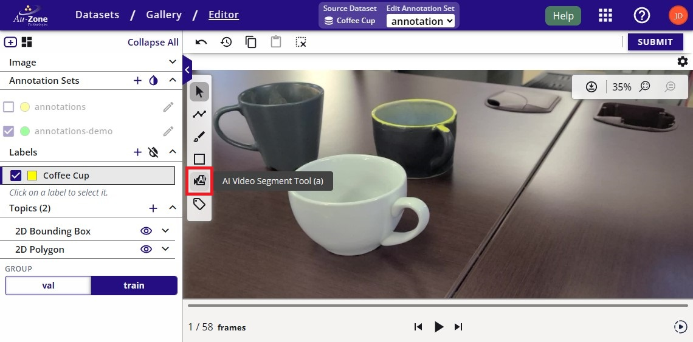
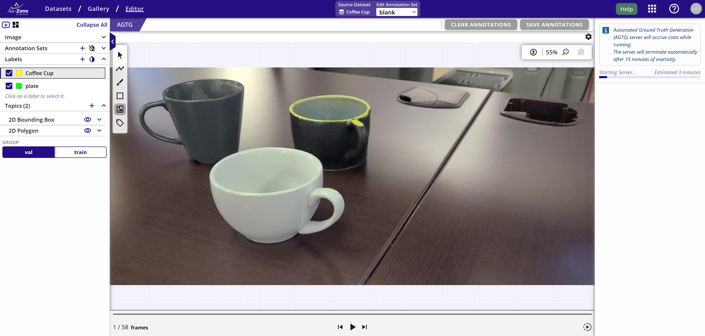
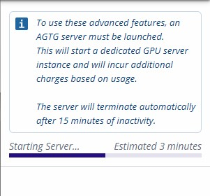
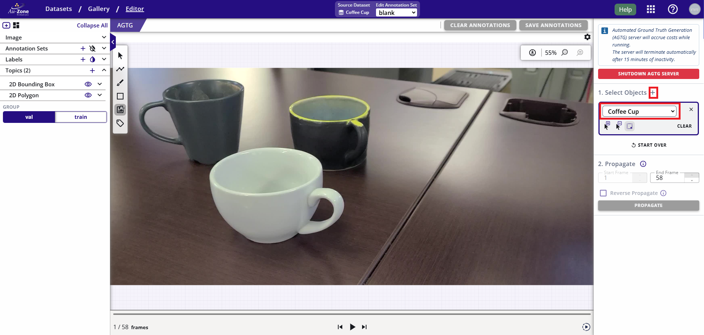
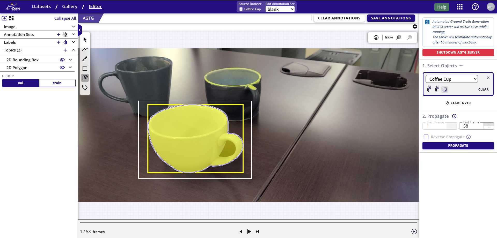
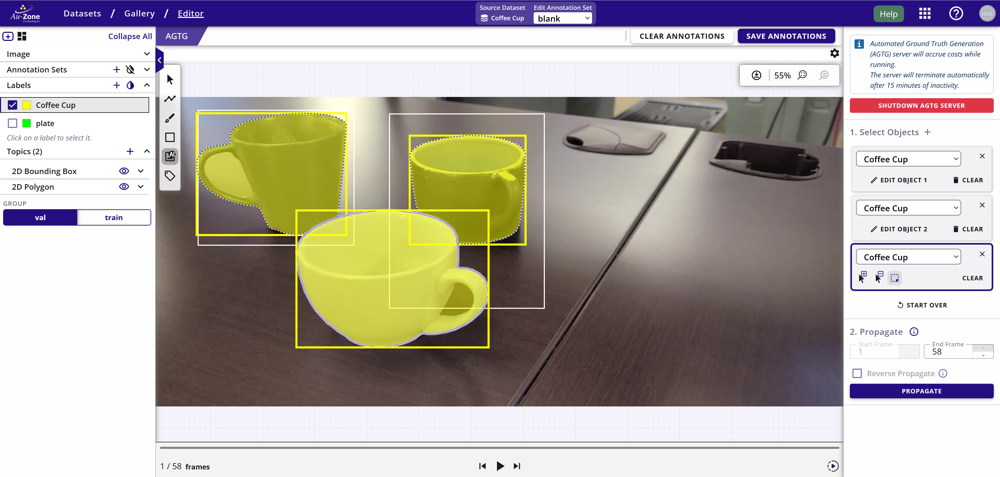
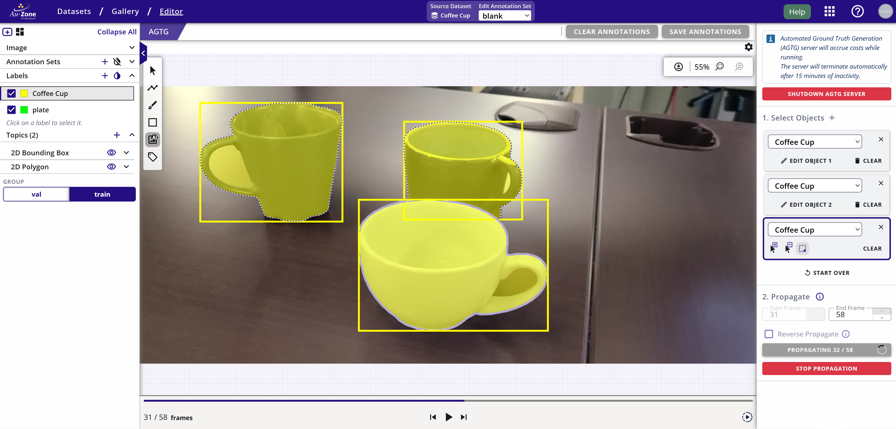

# Automatic Ground Truth Generation (AGTG)

AGTG allows datasets to have annotations populated on a dataset with minimal human interaction. There are two modes of operation.

1. Background Operation: This is invoked at the time of importing the dataset.
2. Semi-automatic: Users can select portions of dataset sequenced and manually trigger AI assisted annotations.

## Fully Automatic Ground Truth Generation

This functionality is available at the time of restoring a snapshot. To invoke the restore feature, import/create a snapshot and then enable AGTG while restoring the snapshot. Please refer to [Restoring a snapshot](snapshots.md) for more information.

## Semi-Automatic Ground Truth Generation

This process is used to generate 2D Bounding boxes, 2D segmentation masks, and 3D bounding boxes using AI assisted pipelines in EdgeFirst Studio.

First [navigate to the dataset gallery](../datasets/tutorials/management.md#viewing-datasets) and click on the "AI Segment Tool" as indicated in red below to open the Automatic Ground Truth Generation (AGTG) Manager View.

<figure markdown="span">
{ align=center }
<figcaption>Select the AI Segment Tool</figcaption>
</figure>

On first use, you will be shown a dialog saying that a new AGTG server will be launched. This server will remain active while active even if the screen is closed. The AGTG server terminate automatically after 15 minutes of inactivity or manually terminating the server. The server takes 3-5 minutes for initialization.  A progress will appear with an indication of the length of time to launch the server.  

<figure markdown="span">
{ align=center }
<figcaption>Launch AIGT Server</figcaption>
</figure>

<figure markdown="span">
{ align=center }
<figcaption>Launching Progress</figcaption>
</figure>

!!! warning

    This server is consumes credits to run.  An inactivity of 15 minutes will auto-terminate this server.  Otherwise, once you have completed the annotations, please ensure to terminate the AGTG server to avoid spending unnecessary credits. 

Once the server has been initialized, the 2D boxes for the initial prompt can be added. 

Below is a detailed breakdown of the sidebar.

<figure markdown="span">
{ align=center }
<figcaption>AGTG Sidebar </figcaption>
</figure>

<figure markdown="span">
{ align=center }
<figcaption>AGTG Object Card </figcaption>
</figure>

Note: For adding subsequent objects you need to press the "+" icon besides the "Select Objects". Also note that Object class (label) should be selection from the object label drop down.

<figure markdown="span">
{ align=center }
<figcaption>Add New Object</figcaption>
</figure>

You can now provide prompts to specify the object to segment.  You can either provide bounding boxes (mouse click and drag) or points (mouse clicks) to highlight the object.  By default prompts via bounding box is selected.  To draw a bounding box, click anywhere on the frame and then drag the mouse to expand the bounding box.  The bounding box should cover the object to annotate in the frame.  The figure below shows the resulting mask. The white box represents the triggering rectangle, while the yellow box represents the generated 2D box annotation.

<figure markdown="span">
{ align=center }
<figcaption>Resulting Annotation using Auto Annotation</figcaption>
</figure>

For multiple objects in the frame, click on the "+" again.  For every object in the frame, a new object must be added so that the tracker can assign a unique tracking ID.  The figure below shows multiple instances of coffee cup annotated using the AI assisted annotations as described above.

<figure markdown="span">
{ align=center }
<figcaption>Distinct Frame Annotations</figcaption>
</figure>

In order to propagate (track) the selected objects in the image to multiple frames, select the ending frames. Please note that the starting frame is fixed to the current frame. Click "Reverse Propagate" if you require to track objects from current frame to previous frames.

Then click the PROPAGATE button. 

During propagation, the progress and the frame counter will update as shown on the bottom right.  Optionally, you can stop the propagation by clicking on "Stop Propagation". 

<figure markdown="span">
{ align=center }
<figcaption>Propagation Progress</figcaption>
</figure>

Once the propagation completes, click on "SAVE ANNOTATIONS" to save the annotations.  A completed propagation will show the 2D annotations with masks and 2D bounding boxes for each object across the video frames.

!!! Note

    For cases where the object exits and then re-enters the frame, the object might not be tracked properly.  Repeat the steps as necessary to annotate the objects that were missed.

If you notice any errors on the annotations or missing annotations, follow the tutorial for [auditing 2D annotations](#audit-2d-annotations).  Furthermore, there is also a tutorial for [auditing 3D annotations](#audit-3d-annotations). 

