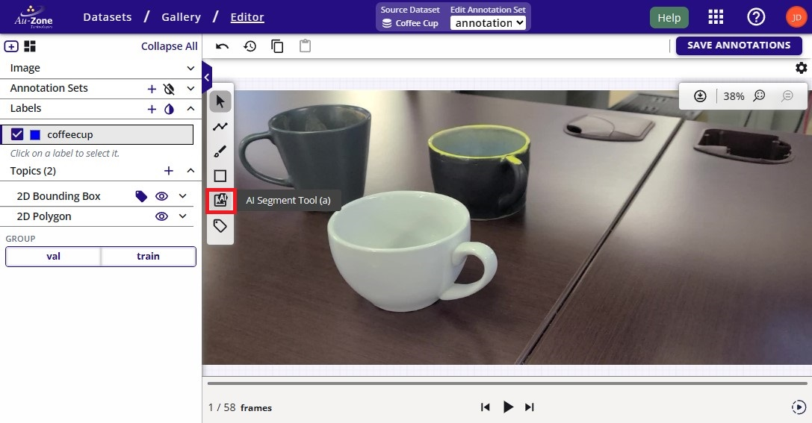
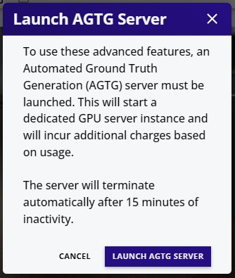
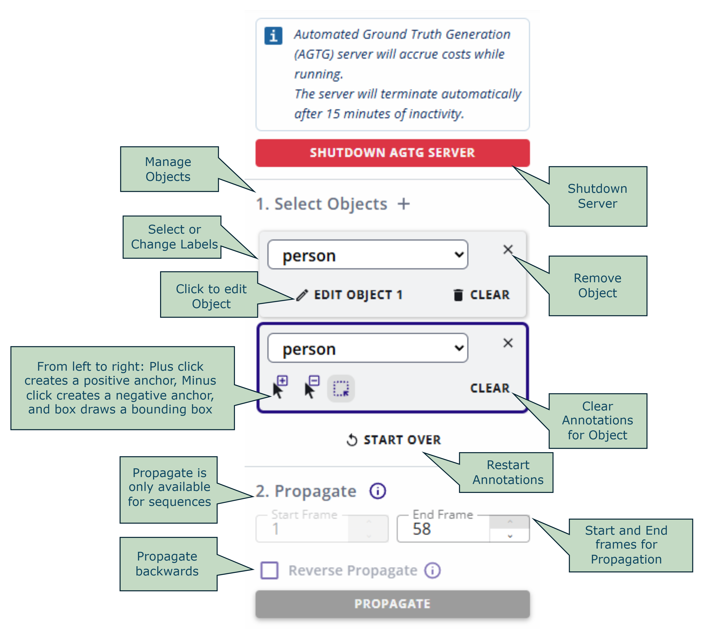
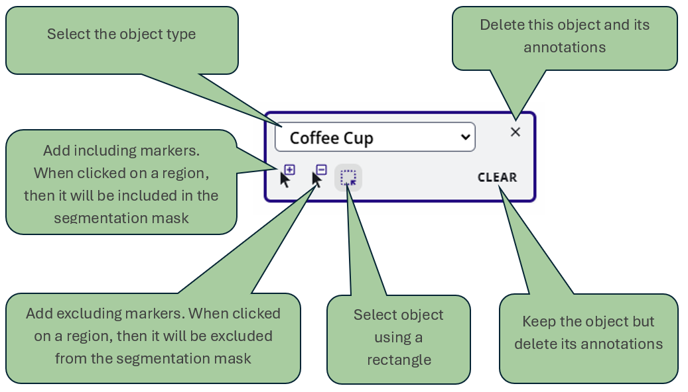
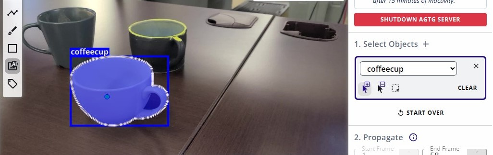
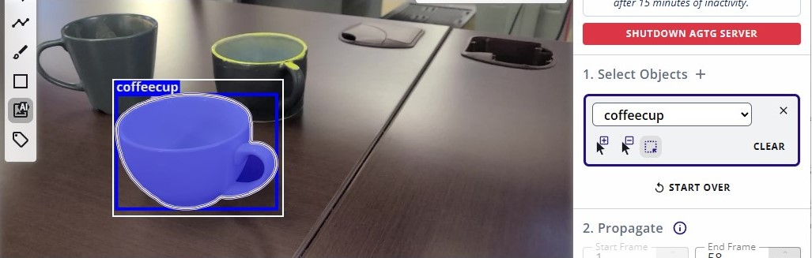
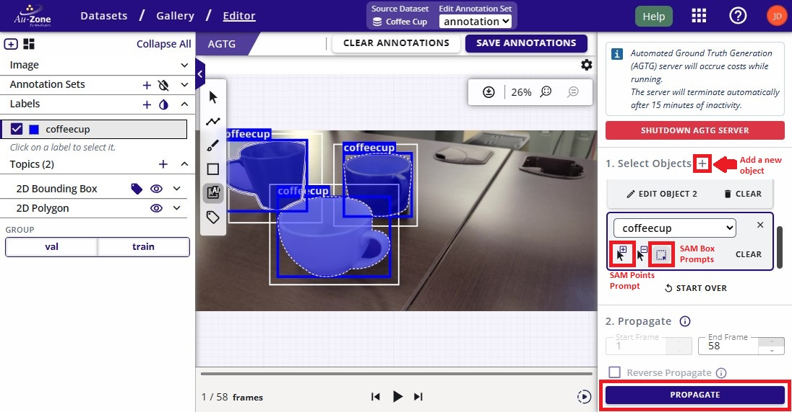
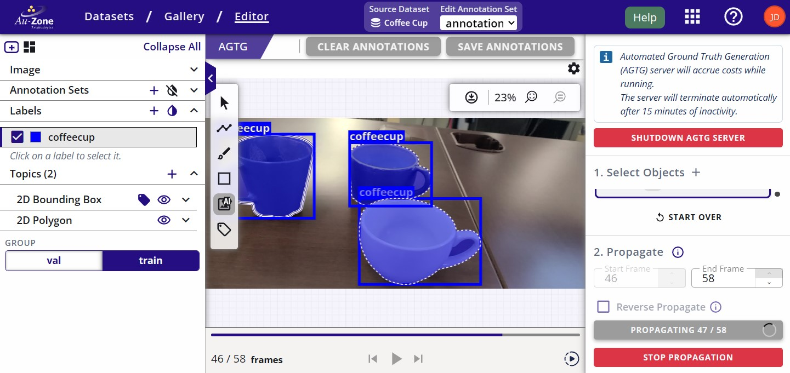

# Automatic Ground Truth Generation (AGTG)

This page is dedicated to describing the Automatic Ground Truth Generation (AGTG) that's available in EdgeFirst Studio.  The context, navigation, and the features of the AGTG will be described here.  For instructions to run the AGTG workflow, please see this [tutorial](../datasets/tutorials/annotations/automatic.md).

The AGTG allows datasets to have annotations populated on a dataset with minimal human interaction.  The AGTG pipeline is based on driving SAM-2 to auto-segment objects throughout the frames.  The segmentation masks generated by SAM are then processed to formulate 2D and 3D (from LiDAR or Radar PCDs) bounding boxes to complete the object's annotations as described in the [EdgeFirst Dataset Format](../datasets/format.md#annotation-schema).  There are two modes of operation.

1. *Fully Automatic*: This is invoked at the time of importing the dataset as a background process which deploys a detection model to drive SAM-2.
2. *Semi-Automatic*: This is invoked when users trigger the AI assisted annotations in the dataset gallery.  Users can select portions of the dataset to auto-annotate, but SAM-2 requires initial annotations from the user as prompts.

A complete annotation set will have 2D and 3D annotations as shown below which is a sample snapshot from the AGTG process.  The 2D annotations are shown on the left which are pixel-based bounding boxes and masks on the image.  The 3D annotations are shown on the right which are world-based 3D boxes surrounding the object in meters. 

<figure markdown="span">
{ align=center }
<figcaption>Sample Annotations</figcaption>
</figure>

## Fully Automatic Ground Truth Generation

This functionality is available at the time of restoring a snapshot.  To invoke the restore feature, import/create a snapshot and then enable AGTG while restoring the snapshot.  All the details for this type of AGTG is available under the [Snapshot Dashboard](snapshots.md).  The tutorial for this workflow is found under [Dataset Annotations](../datasets/tutorials/annotations/automatic.md#fully-automatic-ground-truth-generation).

## Semi-Automatic Ground Truth Generation

This functionality is available after importing the dataset into EdgeFirst Studio.  This type of AGTG requires user annotations in the starting frame to give SAM-2 context as to which objects to annotate throughout the rest of the frames.  This section will describe this type of AGTG.  However, the tutorial for this workflow is found under [Dataset Annotations](../datasets/tutorials/annotations/automatic.md#semi-automatic-ground-truth-generation).

This AGTG feature can be found in the [dataset gallery](datasets/gallery.md).  The dataset gallery can contain sequences or images which are distinguished by the presence of the sequence icon  on the image card as shown below. 

<figure markdown="span">
{ align=center }
<figcaption>Dataset Sequence</figcaption>
</figure>

The SAM-2 propagation step is only available for sequences.  However, images can still be annotated using SAM-2, but through individual annotations which requires more effort over sequences as shown in the [Manual Annotations](../datasets/tutorials/annotations/manual.md#add-2d-annotations). 

There are three steps involved in this process: *Initialize AGTG Server*, *Annotate Starting Frame*, *Propagate*.  This AGTG feature can be invoked by clicking on the "AI Segment Tool" button inside the dataset gallery as shown below.

<figure markdown="span">
{ align=center }
<figcaption>Select the AI Segment Tool</figcaption>
</figure>

Clicking on this feature will prompt you to [start an AGTG server](../datasets/tutorials/annotations/automatic.md#initialize-agtg-server).  This is a cloud based server that hosts SAM-2 and the AGTG backend.  As indicated, this server will take some time (~3 minutes) to initialize and once initialized, 15 minutes of inactivity will auto-terminate the server.  This is a safety mechanism to prevent extreme usage of the credits available in your account.  As a safety precaution, ensure that all unused [servers are terminated](../datasets/tutorials/annotations/index.md#terminate-agtg-server) to prevent any unnecessary server costs.

<figure markdown="span">
{ align=center }
<figcaption>Launch AGTG Server</figcaption>
</figure>

Once the AGTG server has been initialized, you can now proceed to the next step which is to [annotate the starting frame](../datasets/tutorials/annotations/automatic.md#annotate-starting-frame) in the sequence.  This will bring the extended sidebar which contains the AGTG features to control the annotation process.  This step is necessary in order to give SAM-2 context of the objects to track in the current frame. 

Below is a detailed breakdown of the sidebar.

<figure markdown="span">
{ align=center }
<figcaption>AGTG Sidebar </figcaption>
</figure>

<figure markdown="span">
{ align=center }
<figcaption>AGTG Object Card </figcaption>
</figure>

An object is a single annotation or a single instance of an object in the image.  The number of object cards should equate to the number of objects in the image.  For each object, annotate by either drawing a bounding box (click and drag) around the object or markers (mouse clicks) to specify the region that contains the object.  To draw a bounding box, click anywhere on the frame and then drag the mouse to expand the bounding box.  The bounding box should cover the object to annotate in the frame. 

**Markers** | **Boxes**
:------------------:|:------------------:
 |  

!!! Note "Multiple Objects"
    For adding subsequent objects you need to press the "+" button besides the "Select Objects". Also the object class (label) should be selected from the object label drop down.

The figure below shows multiple instances of coffee cup annotated using the AI assisted annotations as described above.

<figure markdown="span">
{ align=center }
<figcaption>AGTG Initial Prompts</figcaption>
</figure>

Once the current frame has been annotated, you can move forward to the last step which is to [propagate](../datasets/tutorials/annotations/automatic.md#propagate).  In order to propagate (track) the selected objects in the current frame to subsequent frames, select the ending frames. Please note that the starting frame is fixed to the current frame.  Click "Reverse Propagate" if you require to track objects from current frame to previous frames.

Click the PROPAGATE button for SAM-2 to start tracking and annotating the objects throughout the frames.  During propagation, the frame and the counter will update as shown below.  Optionally, you can stop the propagation by clicking the "Stop Propagation" button. 

<figure markdown="span">
{ align=center }
<figcaption>Propagation Process</figcaption>
</figure>

Once the propagation completes, click on "SAVE ANNOTATIONS" to save the annotations.  A completed propagation will show the 2D annotations with masks and 2D bounding boxes for each object across the video frames.  If LiDAR or Radar readings are available in the dataset, the 3D annotations will also be generated. 

!!! tip
    For cases where the object exits and then re-enters the frame, the object might not be tracked properly.  Repeat the steps as necessary to annotate the objects that were missed.

## Next Steps

Now that you have been introduced to the auto-annotation features in EdgeFirst Studio, proceed to the [Datasets](../datasets/index.md) section to learn more about managing your own datasets from following the capture and annotation workflows. 
