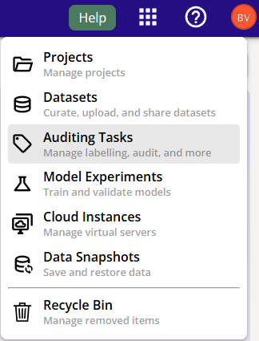
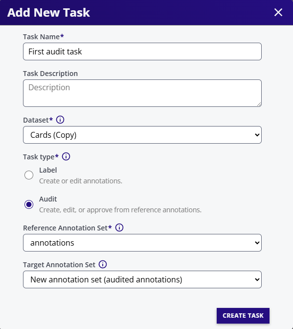
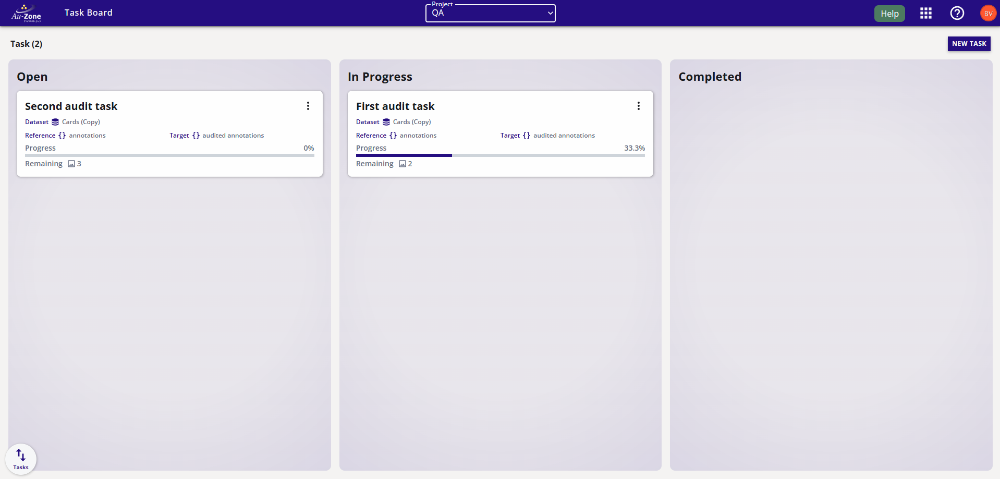
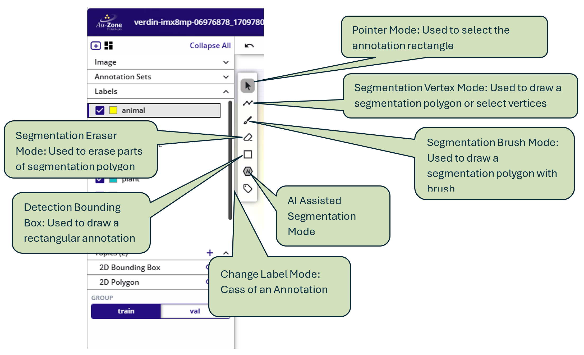
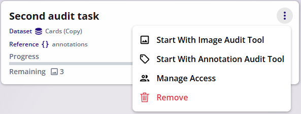
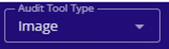

# Annotation Sets

An annotation set is a container in EdgeFirst Studio for storing dataset annotations.

## Editing 2D Annotations

There are two modes of operations:

1.	Edit images from gallery.
2.	Edit Images from Auditing Tasks board.

## Multi-User Annotation Audit / Edit 

EdgeFirst Studio allows multiple users to remotely access a single dataset and annotation set and make changes without interfering with each other. Users can navigate to this page using the menu dropdown.

<figure markdown="span">
{ align=center }
<figcaption>Auditing Tasks</figcaption>
</figure>

### Difference between Label and Audit

#### Label

User works on one annotation set, then create or edit annotations.

#### Audit

User reviews annotations in the reference annotation set: 
- Accepted annotations move to the target annotation set.  
- Rejected annotation are not copied to the target annotation set.
- Edited annotations are copied with edits to the target annotation set.

### Creating a new task

<figure markdown="span">
{ align=center }
<figcaption>New Task</figcaption>
</figure>

- Enter task name and description.
- Select a dataset from the current project you want to work on.
- Select target annotation set. If *New annotation set* is selected then the result will be stored here
- If *Audit* type is selected. A reference annotation set is required. You will be performing audits on annotations from this set.

Task entry is created in the Task board. There are three columns: 

1. Open - Created but no work has started.
2. In Progress - Some images have been worked on - the remaining images are shown.
3. Completed - All images have been worked on.

<figure markdown="span">
{ align=center }
<figcaption>Task Board</figcaption>
</figure>

Click on any task entry and start editing. The editing process is described below.

## Edit images from gallery

1. Open the image gallery
2. Click on an image and expand Annotation Sets

<figure markdown="span">
{ align=center }
<figcaption>Annotation Editing Options</figcaption>
</figure>

### Add a Bounding Box
1.	Click on a label from Labels section – all boxes drawn will be of this class.
2.	Click on the Detection Bounding Box Mode (or press b).
3.	Click and drag on image to draw as many rectangular bounding boxes.
4.	Select any other class and add boxes for that class.
5.	Click on *SAVE ANNOTATIONS* to finalize the annotations.

### Add a Polygon Annotation with Vertices
1.	Click on a label from Labels section – all polygons drawn will be of this class.
2.	Click on the Segmentation Vertex Mode (or press p).
3.	Continuously click on image to draw as many vertices of the polygon as required.
4.	Select any other class and ad polygons for that class.
5.	Select Pointer mode (q) to edit any vertices.
6.	Click on *SAVE ANNOTATIONS* to finalize the annotations.

### Add a Polygon Annotation with Brush
1.	Click on a label from Labels section – all polygons drawn will be of this class.
2.	Click on the Segmentation Brush Mode (or press w).
3.	Hold mouse down on image to draw the polygon as required.
4.	Select any other class and add polygons for that class.
5.	Select Pointer mode (q) to edit any vertex.
6.	Select Segmentation Eraser mode (e) to erase parts of the polygon.
7.	NOTE: Only the polygon selected (using pointer tool) will be erased. 
8.	Use [+]  [-]  icons to make the brush/eraser larger or smaller.
9.	Click on *SAVE ANNOTATIONS* to finalize the annotations. 

### Change Class Label of an Annotation 
1.	Click on a label from Labels section – all annotations clicked will be of this class.
3.	Click on the Change Label Mode (or press l)
4.	Click on any annotation to change its class to the selected class.

### Edit Images from the Edit/Audit Dashboard

Go to the Auditing Tasks board

<figure markdown="span">
{ align=center }
<figcaption>Audit Annotations</figcaption>
</figure>

Create a new task or continue an existing task.

####  Label: 
Add, delete, edit annotations in one annotation set in the target annotation set and save in the same annotation set.

#### Audit: 
Review annotations in the reference annotation set then approve, reject or edit annotation and put in a the reference annotation set.

There are two auditing modes:
1.	Image based audit
2.	Annotation based audit

<figure markdown="span">
{ align=center }
<figcaption>Start Auditing</figcaption>
</figure>

### Image Based Audit
Clicking on the task takes you directly to the image mode auditing. All the editing is the same as described in the Gallery based Editing above.
User can switch between Image based editing/audit and annotation based Audit from the top header: 

<figure markdown="span">
{ align=center }
<figcaption>Audit Tool Type</figcaption>
</figure>

### Annotation Based Audit
In this mode only one annotation is shown at a time. The user can edit the with single click and next annotation is automatically presented. Hotkeys are provided to speed up the process:

1.	(ENTER) – accept annotation.
2.	(SPACE) – reject annotation.
3.	(<--) Go to previous annotation – no change to the current annotation.
4.	(-->) Go to next annotation – no change to the current annotation. 
5.	(Z) – Toggle zoom to annotation view and full image.
6.	(1-9) - change the annotation class from 1 to 9.
7.	(SHIFT 0-9) - change the annotation class from 10 to 19.
User can edit the size of the annotation by mouse click and drag.
