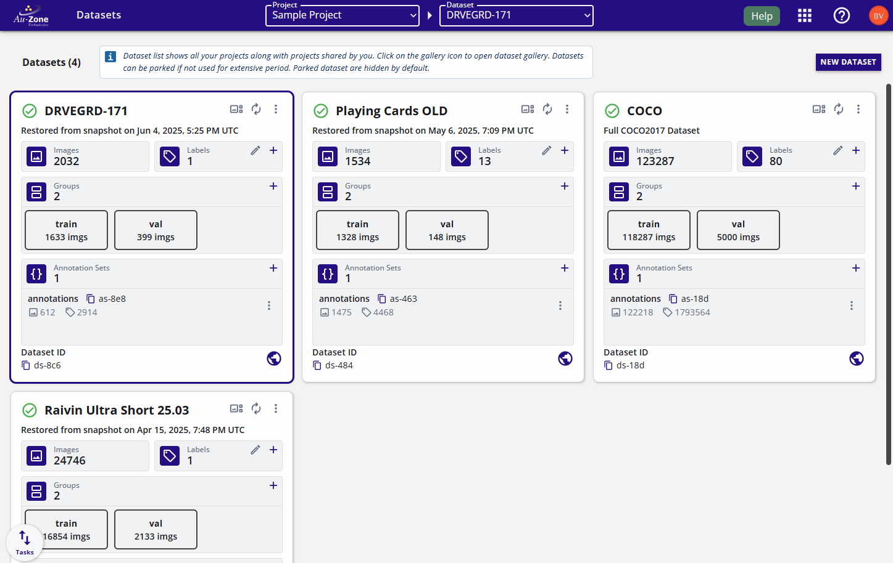
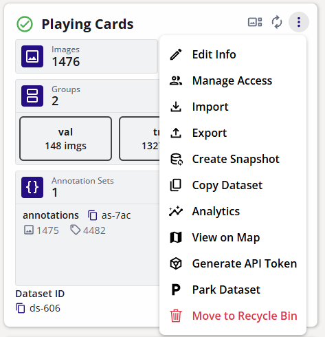
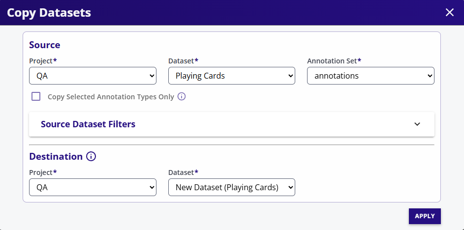
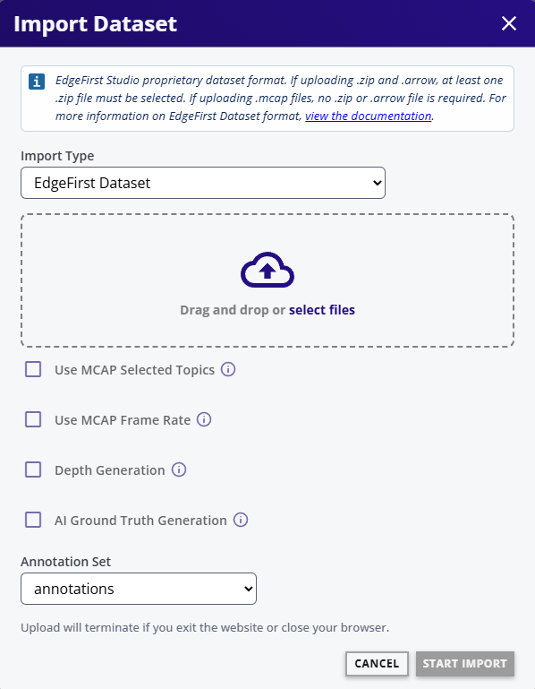
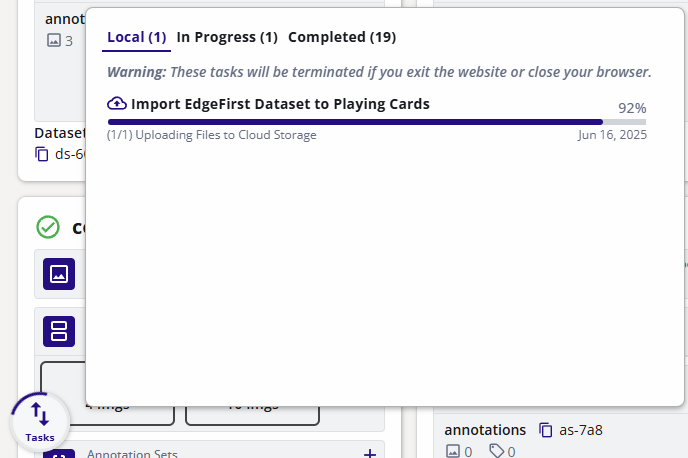
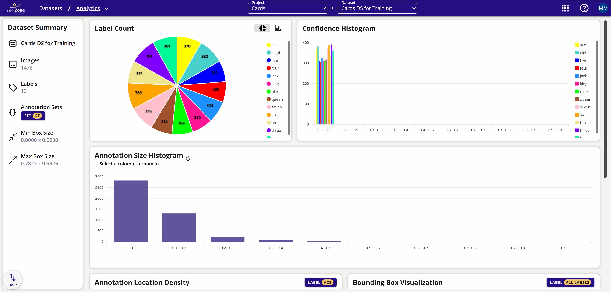
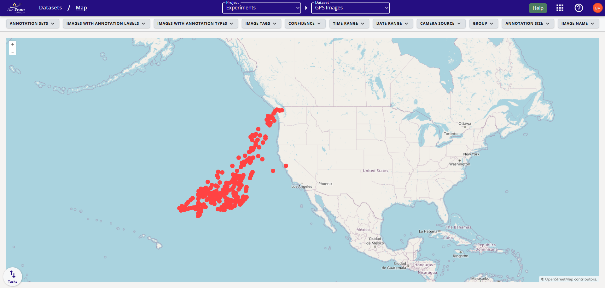
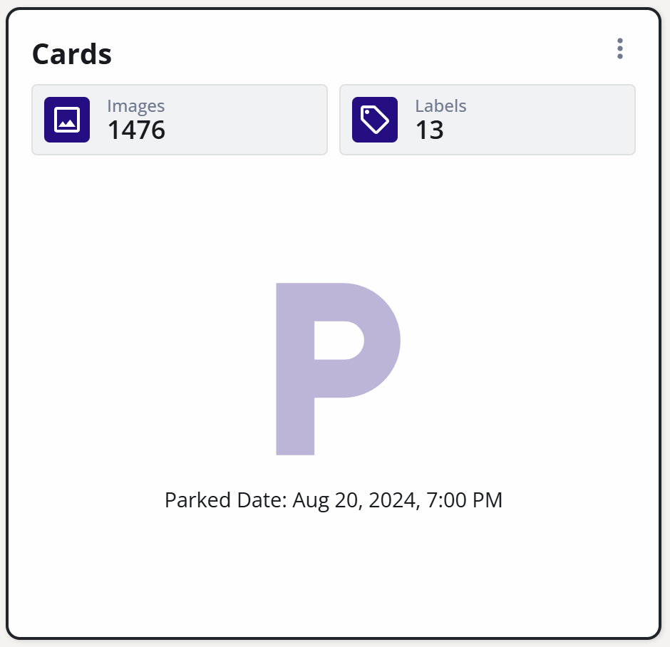

# Dataset Dashboard

The *Dataset Dashboard* show a list of datasets in a project with a summary of datasets in each dataset card.

<figure markdown="span">
{ align=center }
<figcaption>Dataset Dashboard</figcaption>
</figure>

The dataset attributes are shown below.

<figure markdown="span">
{ align=center }
<figcaption>Dataset Attributes</figcaption>
</figure>

## Annotation Sets

Each dataset can have multiple *Annotations Sets*. An *Annotation Set* is a container for storing the annotations in the datast. Each *Annotation Set* contains annotations from a different source (i.e. different annotation teams, or inferences from models).

### Annotation Set Operation

 - Click on the add annotation set icon (+) to add an annotation set.
 - Each annotation set has an (x) icon to delete the annotation set - all associated annotations will also be deleted. Please note that deleted annotation sets goes the the recycling bin and can either be restored or permanently deleted. The storage is only freed when the recycling bin is cleared.  
 - Each annotation set has an (i) icon to get/set the details of the annotation set.

## Labels

Click on labels (i) icon to open the dialog to edit labels.

<figure markdown="span">
{ align=center }
<figcaption>Editing Labels</figcaption>
</figure>

The edit dialog allows to:

- Add Label (class).
- Change the color of the label.
- Change the order of the labels by changing its index.
- Delete a label.
- Change the name of a label.

## Groups

- Groups allow images to be associated with a certain functionality such as training images, validation images, images with errors, etc.
- One image can be associated with zero or only one group at a time.
- Use the slider to adjust percentages for each group.
- If *Only ungrouped images* is unchecked, all images will be shuffled and assigned new groups.

The following image shows a dialog to split ungrouped images into 2 groups, *Training* and *Validation*

<figure markdown="span">
{ align=center }
<figcaption>Assigning Groups</figcaption>
</figure>

## Dataset Extended Menu

Click on the three dots on dataset card to open the extended menu.

<figure markdown="span">
{ align=center }
<figcaption>Extended Dataset Menu</figcaption>
</figure>

### Pause Activities

Pause or resume upload activities on this dataset.

### Edit Dataset

Change the name or description of the dataset.

### Manage Access

The dataset access control allows dataset resources to be selectively available to different users. 

For more information pease visit [Access Control](../user/organization.md#roles).

### Copy Dataset

<figure markdown="span">
{ align=center }
<figcaption>Copying Datasets</figcaption>
</figure>

To copy datasets proceed with the steps as follows:

1. Open the dataset extended menu.
2. Select *Copy Dataset*.
3. Source project, dataset, and annotation set (if applicable) are auto-filled, but you can select a different source if required.
3. Destination project is selected by default. If *New Dataset (Dataset name)* is selected, a new dataset along with any annotation set from source will be created in the destination project. Otherwise, you can choose a dataset and an annotation set as destination.
4. Optionally select *Copy Selected Annotation Types Only* to only copy annotations and files that match the checked types.
5. Select filters if required. Please refer to [Gallery Filters](gallery.md) for more information.  

### Import Dataset

There are several import types available:

<figure markdown="span">
{ align=center }
<figcaption>Importing Datasets</figcaption>
</figure>

Select an import type. EdgeFirst Dataset is the proprietary format used by many operations in EdgeFirst Studio. Please refer to [EdgeFirst Dataset Format](../../datasets/format.md) for more information.

1. Pre-create an annotation set where annotations are to be imported. If only images are imported, then this step is not required.
2. Drag and drop a folder or group of files.
3. Select an annotation set if the annotation type allows annotation import.
4. Click *START IMPORT*.
5. Import will start in the background and the status is shown in the task progress popup.

<figure markdown="span">
{ align=center }
<figcaption>Task Dialog</figcaption>
</figure>

!!! warning
    Although the import process is running in the background, closing the web browser or the tab will terminate all uploads in the *Local* tab of the task dialog. Moving to other pages in the studio is still fine.

### Export Dataset

The *Export Dataset* downloads the data from EdgeFirst Studio to the local folder in your PC.

<figure markdown="span">
{ align=center }
<figcaption>Export Dataset</figcaption>
</figure>

1. Select the dataset type: Detection (Bounding boxes) or Segmentation (Masks).
2. Select the export format.
3. Select the annotation set to be exported if required.
4. Select Mode:
    - Dataset - Exports images and annotations. Exports a zip file in the downloads folder.
    - Annotations Only - Exports only the annotations. Exports a zip file in the downloads folder.
    - Image URLS only - Useful for larger datasets. Exports a file with image urls in the downloads folder.
5. For datasets larger than 10000 images, import image URLS and annotations separately and then use a script to download images.

### Analytics

Click on Analytics to see information about the dataset.

<figure markdown="span">
{ align=center }
<figcaption>Dataset Analytics</figcaption>
</figure>

### View on Map

When importing a dataset, the GPS location can be imported in the two following ways: 

1. GPS location in image EXIF.
2. GPS location as an annotation type.

If GPS location is present, then the annotation can be viewed on the map by using the View on Map option.

<figure markdown="span">
{ align=center }
<figcaption>Dataset Maps</figcaption>
</figure>

### Park Dataset

Datasets that are not used often can be parked. The advantages of Parking a dataset are:

1. Reduced storage cost.
2. Dataset is frozen and can not be modified.

Datasets can be un-parked at any time for normal usage.

<figure markdown="span">
{ align=center }
<figcaption>Park Dataset</figcaption>
</figure>

### Remove Dataset

To delete a dataset, click *Move to Recycle Bin*. This moves the dataset and all of its contents to the recyle bin

!!! note

    The deleted dataset goes to the recycling bin and can be undeleted. The storage used by the dataset is only released when the dateset is purged from the recycling bin.
