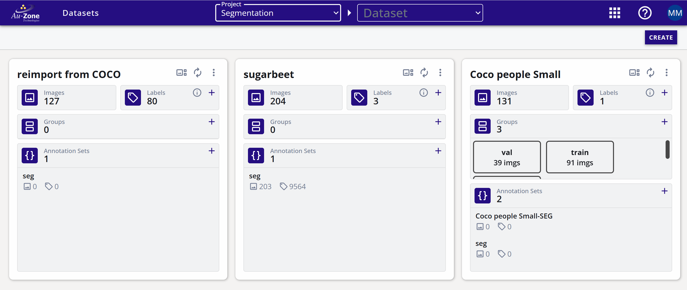
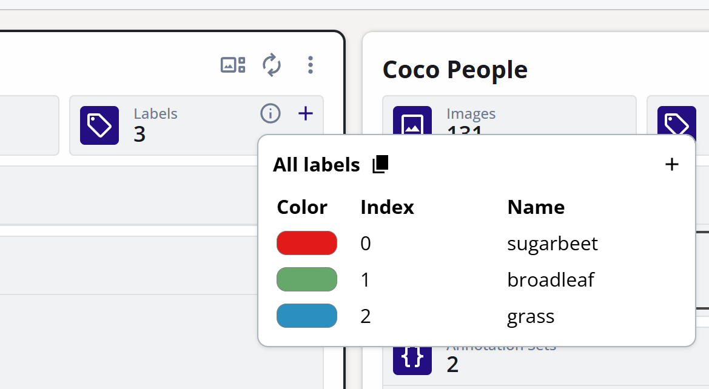
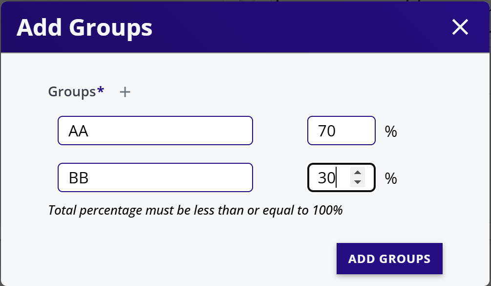
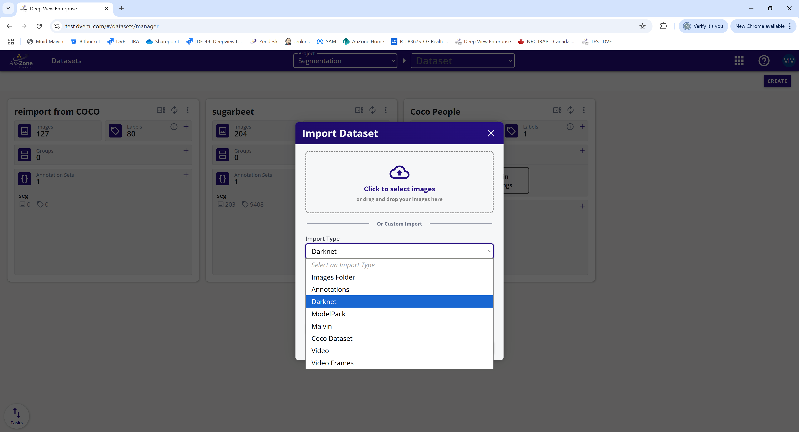
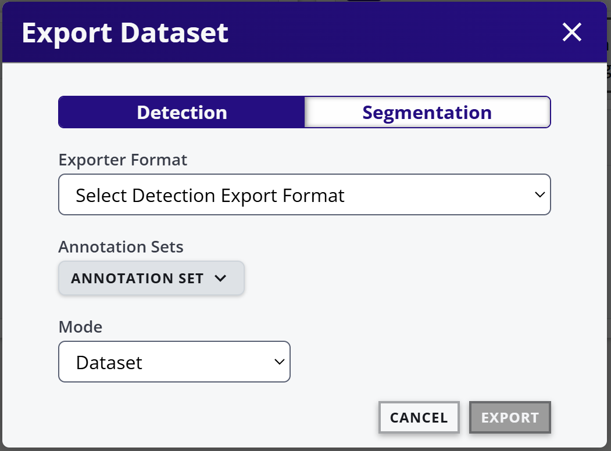
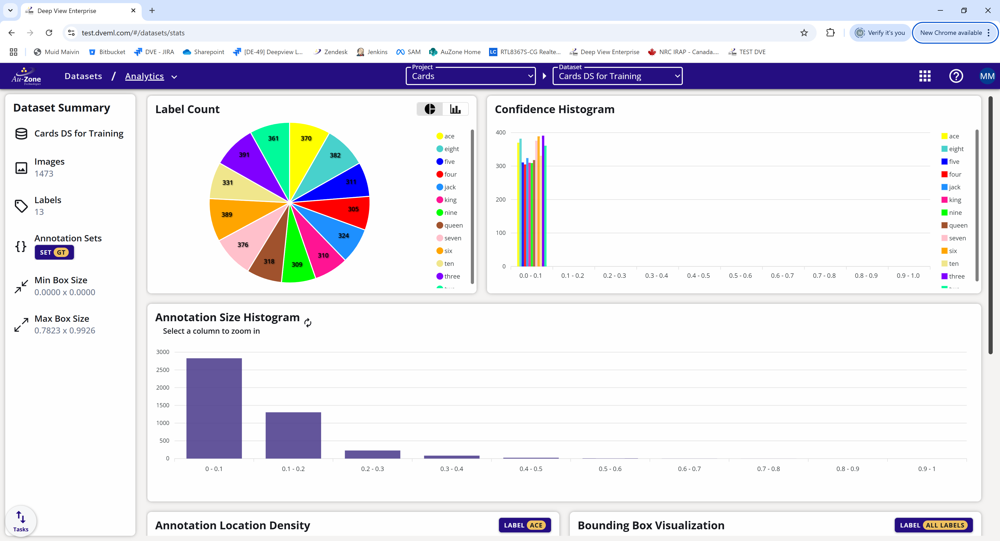
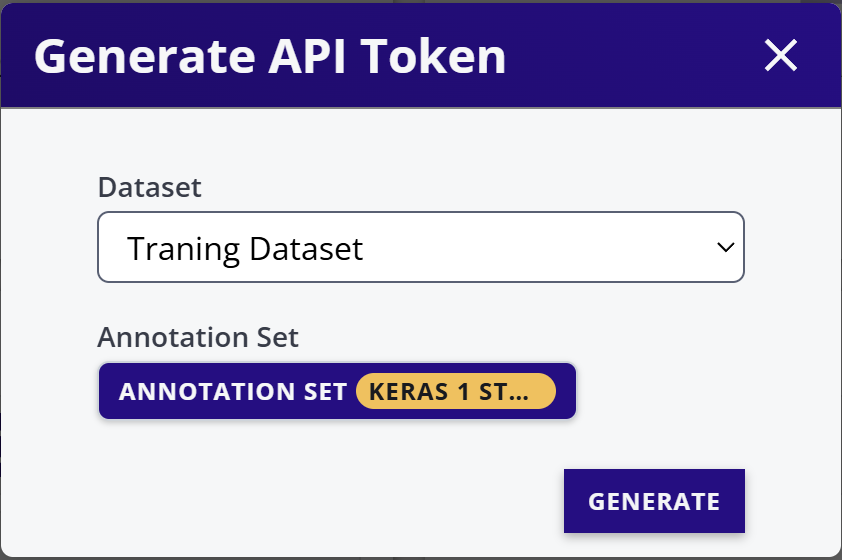
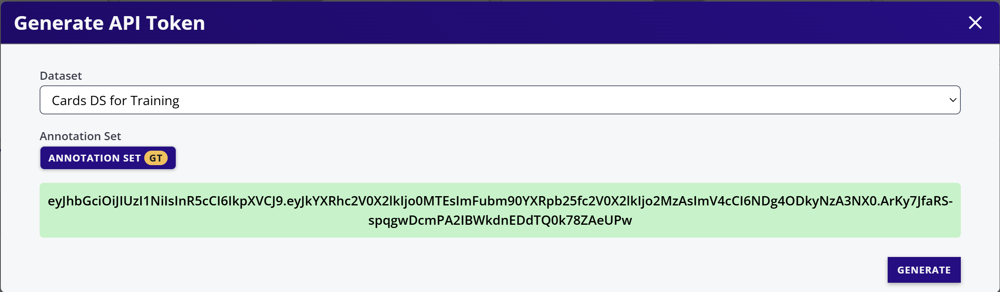

# Dataset Dashboard

The *Dataset Dashboard* show a list of datasets in a project with a summary of datasets in each dataset card.

<figure markdown="span">
{ align=center }
<figcaption>Dataset Dashboard</figcaption>
</figure>

The dataset attributes are shown below.

<figure markdown="span">
{ align=center }
<figcaption>Dataset Attributes</figcaption>
</figure>

## Annotation Sets

Each dataset can have multiple *Annotations Sets*. An *Annotation Set* is a container for storing the annotations in the datast. Each *Annotation Set* contains annotations from a different source (i.e. different annotation teams, or inferences from models).

### Annotation Set Operation

 - Click on the add annotation set icon (+) to add an annotation set.
 - Each annotation set has an (x) icon to delete the annotation set - all associated annotations will also be deleted. Please note that deleted annotation sets goes the the recycling bin and can either be restored or permanently deleted. The storage is only freed when the recycling bin is cleared.  
 - Each annotation set has an (i) icon to get/set the details of the annotation set.

## Labels

Click on labels (i) icon to open the dialog to edit labels.

<figure markdown="span">
{ align=center }
<figcaption>Editing Labels</figcaption>
</figure>

The edit dialog allows to:

- Add Label (class).
- Change the color of the label.
- Change the order of the labels by changing its index.
- Delete a label.
- Change the name of a label.

## Groups

- Groups allow images to be associated with a certain functionality such as training images, validation images, images with errors, etc.
- One image can be associated with zero or only one group at a time.
- A Group can have any name.
- Click on the groups (+) icon to add groups.
- Multiple groups can be added at one time.

The following image shows a dialog to add two groups by the name AA abd BB and randomly add 70% and 30% images to each group.

<figure markdown="span">
{ align=center }
<figcaption>Assigning Groups</figcaption>
</figure>

## Dataset Extended Menu

Click on the three dots on dataset card to open the extended menu.

<figure markdown="span">
{ align=center }
<figcaption>Extended Dataset Menu</figcaption>
</figure>

### Pause Activities

Pause or resume upload activities on this dataset.

### Edit Dataset

Change the name or description of the dataset.

### Manage Access

The dataset access control allows dataset resources to be selectively available to different users. 

For more information pease visit [Access Control](../access.md).

### Copy Dataset

To copy datasets proceed with the steps as follows:

1. Open the dataset extended menu (three vertically aligned dots).
2. Select *Copy Dataset*.

<figure markdown="span">
{ align=center }
<figcaption>Copying Datasets</figcaption>
</figure>

3. Select the source project (datasets from other projects can be copied into the currently selected project).
4. Select the source dataset.
5. Select the groups to copy (or all groups - default).
6. Select the source annotation set - if none is selected then annotations will not be copied.
7. Optional select 'Copy Annotations for Duplicate Images'. Normally images with same names are not copied to avoid image duplications. In this case the annotations of duplication images are also not copied. This option (selected) copies the annotations even if the image is duplicated. This is useful if two datasets have the same images but only annotations are required to be copied from one dataset to another.
8. Select filters if required. Please refer to [Gallery Filters](gallery.md) for more information.
9. Select the destination dataset(s). Please note that multiple destination datasets can be selected to split the source dataset images into multiple datasets.
10. Finally select the percentage of the images to be copied. If less that 100% of the images are selected then random subset of the images will be copied.  

### Import Dataset

There are several import types available:

<figure markdown="span">
{ align=center }
<figcaption>Importing Datasets</figcaption>
</figure>

Select the import type. The most common import is the *Darknet format*.

1. Pre-create an annotation set where annotations are to be imported. If only images are imported, then this step is not required.
2. Select the folder where the data is located. For Darknet format datasets, browse to the images images folder.
3. If "Create image groups from folders" is selected, then the importer will automatically create groups based on the folders in the images folder (for example train, val).
4. Select an annotation set.
5. Click *START IMPORT*.
6. Import will start in the background and the status is shown in the task progress bar.

<figure markdown="span">
{ align=center }
<figcaption>Import Taskbar</figcaption>
</figure>

!!! warning
    Although the import process is running in the background, closing the web browser or the tab will kill the import. Moving to other pages in the studio is still fine.

### Export Dataset

The *Export Dataset* downloads the data from EdgeFirst Studio to the local folder in your PC.

<figure markdown="span">
{ align=center }
<figcaption>Export Dataset</figcaption>
</figure>

1. Select the dataset type: Detection (bounding box) or Segmentation (Polygons).
2. Select the export format.
3. Select the annotation set to be exported (none if annotations are not to be exported).
4. Select Mode:
    - Dataset - Exports images and annotations. Exports a zip file in the downloads folder.
    - Annotations Only - Exports only the annotations. Exports a zip file in the downloads folder.
    - Image URLS only - Useful for larger datasets. Exports a file with image urls in the downloads folder.
5. For datasets larger than 10000 images, import image URLS and annotations separately and then use a python script (downloadable from help menu) to download images.

### Analytics

Click on Analytics to see information about the dataset.

<figure markdown="span">
{ align=center }
<figcaption>Dataset Analytics</figcaption>
</figure>

### View on Map

When importing a dataset, the GPS location can be imported in the two following ways: 

1. GPS location in image EXIF.
2. GPS location as an annotation type.

If GPS location is present, then the annotation can be viewed on the map by using the View on Map option.

<figure markdown="span">
{ align=center }
<figcaption>Dataset Maps</figcaption>
</figure>

### Generate API Token

An API token is used for Bridge In and Bridge out API. To generate the API.  The API has an encrypted Java Web Token (JWT) with embedded information about the dataset and the annotation set.

<figure markdown="span">
{ align=center }
<figcaption>Generate an API Token</figcaption>
</figure>

Specify the Dataset and the Annotation set and click *GENERATE*.

<figure markdown="span">
{ align=center }
<figcaption>Generated API Token</figcaption>
</figure>

Copy the API token in green and use it for Bridge In or Bridge out API.

### Park Dataset

Datasets that are not used often can be parked. The advantages of Parking a dataset are:

1. Reduced Storage Cost.
2. Dataset is segregated and un-corruptable.

Datasets can be un-parked at any time for normal usage.

<figure markdown="span">
{ align=center }
<figcaption>Park Dataset</figcaption>
</figure>

### Remove Dataset

To delete a dataset, click *Remove Dataset*. This deletes all the images in the dataset and its associated annotation.

!!! note

    The deleted dataset goes to the recycling bin and can be undeleted. The storage used by the dataset is only released when the dateset is purged from the recycling bin.
