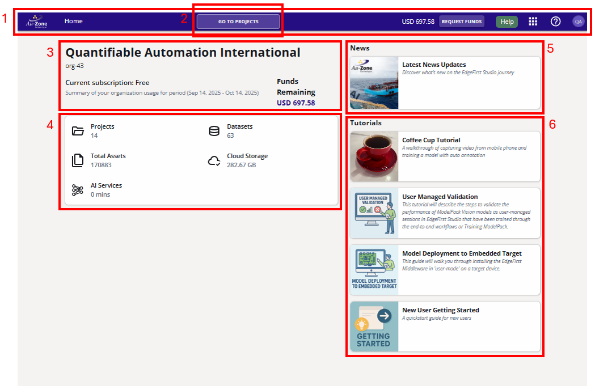

# Home Page

## Introduction
The User Home Page is the first page that a user sees when the log into EdgeFirst Studio.  It contains a summary of the relevant information a user needs at their fingertips, as well as pertinent links to the additional information.
<figure markdown="span">
{ align=center }
<figcaption>User Home Page</figcaption>
</figure>

To return to this splash page from any other page, you can:

* click your browser's "Back" button until back here.
* click on the "Au-Zone" Home button in the top-left corner.

## User Home Page Breakdown
Let's explain the elements contained in the User Home Page.
<figure markdown="span">
{ align=center }
<figcaption>User Home Page Breakdown</figcaption>
</figure>
At the top of the User Home Page is the violet [navigation bar](navigation.md) (1).  Some of the more important buttons are the Au-Zone Home Button, Request Funds Button, the Help Button, and Apps Waffle Button.  The [navigation page](navigation.md) contains a more detailed breakdown of the entire navbar.  Only on the User Home Page, there is the "Go To Projects" button (2) prominently displayed in the middle of the navbar.  This will take you to your [projects page](projects.md), which is where datasets and their respective training and validation sessions are housed.

Information regarding the user's organization, including the ID, current subscription level, and the organization's remaining funds are available in the Organization Summary Panel (3).  It's important to note here that funds and subscription level are tied to organization, and not user.  Though, at the free subscription level, this is largely academic as users cannot be added to those organizations.  Underneath the Organization Summary Panel is a second panel (4) that notes the number of [projects](projects.md) and [datasets](datasets/index.md) owned by the organization, as well as the number of assets -- files containing image data and annotation data -- uploaded, total cloud storage, and billable minutes of AI services currently accrued that month.

On the right sidebar, we have the news panel (5) that links to [our news page](https://www.edgefirst.ai/news) and a tutorial panel (6) to help users guides through some of our most common workflows.

## Next Steps
Now that you've read about the User Home Page, the next step would be to learn more about [Navigating EdgeFirst Studio](navigation.md), which introduces how to get to the various features and dashboards in EdgeFirst Studio. 