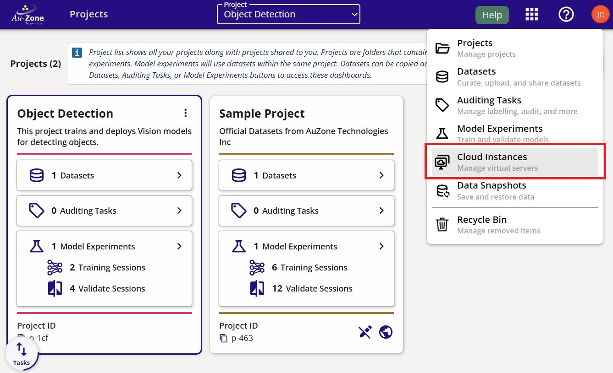
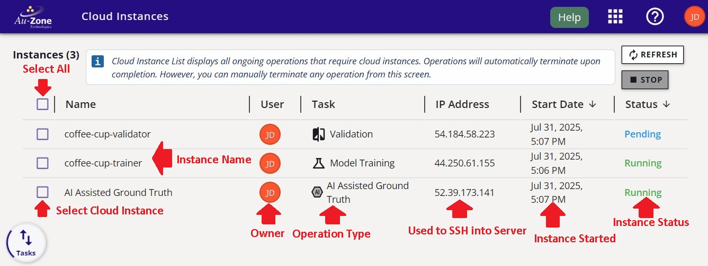

# Cloud Instances Dashboard

The Cloud Instances Dashboard can be accessed by clicking on the "Cloud Instances" from the Apps Menu.

<figure markdown="span">
{ align=center }
<figcaption>Cloud Instances Button</figcaption>
</figure>

The Cloud Instances Dashboard lists all the active cloud servers that are running in the background.  These server hosts any operations running in Studio such as a dedicated AGTG server for SAM-2 during the annotation process, or servers for running training and validation sessions.  The figure below points to the various elements of the Cloud Instances Dashboard page.

<figure markdown="span">
{ align=center }
<figcaption>Cloud Instances Page</figcaption>
</figure>

From this page you can click "Refresh" to refresh the page to see the latest active servers.  You can also select an active server and click "Stop" to terminate this server. 

It is important to stop any running servers that are idle to prevent any unnecessary deductions from your credits.  For example, the AGTG server has an auto-termination mechanism after 15 minutes of inactivity.  However, it is recommended to [stop this server](../datasets/tutorials/annotations/index.md#terminate-agtg-server) if it is no longer being used. 

## Next Steps

Now that you are familiar with the Cloud Instances Dashboard, we invite you to follow along the [Snapshots Dashboard](snapshots.md) to be familiar with the feature and context of this page.