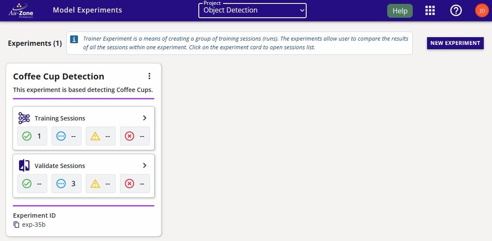
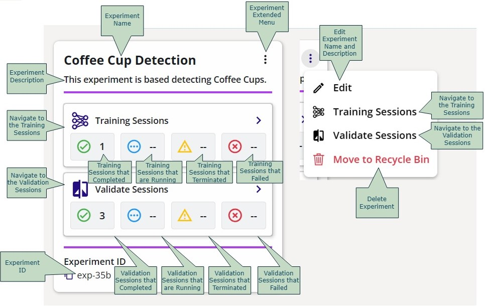
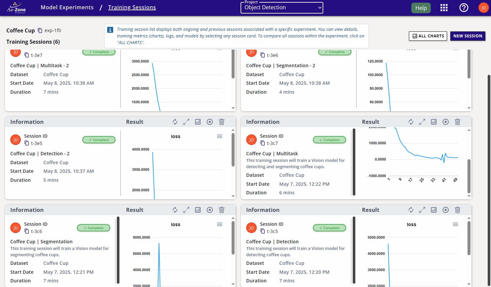
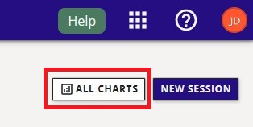
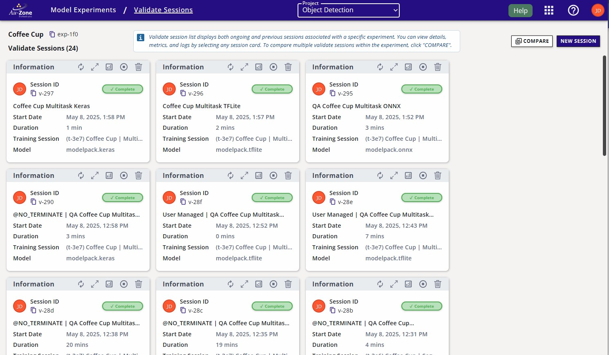
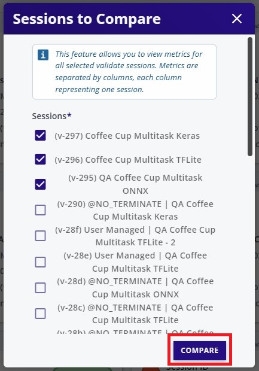
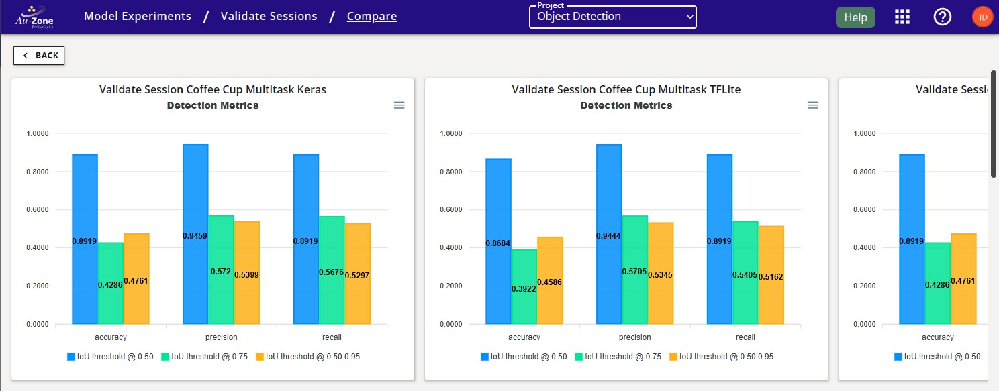

# Model Experiments Dashboard

A model experiment is a container of the training and validation sessions in the experiment.  The following figure shown is the "Model Experiments" page.  This page will contain all the experiments that were started by the user. 

<figure markdown="span">
{ align=center }
<figcaption>Project Experiments</figcaption>
</figure>

The following figure breaks down the elements of an "Experiment" card.

<figure markdown="span">
{ align=center }
<figcaption>Experiment Card UI Breakdown</figcaption>
</figure>

An experiment will contain child training and validation sessions.  The training sessions and validation sessions will be described in more detail in the sections below. 

#### Training Sessions

Training sessions take in datasets and synthesize from them new AI models for object recognition (Vision) or object perception (Fusion).

From the "Model Experiments" page, we can click on the "Training Sessions" button with the icon  to see the training sessions in the experiment.  The figure below shows the layout of the training session cards under the "Training Sessions" page.

<figure markdown="span">
{ align=center }
<figcaption>Training Sessions</figcaption>
</figure>

The following figure describes the attributes of any given training session.

<figure markdown="span">
{ align=center }
<figcaption>Training Session Attributes</figcaption>
</figure>

To compare all the training charts of each session, click on "All Charts" at the top right corner of the "Training Sessions" page.  This will show the charts from each session overlaid on top of one another for a quick comparison. 

<figure markdown="span">
{ align=center }
<figcaption>All Charts</figcaption>
</figure>

All the training charts will be displayed with a legend that indicates the training session.

<figure markdown="span">
{ align=center }
<figcaption>All Charts</figcaption>
</figure>

For more details regarding deploying training sessions, please see [Training ModelPack](../models/modelpack/training.md) for training Vision models and [Training Fusion](../models/fusion/training.md) for training Fusion models.

#### Validation Sessions

The validation sessions will assess the performance of the models in the training sessions.  A training session can have any number of validation sessions.  From the "Model Experiments" page, we can click on the "Validation Sessions" button with the icon  to see the validation sessions in the experiment.  The figure below shows the layout of the validation session cards under the "Validation Sessions" page.

<figure markdown="span">
{ align=center }
<figcaption>Validation Sessions</figcaption>
</figure>

The following figure describes the attributes of any given validation session.

<figure markdown="span">
{ align=center }
<figcaption>Validation Session Attributes</figcaption>
</figure>

To compare the validation charts of each session, click on "Compare" at the top right corner of the "Validate Sessions" page.  This will show the charts of each validation session side-by-side for a quick comparison.

<figure markdown="span">
{ align=center }
<figcaption>Compare Validation Sessions</figcaption>
</figure>

Next select the validation session results you wish to compare.  Once select, click "Compare" to show the validation charts side-by-side.

<figure markdown="span">
{ align=center }
<figcaption>Select Validation Sessions</figcaption>
</figure>

Now the charts for each session are displayed side-by-side.  All the charts for a single training session will be shown in one column.  A new column indicates another session. 

<figure markdown="span">
{ align=center }
<figcaption>Comparing Validation Sessions</figcaption>
</figure>

For more details regarding deploying validation sessions, please see [Validating ModelPack](../models/tutorials/validation.md) for validating Vision models and [Validating Fusion](../models/fusion/validation.md) for validating Fusion models.

## Next Steps

Now that you are familiar with the layout of EdgeFirst Studio including the element definitions and it's hierarchy, checkout our end-to-end [User Workflows](../getting_started/workflows/index.md) to start experimenting with data capture, model training, and model deployment. 

It is also recommended for new users to visit the following tutorials for more details in the layout and features of EdgeFirst Studio.

* [Navigating EdgeFirst Studio](../studio/navigation.md)
* [Project Dashboard](../studio/projects.md)
* [Dataset Dashboard](../studio/datasets/index.md)
