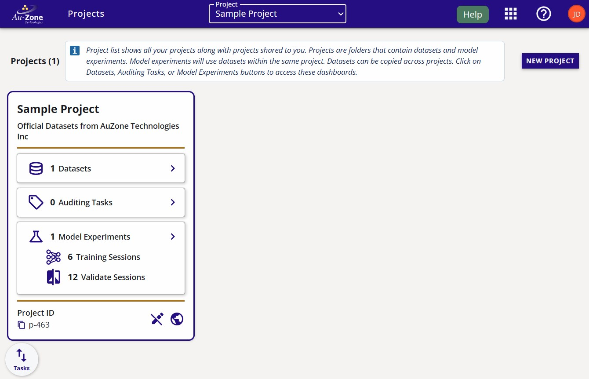
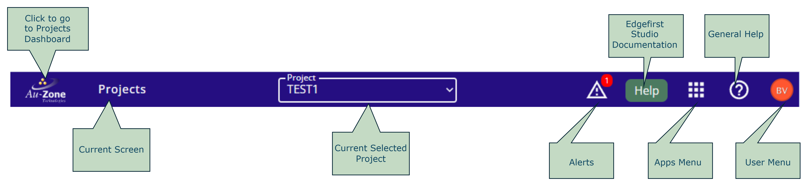
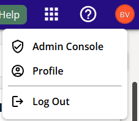
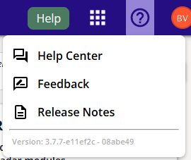
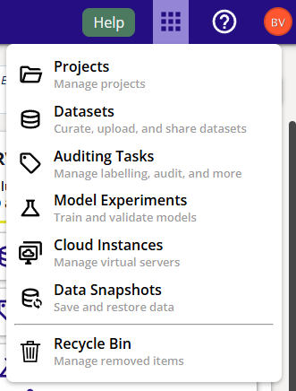

# Navigating EdgeFirst Studio

This page describes how to navigate towards different functionalities in the EdgeFirst Studio.  When first logged in to EdgeFirst Studio, you will be directed to the "Projects" page as shown below.  This page is the main landmark in EdgeFirst Studio. 

<figure markdown="span">
{ align=center }
<figcaption>Projects Splash Page</figcaption>
</figure>

Navigation towards different functionalities in the EdgeFirst Studio portal is facilitated through the top navigation bar as shown below.

<figure markdown="span">
{ align=center }
<figcaption>Navigation Bar</figcaption>
</figure>

## User Menu

<figure markdown="span">
{ align=center }
<figcaption>Admin Options</figcaption>
</figure>

This menu can be found on the right side of the top navigation bar.  This menu has the following options.  More information describing this menu can be found in the [user section](user/index.md).

### Admin Console

An admin user can [manage organizational details and users](user/organization.md), and [view billing information](user/billing.md).  More details are inside the links provided.

### Profile

Any user can [manage their profile](user/profile.md) and change their password.

### Logout

Logout of Edgefirst Studio.

## Help

We provide various methods of assistance from accessing the EdgeFirst documentation or help pages for any tutorials related to the current page being landed.  Otherwise, you can reach out to submit feedback or [contact us directly](mailto:support@edgefirst.ai).

### General Help

This menu provides the options to go to the help pages, submit feedback, view release notes, and to see the currently deployed version of EdgeFirst Studio as shown below.

<figure markdown="span">
{ align=center }
<figcaption>Help Options</figcaption>
</figure>

### Documentation

The "Help" button will point towards the link in the EdgeFirst documentation that describes the features and context of the current page being visited. 

## Apps Menu

The Apps Menu provides selections towards the various tools provided in EdgeFirst Studio.

<figure markdown="span">
{ align=center }
<figcaption>Apps Menu</figcaption>
</figure>

### Projects

Clicking on "Projects" takes the user to the [Projects Dashboard](projects.md).  This operation is the same as clicking on the Au-Zone Icon on the left of the top navigation bar.  A project is a high-level collections of sensor datatasets, model experiments, and other automation and management tasks associated with the dataset inputs and model outputs. 

### Datasets

Clicking on "Datasets" takes the user to the [Datasets Dashboard](datasets/index.md).  This page lists all datasets available to the user in the selected project.  A dataset is a collection of sensor data, such as images, videos (sequences), radar cubes, etc. logically grouped together by the user.  Usually, each dataset contained within a project will come from a single recording session. 

### Auditing Tasks

Clicking on "Auditing Tasks" takes the user to the Auditing Tasks Dashboard.  This page lists all auditing tasks for any dataset in the selected project.  Auditing tasks are formal operations of editing, approving, or removing annotations.  However, other methods of annotating datasets are described in the [Dataset Annotations](../datasets/tutorials/annotations/index.md) sections. 

### Model Experiments

Clicking on "Model Experiments" takes the user to the [Model Experiments Dashboard](models.md).  This page contains all training sessions and validation sessions.  Additional features for comparing training charts and validation metrics are also available.  More information can be found in the [model training](../models/tutorials/training.md) and [model validation](../models/tutorials/validation.md) sections.  A model experiment is a high-level collections of training and validation sessions.  A training session is the functionality of converting datasets into vision- and radar-based models that can be deployed back to the [EdgeFirst platforms/devices](../platforms/quickstart.md).  A validation session is the functionality to take a model and measure its performance against other models or a standardized validation set to see if it is ready for deployment. 

### Cloud Instances

Clicking on the "Cloud Instances" takes the user to the [Cloud Instances Dashboard](instances.md). This page allows user to view currently running cloud instances and to stop a running cloud instance in here.  A cloud instance is a server dedicated to hosting any operations such as model training and validation, or [AGTG](agtg.md) operations. 

### Data Snapshots

Clicking on the "Data Snapshots" takes the user to the [Snapshots Dashboard](snapshots.md).  This page allows users to create and restore snapshots.  This is a method to preserve the current state of the dataset.  A snapshot is a frozen and compact form of a dataset represented in the [EdgeFirst Dataset Format](../datasets/format.md).

### Recycling Bin

Clicking on the "Recycle Bin" takes the user to the Recycle Bin page.  This page is used for managing the recycling bin.  The deletions of the following items can be reverted or purged:

1. Project
2. Dataset
3. Annotation Set
4. Model Experiment
5. Training Session
6. Validate Session

## Alerts

This link provides information about general alerts (if present).  For example, an alert can be triggered by setting the image limit as shown [here](user/organization.md#image-limit). 

## Next Steps

Now that you are familiar with navigating EdgeFirst Studio, learn more about the [Automatic Ground Truth Generation (AGTG)](agtg.md) next which describes the auto-annotation features in EdgeFirst Studio to make the annotation process as seamless as possible. 