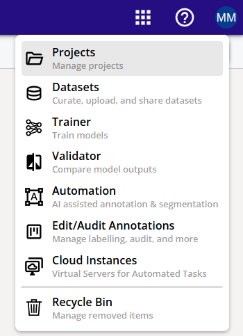
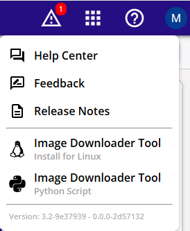
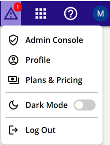

# Navigating EdgeFirst Studio

Navigating to different functionalities in the EdgeFirst Studio portal is facilitated through the top navigation bar.

<figure markdown="span">
{ align=center }
<figcaption>Navigation Bar</figcaption>
</figure>

## Apps Menu

The Apps Menu provides selections towards the various tools provided in EdgeFirst Studio.

<figure markdown="span">
{ align=center }
<figcaption>Apps Menu</figcaption>
</figure>

### Projects

Clicking on *Projects* takes the user to the projects dashboard. This operation is the same as clicking on the Au-Zone Icon on the top left of the portal.

### Datasets

Clicking on *Datasets* takes the user to the dataset dashboard for the currently selected project.

### Trainer

Clicking on *Trainer* takes the user to the trainer dashboard for the currently selected project.

### Automation

Clicking on *Automation* takes the user to the auto annotation page.

### Edit / Audit Annotations

This page provides functionality to create tasks for editing or auditing annotations. 

### Cloud Instances

This page allows user to view the currently running cloud instances, start or stop a cloud instance, etc.

### Recycling Bin

This page is used for managing the recycling bin. The deletions of the following items can be reverted or purged:

1. Project
2. Dataset
3. Annotation Set
4. Training Experiment
5. Training Session
6. Automation Task
7. Validation Session

## Alerts

This link provides information about general alerts (if present).

## Help

This submenu provides the ability to go to the help pages, submit feedback, view release notes, download image downloader tool, and also look at the currently deployed version. 

<figure markdown="span">
{ align=center }
<figcaption>Help Options</figcaption>
</figure>

## User and Organization Management

<figure markdown="span">
{ align=center }
<figcaption>Admin Options</figcaption>
</figure>

This menu has the following options:

### Admin Console

An admin user can manage organizational users, edit organizational details, and view billing information.

### Profile

Any user can manage their profile and change their password.

### Plans and Pricing

View Plans and proving models.

### Dark Mode

Toggle Dark Mode.

### Logout

Logout.

