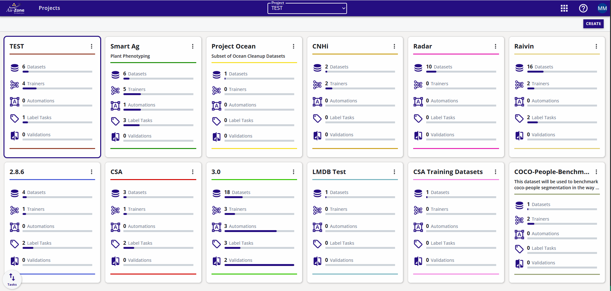
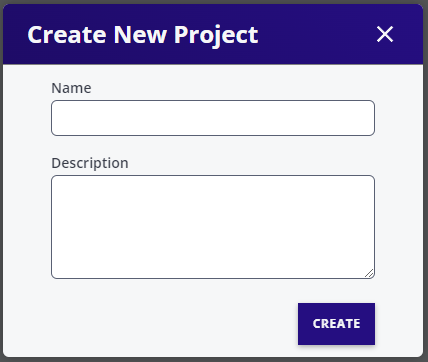

# Project Dashboard

<figure markdown="span">
{ align=center }
<figcaption>Project Dashboard</figcaption>
</figure>

The *Projects Dashboard* is the main page of the portal which organizes data into logical project partitions.

## Create Project

1. Click on *CREATE* on the project dash board at the top right of the portal.
2. Enter project name and description.
2. Click *Create*.

<figure markdown="span">
{ align=center }
<figcaption>Create New Project</figcaption>
</figure>

## Delete Project

1. Click on project menu drop down (three vertically aligned dots) on the project card.
2. Click *Remove Project*.
2. The project is moved to the recycling bin. Remove the project from the recycling bin to actually free the storage space.

## Edit Project

1. Click on project menu drop down (three vertically aligned dots) on the project card.
2. Click *Edit*.
3. Change the name or description as desired.
4. Click *Apply Changes*.

## Project Access Control

Project access control allows project resources to be selectively available to different users. 

For more information please visit [Access Control](user/organization.md#roles).
