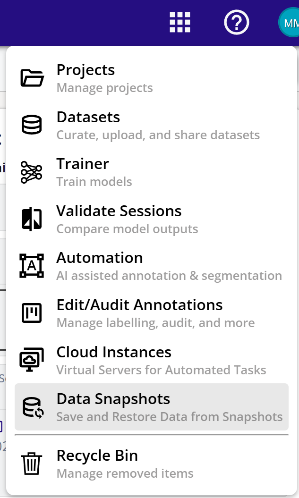
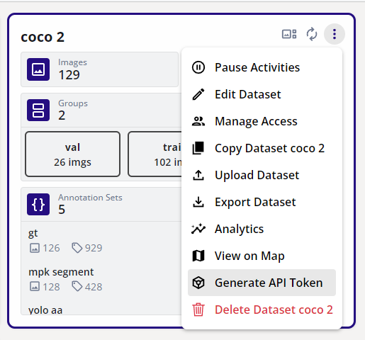

# Snapshot Dashboard

Snapshots are frozen and compact form of datasets. The snapshot can be opened from the apps menu.

<figure markdown="span">
{ align=center }
<figcaption>Data Snapshots</figcaption>
</figure>

The snapshots menu shows the list of snapshots with its name and status.

<figure markdown="span">
{ align=center }
<figcaption>Snapshot List</figcaption>
</figure>

## Create Snapshot

A snapshot can be created by the following ways:

1. Create from Existing Dataset.
2. Upload from MCAP File.
3. Upload from Zip/Arrow File

### Create from Existing Dataset

This will create a Zip/Arrow file pair for each sequence in a dataset and stored in the cloud storage. This snapshot can be later restored (into another dataset) or can be downloaded to a local folder on a PC.

1. From the dataset card, open the context menu and select "Generate API Token"

<figure markdown="span">
{ align=center }
<figcaption>Generate API Token</figcaption>
</figure>

2. This will trigger the creation of a snapshot.
3. The status of the snapshot generation will be shown in the dataset card.
4. When completed, the snapshot will appear in the snapshots dashboard.

### Upload from MCAP File

1. Go to the snapshots dashboard.
2. Click on the "FROM FILE" button or drag and drop an MCAP file on the dashboard.

### Upload from Zip/Arrow File

1. Go to the snapshots dashboard.
2. Click on the "FROM FILE" button or drag and drop as a folder containing zip and arrow file pairs on the dashboard.
3. The name of corresponding zip and arrow files must be same.
4. If there are multiple zip and arrow pairs, then each pair will become a sequence.

## Restore Snapshot

This action will take an MCAP or Zip/Arrow files and create a dataset in EdgeFirst Studio. The Backend pipelines of auto depthmap generation, object detection, and Automated Ground Truth Generation can also be selected at this time while restoring.

1. Click on the snapshot context menu (three dots).
2. Select "Restore".

<figure markdown="span">
{ align=center }
<figcaption>Snapshot Options</figcaption>
</figure>

3. This will open the restore dialog for specifying the options.

<figure markdown="span">
{ align=center }
<figcaption>Restore Options</figcaption>
</figure>

4. Select "Project" where the dataset will be created.
5. Enter the dataset name and description. If the dataset name is not provided a dataset, a dataset with the snapshot name will be created.
6. Check "Use MCAP Selected Topics" if selected topics are to be imported (for example ignoring Radar and only importing Segmentation).
7. Select "Use MCAP Frame Rate" to select a custom frame rate.
8. Select "Depth Generation" to use AI Model based depth map generation.
9. Select "AI Ground Truth Generation" to enable auto generation of 2D boxes, 3D boxes, and segmentation masks.
10. Click "RESTORE SNAPSHOT".
11. The dataset dashboard will have a new dataset with progress indication.
12. The progress for different stages will be at different rates.

## Download Snapshot

1. Click on the snapshot context menu (three dots).
2. Select "Download".

<figure markdown="span">
{ align=center }
<figcaption>Snapshot Options</figcaption>
</figure>

## Delete Snapshot

1. Click on the snapshot context menu (three dots).
2. Select "Remove".

<figure markdown="span">
{ align=center }
<figcaption>Snapshot Options</figcaption>
</figure>
