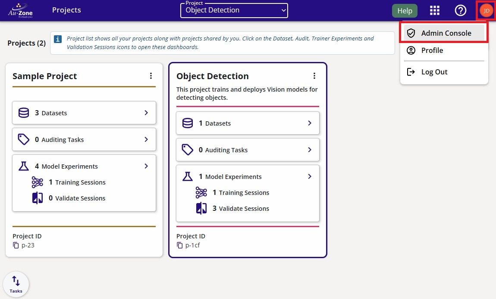
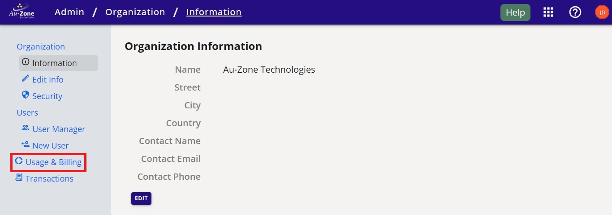
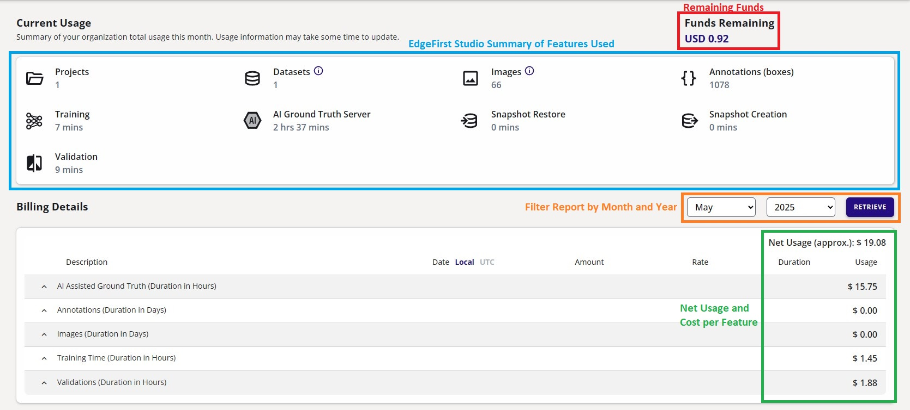
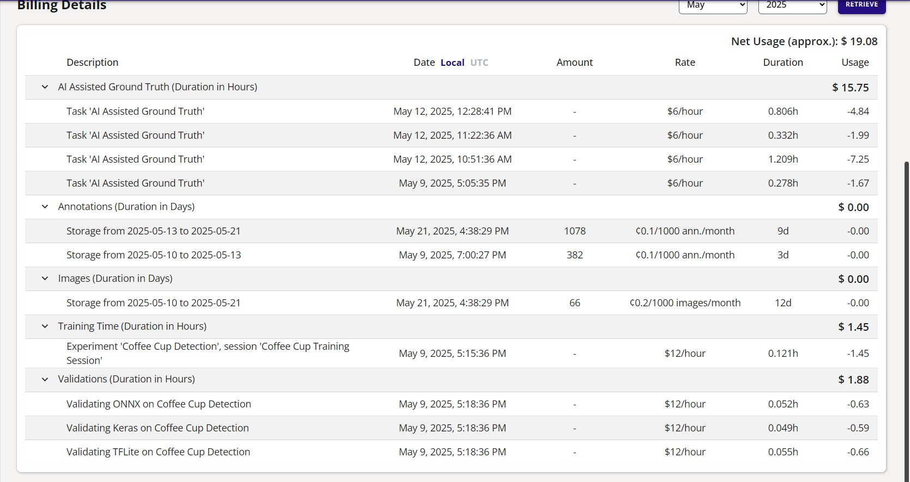
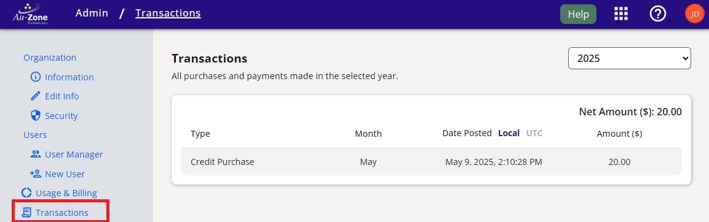

# Billing Information

This page will describe the billing information that is subjected to the user's organization.  Prior to reading the contents in this page, it is recommended to be familiar with the [Organization Management](organization.md).  A new organization is given $20.00 worth of credits to allow trials of the features in EdgeFirst Studio as shown in the [Quickstart Guide](../../index.md).  The credits in the organization will be shared amongst the members.  

## Usage & Billing

You can find the details on the remaining funds and the cost breakdown in your organization by visiting the "Usage & Billing" page.  To navigate to this page, click on the "User" button that is found on the top right of the navigation bar as shown below.  You will see three different options, click on the "Admin Console" button. 

<figure markdown="span">
{ align=center }
<figcaption>The location of the "User" button</figcaption>
</figure>

This will navigate you to the "Organization Information" page.  Click on the "Usage & Billing" button as indicated in red below.

<figure markdown="span">
{ align=center }
<figcaption>The location of the "Usage & Billing" button</figcaption>
</figure>

This page may take some time to render.  Once rendered, the following page will show which describes the current usages of EdgeFirst Studio features and the billing details under.

<figure markdown="span">
{ align=center }
<figcaption>Usage & Billing Page</figcaption>
</figure>

### Remaining Funds

Initially, the remaining funds will show as `USD 20.00`.  This is free for trial users to experience EdgeFirst Studio and its features.  However, as you use EdgeFirst Studio such as importing datasets you incur storage costs or deploying training and validation incur server costs, you will see that these remaining funds will start to decrease.  Once the remaining funds run out, you will no longer be able to use any features in EdgeFirst Studio and your datasets will be parked, training and validation sessions will be paused or terminated.  It is recommended to always check the remaining funds in your organization before running experiments to ensure you have enough funds to support the cost of the experiment.  The cost of the features in EdgeFirst Studio will be discussed in more detail in the section [below](#features-and-associated-costs).

### Features and Associated Costs

In the current usage, there is a summary of the features used in EdgeFirst Studio with the associated time measurements during deployments.  For example, all training sessions in the organization accumulated to 7 minutes.  Furthermore, active datasets incur storage costs.  The billing details provide more information on the cost of each feature as shown below.

<figure markdown="span">
{ align=center }
<figcaption>Billing Details</figcaption>
</figure>

The cost of each feature is summarized below:

* AI Assisted Ground Truth: `$6/hour`
* Dataset Annotations Storage: `c0.1/1000 annotations/month`
* Dataset Images Storage: `c0.2/1000 images/month`
* Training Session: `$12/hour`
* Validation Session: `12/hour`

## Transactions

The "Transactions" page will show your purchases or the amount of credits allocated to your organization.  This page can be accessed by clicking on the "Transactions" button as shown below.

<figure markdown="span">
{ align=center }
<figcaption>Transactions Summary</figcaption>
</figure>

Since this is a trial account, the only transaction shown is the `$20.00` credits allocated to my organization upon signup. 

This page has described billing information and the cost of each feature in EdgeFirst Studio.  Explore more by using these features in your trial account by following one of the [end-to-end workflows](../../getting_started/workflows/index.md).