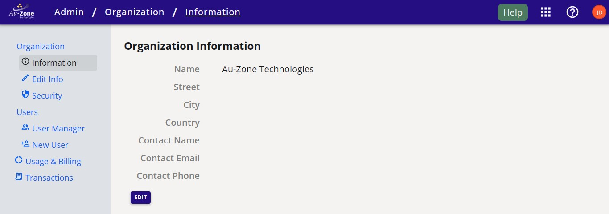

# User Management

To get started with EdgeFirst Studio, you can [sign up](profile.md#sign-up) to create your profile.  If you have an EdgeFirst Studio account, you can [login](profile.md#log-in) to EdgeFirst Studio.  If you have an EdgeFirst Studio account, but you forgot your password, follow the steps to [forget your password](profile.md#forgot-password) to change your password.

You can see your [profile information](profile.md#profile-information) and [make changes to your information](profile.md#edit-information) as you wish.  

When you first sign up to EdgeFirst Studio, you will also automatically create your own organization.  An organization allows multiple users to access your projects, but at the start, you will be the only user in your organization.  However, you can create multiple users/profiles in your organization to allow collaboration between members in your team.  In this way, multiple members can be assigned to your organization.  You can find more information for [managing your organization](organization.md).  Otherwise, follow the [workflow below](#inviting-new-users) for inviting new users to your organization. 

A new organization is given $20.00 worth of credits to allow trials of the features in EdgeFirst Studio as shown in the [Quickstart Guide](../../index.md).  The credits in the organization will be shared amongst the members.  You can find more information on the [billing details](billing.md).

## Inviting New Users

This guide will walk you through inviting new users to your organization once you have [logged in][login] to EdgeFirst Studio.  By signing up, you are the admin of your organization. You will create the accounts for other users in your organization that will be shown below. 

### Visit the Admin Console

When you log in, you will be first directed to the "Projects Page". Click on the "User" button that is found on the top right of the navigation bar as shown below. You will see three different options, click on the "Admin Console" button.

<figure markdown="span">
{ align=center }
<figcaption>The location of the "User" button</figcaption>
</figure>

This will navigate you to the "Organization Information" page.  Shown below is an example.

<figure markdown="span">
{ align=center }
<figcaption>Your Organization Information</figcaption>
</figure>

Proceed to the next section below for creating the accounts for the new users in your organization



This workflow has shown how to invite new users to your organization.  To start experimenting with various features in EdgeFirst Studio, the end-to-end workflow in the [Quickstart](../../index.md#create-project) provides more guidance. 

[login]: https://test.edgefirst.studio/#/login