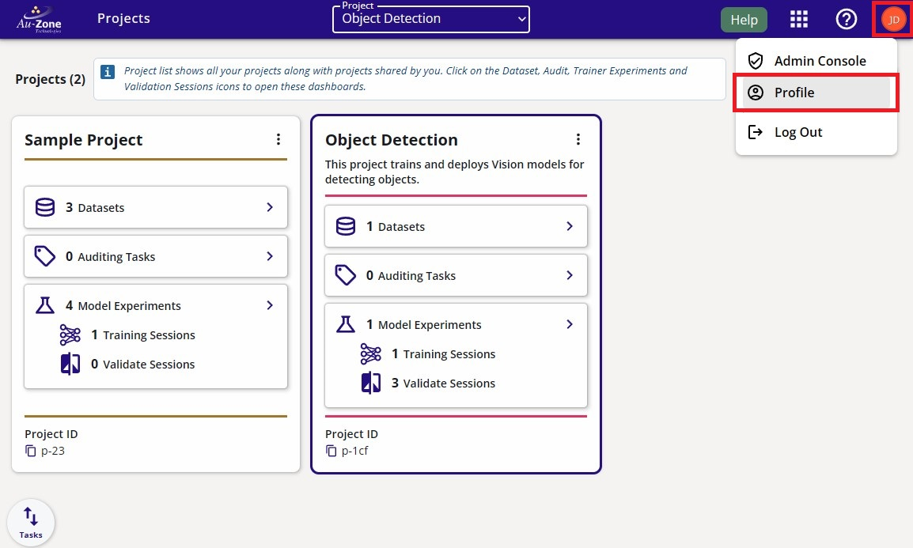
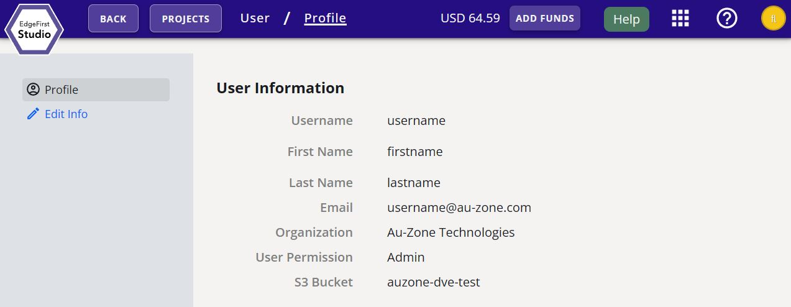
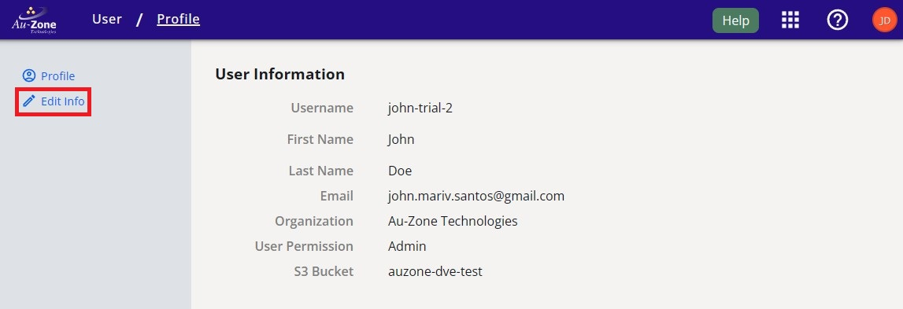
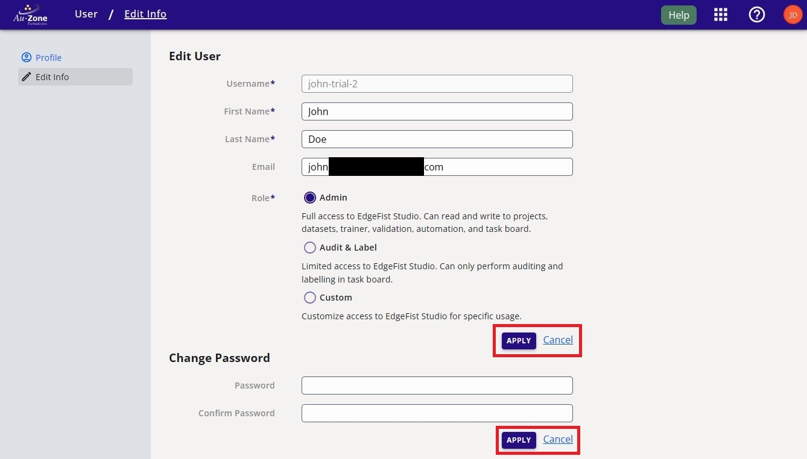

# User Profile

This page provides details on your profile information.  To get started, you can create your profile by [signing up](#sign-up) to EdgeFirst Studio.  Once you have signed up, you can [log in](#log-in) to EdgeFirst Studio.  Once you have logged in, you can see your [profile information](#profile-information) and [make any changes to your profile](#edit-information). 

!!! note

    If your profile was created by the admin of your [organization](organization.md), it is recommended to change your password.  There are two methods for changing your password.  The first method is to [edit your password](#change-password) under your profile information.  Otherwise, you can also [forget your password](#forgot-password).





## Profile Information

You can find your profile information by clicking on the "User" button that is found on the top right of the navigation bar shown below.  You will see three different options, click on the "Profile" button as shown below. 

<figure markdown="span">
{ align=center }
<figcaption>The location of the "Profile" button</figcaption>
</figure>

This will navigate you to your profile information you've set when you first sign up.

<figure markdown="span">
{ align=center }
<figcaption>Your Profile Information</figcaption>
</figure>

## Edit Information

Now that you can [see your profile information](#profile-information).  You can edit your information by clicking on the "Edit Info" button on the left.

<figure markdown="span">
{ align=center }
<figcaption>Edit Profile Button</figcaption>
</figure>

This will bring you to the page to edit your profile information such as your username, first and last name, your email, and the [role](organization.md#roles) associated to your account. 

<figure markdown="span">
{ align=center }
<figcaption>Edit Profile Information</figcaption>
</figure>

After making the changes, click "Apply" to save your changes. Otherwise, click "Cancel" to abort your changes.  

### Change Password

To change your password, navigate to your [profile information](#profile-information) and [edit your profile information](#edit-information).  Next under "Change Password", input your new password twice to confirm.  Click "Apply" to save your new password.
