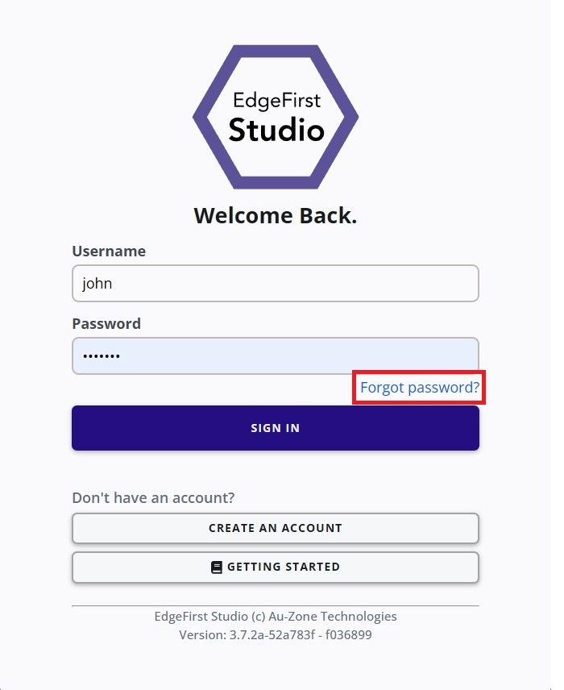
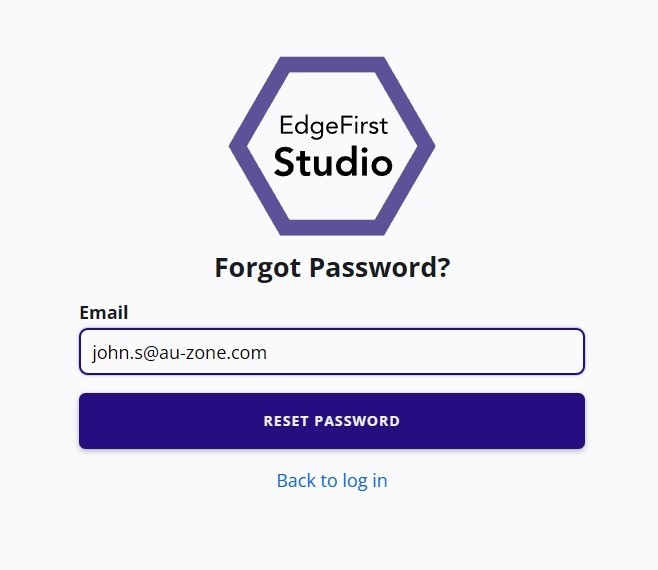
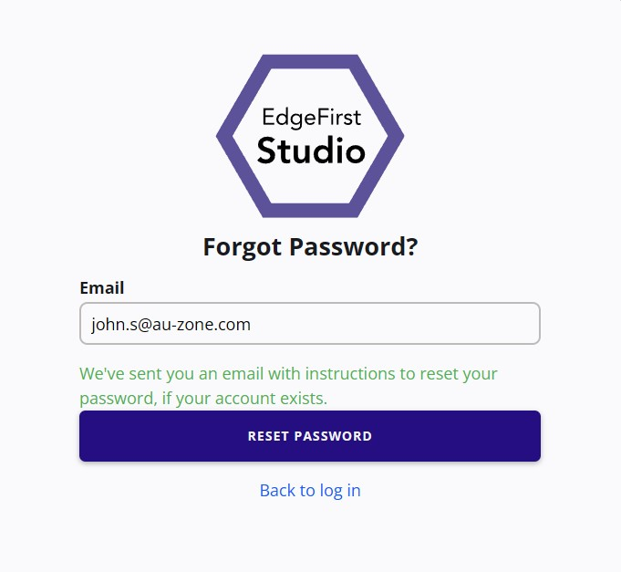
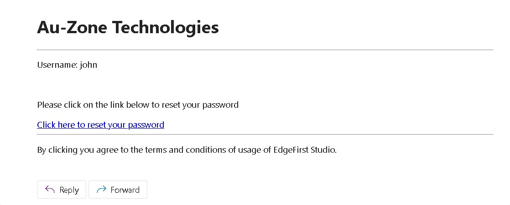
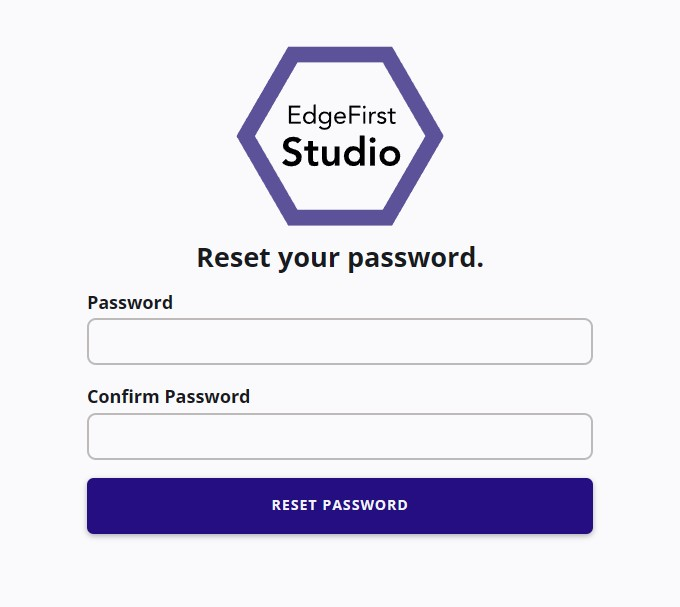

# User Profile

This page provides details on your profile information.  To get started, you can create your profile by [signing up](#sign-up) to EdgeFirst Studio.  Once you have signed up, you can [log in](#log-in) to EdgeFirst Studio.  Once you have logged in, you can see your [profile information](#profile-information) and [make any changes to your profile](#edit-information). 

!!! note

    If your profile was created by the admin of your [organization](organization.md), it is recommended to change your password.  There are two methods for changing your password.  The first method is to [edit your password](#change-password) under your profile information.  Otherwise, you can also [forget your password](#forgot-password).

## Sign Up 

1. If you haven't already created an EdgeFirst Studio Account, start by [creating an account][signup].  If you've already created an account, but you [forget your password](#forgot-password), click on the link for instructions to reset your password.

2. When creating your account, enter the required fields denoted by the asterisk (*) and then create your account once completed.

    <figure markdown="span">
    { align=center }
    <figcaption>Create a New Account</figcaption>
    </figure>

    When you first sign up to EdgeFirst Studio, you will also automatically create your own organization.  You can specify the name of your organization when you first sign up denoted by the "Organization" field.  An organization allows multiple users to access your projects, but at the start, you will be the only user in your organization.  However, you can create multiple users/profiles in your organization to allow collaboration between members in your team.  In this way, multiple members can be assigned to your organization.  You can find more information for [managing your organization](organization.md).

    A new organization is given $20.00 worth of credits to allow trials of the features in EdgeFirst Studio.  The credits in the organization will be shared amongst the members.  You can find more information on the [billing details](billing.md). 

3. An email will be sent to verify the email you provided.  Go ahead and click on the link provided to verify your email.

    <figure markdown="span">
    { align=center }
    <figcaption>Email Verification</figcaption>
    </figure>

4. Once the email is verified, you can now [login][login] to EdgeFirst Studio.

## Log In

1. When logging in, enter your username and password you specified.  Next click the "Sign In" button to sign in.

    <figure markdown="span">
    { align=center }
    <figcaption>Login Page</figcaption>
    </figure>

2. Once logged in to EdgeFirst Studio, you will be greeted with the following [Projects](../projects.md) page.

    <figure markdown="span">
    { align=center }
    <figcaption>Projects Splash Page</figcaption>
    </figure>

## Forgot Password?

Visit the [login page][login] and click on the link "Forgot password?" as shown below.

<figure markdown="span">
{ align=center }
<figcaption>Forgot Password</figcaption>
</figure>

You will then be prompted to enter the email associated to your account. Go ahead and enter your email and then click "RESET PASSWORD".

<figure markdown="span">
{ align=center }
<figcaption>Enter your Email</figcaption>
</figure>

You will be notified to check your email for instructions to reset your password. Check your email for these instructions. 

<figure markdown="span">
{ align=center }
<figcaption>Resetting Your Password</figcaption>
</figure>

A link will be provided in the sent email. Click on the link to continue to reset your password.

<figure markdown="span">
{ align=center }
<figcaption>Resetting Your Password</figcaption>
</figure>

You will then be prompted to enter a new password. Once entered, click "RESET PASSWORD" to submit.

<figure markdown="span">
{ align=center }
<figcaption>Enter New Password</figcaption>
</figure>

Done! You will then be prompted back to the login page for you to enter your new credentials. 

## Profile Information

You can find your profile information by clicking on the "User" button that is found on the top right of the navigation baras shown below.  You will see three different options, click on the "Profile" button as shown below. 

<figure markdown="span">
{ align=center }
<figcaption>The location of the "Profile" button</figcaption>
</figure>

This will navigate you to your profile information you've set when you first sign up.

<figure markdown="span">
{ align=center }
<figcaption>Your Profile Information</figcaption>
</figure>

## Edit Information

You can edit your information by clicking on the "Edit Info" button on the left.

<figure markdown="span">
{ align=center }
<figcaption>Edit Profile Button</figcaption>
</figure>

This will bring you to the page to edit your profile information such as your username, first and last name, your email, and the [role](organization.md#roles) associated to your account. 

<figure markdown="span">
{ align=center }
<figcaption>Edit Profile Information</figcaption>
</figure>

After making the changes, click "Apply" to save your changes. Otherwise, click "Cancel" to abort your changes.  

### Change Password

To change your password, navigate to your profile information and edit your profile information by following the [steps above](#profile-information).  Next under "Change Password", input your new password twice to confirm.  Click "Apply" to save your new password.

[signup]: https://test.edgefirst.studio/#/signup
[login]: https://test.edgefirst.studio/#/login